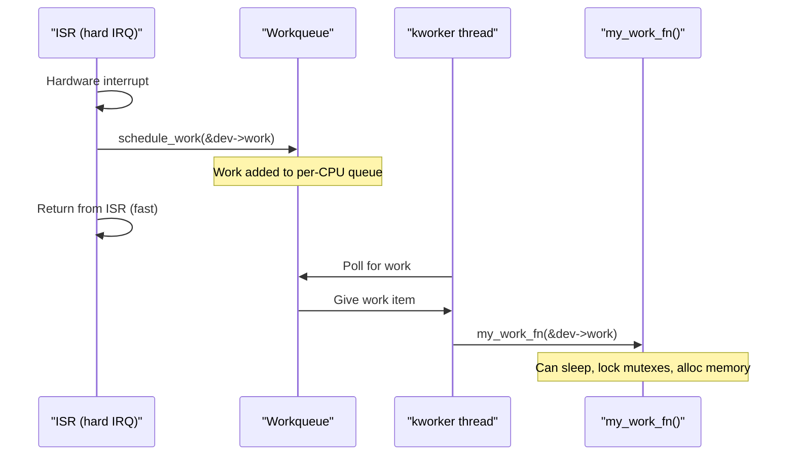

# 04 — Work Queues

## 1. What is a Work Queue?

A **work queue** defers work to a **kernel thread** (kworker), running in **process context**. This means:
- **CAN sleep** — can call `msleep()`, `mutex_lock()`, `kmalloc(GFP_KERNEL)`, etc.
- Can be scheduled by the normal scheduler
- Higher overhead than softirq/tasklet, but most flexible

---

## 2. Data Structures

```c
/* include/linux/workqueue.h */

/* Unit of work */
struct work_struct {
    atomic_long_t   data;       /* flags + wq pointer */
    struct list_head entry;     /* Position in work queue */
    work_func_t     func;       /* Callback function */
};

/* Delayed work (runs after a delay) */
struct delayed_work {
    struct work_struct  work;
    struct timer_list   timer;  /* Timer to trigger after delay */
    struct workqueue_struct *wq;
    int cpu;
};
```

---

## 3. The Global Work Queue (system_wq)

The easiest way to use work queues is via the **system-wide** work queue `system_wq`:

```c
#include <linux/workqueue.h>

static void my_work_fn(struct work_struct *work)
{
    struct my_device *dev = container_of(work, struct my_device, work);

    /* CAN sleep here! */
    if (mutex_lock_interruptible(&dev->lock))
        return;

    msleep(10);  /* OK! */
    process_data(dev);

    mutex_unlock(&dev->lock);
}

struct my_device {
    struct work_struct   work;
    struct delayed_work  dwork;
    /* ... */
};

/* Initialize */
INIT_WORK(&dev->work, my_work_fn);
INIT_DELAYED_WORK(&dev->dwork, my_delayed_fn);

/* Schedule work immediately */
schedule_work(&dev->work);

/* Schedule work after 100ms delay */
schedule_delayed_work(&dev->dwork, msecs_to_jiffies(100));

/* Cancel pending work */
cancel_work_sync(&dev->work);        /* Waits for completion */
cancel_delayed_work_sync(&dev->dwork);
```

---

## 4. Custom Work Queues

For performance-critical or isolated work, create a dedicated work queue:

```c
/* Create custom work queue */
struct workqueue_struct *my_wq;

/* Flags: WQ_UNBOUND | WQ_MEM_RECLAIM | WQ_HIGHPRI | WQ_CPU_INTENSIVE */
my_wq = create_singlethread_workqueue("my_wq");  /* Single thread */
my_wq = alloc_workqueue("my_wq", WQ_MEM_RECLAIM, 1);  /* Configurable */

/* Queue work to custom queue */
queue_work(my_wq, &dev->work);
queue_delayed_work(my_wq, &dev->dwork, delay);

/* Destroy */
destroy_workqueue(my_wq);  /* Flushes all pending work first */
```

---

## 5. Work Queue Flags

| Flag | Description |
|------|-------------|
| `WQ_UNBOUND` | Not bound to specific CPU (for long tasks) |
| `WQ_MEM_RECLAIM` | Needed for memory reclaim path (deadlock prevention) |
| `WQ_HIGHPRI` | High priority workers |
| `WQ_CPU_INTENSIVE` | CPU-bound work (yields to other workers) |
| `WQ_FREEZABLE` | Stopped during system suspend |

---

## 6. Execution Flow


    Handler->>Handler: Process data
    Handler->>Worker: Return
    Worker->>WQ: Poll again
```

---

## 7. Complete Example: Thermal Monitoring

```c
#include <linux/module.h>
#include <linux/workqueue.h>
#include <linux/thermal.h>

struct thermal_monitor {
    struct workqueue_struct *wq;
    struct delayed_work      poll_work;
    struct thermal_zone_device *tz;
    int                      threshold_temp;
};

static void thermal_poll_fn(struct work_struct *work)
{
    struct delayed_work *dwork = to_delayed_work(work);
    struct thermal_monitor *tm = container_of(dwork,
                                              struct thermal_monitor,
                                              poll_work);
    int temperature;

    /* This can sleep — thermal_zone_get_temp may block */
    thermal_zone_get_temp(tm->tz, &temperature);

    if (temperature > tm->threshold_temp) {
        pr_warn("Temperature %d°C exceeds threshold %d°C!\n",
                temperature / 1000, tm->threshold_temp / 1000);
        /* Could send notification, throttle CPU, etc. */
    }

    /* Reschedule itself every 1 second */
    queue_delayed_work(tm->wq, &tm->poll_work, HZ);
}

static int thermal_monitor_init(struct thermal_monitor *tm)
{
    tm->wq = alloc_workqueue("thermal_monitor", WQ_MEM_RECLAIM, 1);
    if (!tm->wq)
        return -ENOMEM;

    INIT_DELAYED_WORK(&tm->poll_work, thermal_poll_fn);

    /* Start polling after 1 second */
    queue_delayed_work(tm->wq, &tm->poll_work, HZ);
    return 0;
}

static void thermal_monitor_destroy(struct thermal_monitor *tm)
{
    cancel_delayed_work_sync(&tm->poll_work);
    destroy_workqueue(tm->wq);
}
```

---

## 8. System Work Queues (Predefined)

| Queue | Description |
|-------|-------------|
| `system_wq` | General purpose, may starve |
| `system_highpri_wq` | High-priority, WQ_HIGHPRI |
| `system_long_wq` | WQ_UNBOUND, for long-running tasks |
| `system_unbound_wq` | Not CPU-bound |
| `system_freezable_wq` | Stopped during freeze |

---

## 9. Source Files

| File | Description |
|------|-------------|
| `include/linux/workqueue.h` | API |
| `kernel/workqueue.c` | Implementation (alloc_workqueue, kworker) |
| `Documentation/core-api/workqueue.rst` | Official documentation |

---

## 10. Related Concepts
- [03_Tasklets.md](./03_Tasklets.md) — For cannot-sleep deferred work
- [05_Choosing_A_Bottom_Half_Mechanism.md](./05_Choosing_A_Bottom_Half_Mechanism.md) — Decision guide
- [../09_Kernel_Synchronization_Methods/05_Mutex.md](../09_Kernel_Synchronization_Methods/05_Mutex.md) — Mutexes in work handlers
