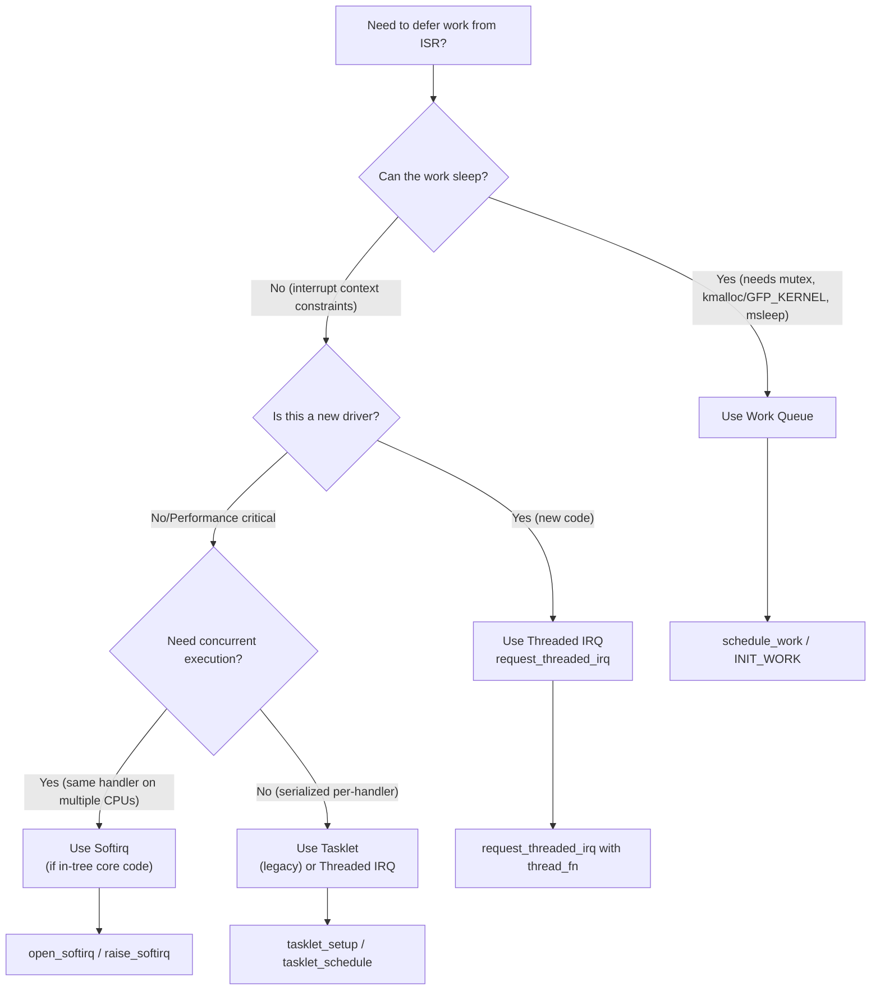

# 05 — Choosing a Bottom Half Mechanism

## 1. Decision Flowchart


```

---

## 2. Comparison Table

| Property | Softirq | Tasklet | Work Queue | Threaded IRQ |
|----------|---------|---------|-----------|-------------|
| Context | Softirq | Softirq | Process | Process |
| Can sleep? | No | No | **Yes** | **Yes** |
| Concurrent? | Yes (same on diff CPUs) | No | Yes | Yes |
| Latency | Lowest | Low | High | Medium |
| Complexity | High | Medium | Low | Low |
| Dynamic creation | No (compile-time only) | Yes | Yes | Via API |
| Status (6.x+) | Stable | Deprecated | Preferred | Preferred |
| Use case | Net/Block core | Simple deferral | General | Driver slow work |

---

## 3. Mapping Common Tasks

| Task | Mechanism | Reason |
|------|-----------|--------|
| Network packet processing | Softirq (NET_RX/TX) | High frequency, needs parallelism |
| USB data transfer | Work Queue | Needs to sleep for USB stack calls |
| Timer callbacks | TIMER_SOFTIRQ | Low latency timers |
| Block I/O completion | BLOCK_SOFTIRQ | Performance critical |
| Sensor data processing | Work Queue | Simple, can sleep |
| GPIO interrupt handler | Threaded IRQ | Driver, may need I2C/SPI calls |
| NAPI (network poll) | Softirq / Napi | High-rate packet processing |

---

## 4. The Modern Recommendation

Since Linux 5.x and especially 6.x:

1. **Threaded IRQs** are the default for driver developers
2. **Work queues** for anything needing process context
3. **Softirqs** only for core kernel subsystems
4. **Tasklets** — AVOID for new code (deprecated path)

```c
/* Modern driver pattern */
ret = request_threaded_irq(
    irq,
    my_primary_handler,    /* Fast: top half */
    my_thread_handler,     /* Slow: runs as kernel thread (can sleep) */
    IRQF_ONESHOT,
    "my_driver",
    dev
);
```

---

## 5. Latency vs Flexibility Trade-off


```

---

## 6. Related Concepts
- [02_Softirqs.md](./02_Softirqs.md)
- [03_Tasklets.md](./03_Tasklets.md)
- [04_Work_Queues.md](./04_Work_Queues.md)
- [../06_Interrupts_And_Interrupt_Handlers/02_Interrupt_Handlers.md](../06_Interrupts_And_Interrupt_Handlers/02_Interrupt_Handlers.md) — Threaded IRQs
