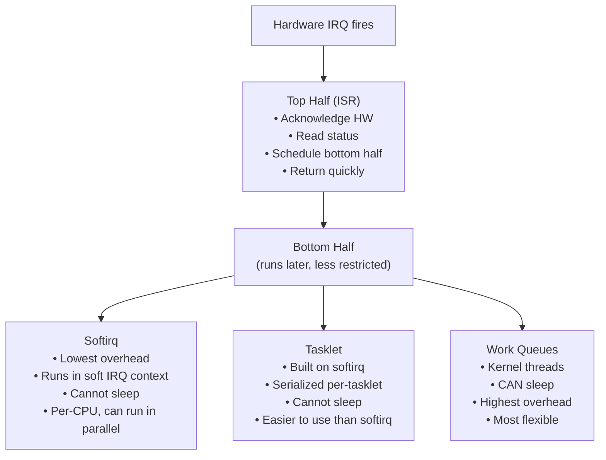

# Chapter 07 — Bottom Halves and Deferring Work

## Overview

Interrupt handlers (top halves) must be fast. Work that is too slow for an ISR is deferred to **bottom halves** — mechanisms that run the work later, outside of hard interrupt context.



## Topics

| File | Topic |
|------|-------|
| [01_Why_Bottom_Halves.md](./01_Why_Bottom_Halves.md) | Design rationale, top vs bottom half |
| [02_Softirqs.md](./02_Softirqs.md) | Kernel softirq system, ksoftirqd |
| [03_Tasklets.md](./03_Tasklets.md) | Tasklets: simple deferred functions |
| [04_Work_Queues.md](./04_Work_Queues.md) | Work queues: process-context deferred work |
| [05_Choosing_A_Bottom_Half_Mechanism.md](./05_Choosing_A_Bottom_Half_Mechanism.md) | Decision guide and comparison |

## Key Files

```
include/linux/interrupt.h     — tasklet API
include/linux/workqueue.h     — work queue API
kernel/softirq.c              — softirq + tasklet + work implementation
kernel/workqueue.c            — work queue implementation
```
