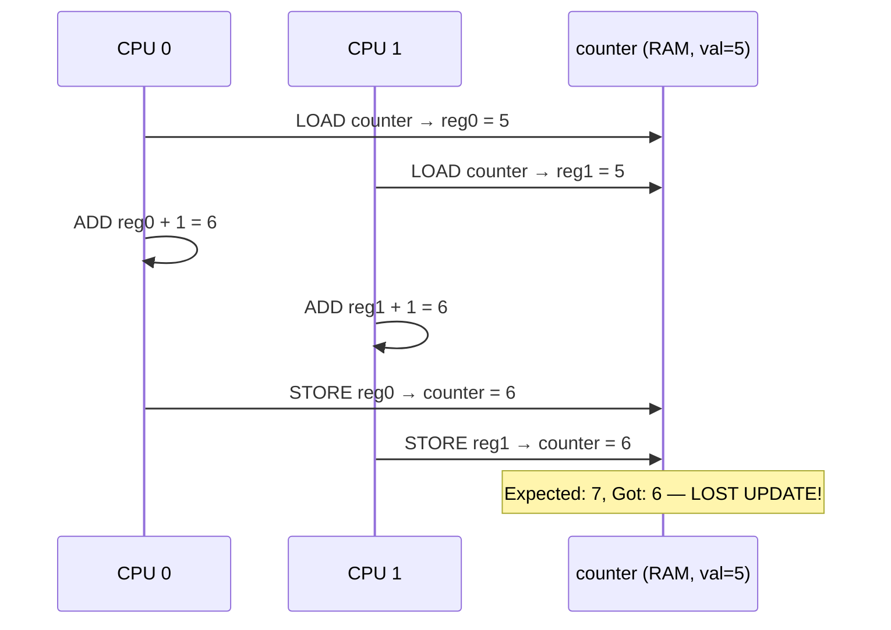

# 01 — Critical Regions

## 1. Definition

A **critical region** (or **critical section**) is a stretch of code that accesses shared data and must execute **atomically** — without interruption from other concurrent paths that also access (especially write) that data.

```c
/* Example: two CPUs both increment a shared counter */
/* Non-atomic — this is a CRITICAL REGION */
counter++;  /* 3 instructions: load, add, store */
            /* If two CPUs do this simultaneously, one increment is lost */
```

---

## 2. Why Increment is Not Atomic



---

## 3. What Makes a Critical Region

A critical region exists when **all three** conditions hold:
1. **Shared data** (global, heap, or shared between threads/ISR/CPU)
2. **At least one writer** (if all readers, no synchronization needed for most data)
3. **Concurrent execution** possible (SMP, preemption, interrupts)

```c
/* These are NOT critical regions: */
int local_var = 0;              /* Stack variable — not shared */
const char *msg = "hello";      /* Read-only constant */

/* These ARE critical regions: */
static int global_count;         /* Written by multiple CPUs → protect it */
struct list_head free_list;      /* Multiple CPUs add/remove → protect */
struct task_struct *current_task; /* Shared pointer — protect writes */
```

---

## 4. Atomicity

An operation is **atomic** if it appears instantaneous to all other observers — it completes without any intermediate visible state.

| Operation | Atomic? | Notes |
|-----------|---------|-------|
| `x++` | **No** | 3 machine instructions |
| `atomic_inc(&x)` | Yes | Kernel atomic_t operations |
| `x = 5` (aligned) | Yes on x86 | Single aligned write |
| Pointer assignment | Yes (aligned) | On most architectures |
| `list_add(&entry, &list)` | **No** | Multiple pointer writes |

---

## 5. Identifying Critical Regions

```c
/* BAD — unsynchronized access to shared list */
void add_request(struct request *req)
{
    list_add(&req->list, &pending_requests);  /* NOT thread-safe! */
}

/* GOOD — protected critical region */
void add_request(struct request *req)
{
    spin_lock(&requests_lock);                /* Enter critical section */
    list_add(&req->list, &pending_requests);  /* Safe */
    spin_unlock(&requests_lock);              /* Exit critical section */
}
```

---

## 6. Protection Scope

The critical region must be protected for the **entire duration** the invariant must hold:

```c
/* WRONG: each operation individually protected, but gap between them */
spin_lock(&lock);
if (!list_empty(&queue)) { spin_unlock(&lock); }
/* Another CPU could add/remove here! */
spin_lock(&lock);
entry = list_first_entry(&queue, struct entry, list);
spin_unlock(&lock);

/* CORRECT: protect the check AND the read together */
spin_lock(&lock);
if (!list_empty(&queue))
    entry = list_first_entry(&queue, struct entry, list);
spin_unlock(&lock);
```

---

## 7. Related Concepts
- [02_Race_Conditions.md](./02_Race_Conditions.md) — What happens without protection
- [03_Locking.md](./03_Locking.md) — How to protect critical regions
- [../09_Kernel_Synchronization_Methods/](../09_Kernel_Synchronization_Methods/) — Specific lock types
