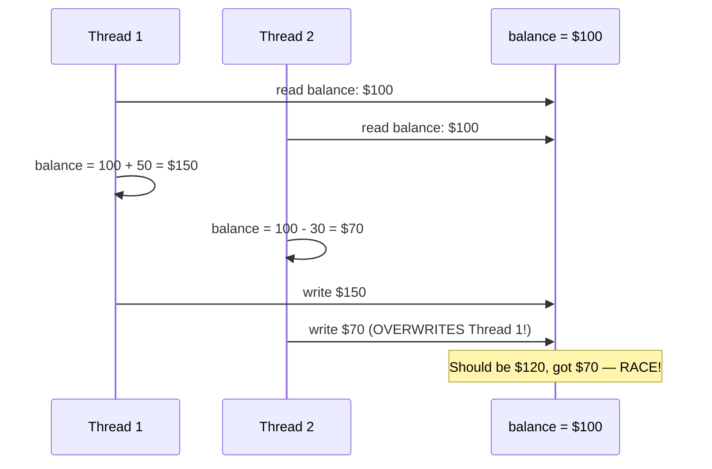
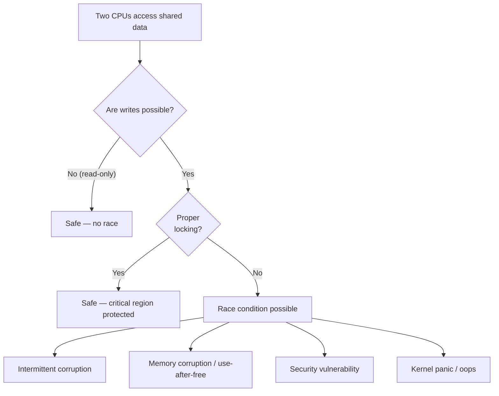

# 02 — Race Conditions

## 1. Definition

A **race condition** occurs when the correctness of a program depends on the relative timing or ordering of multiple threads of execution — and the result can change based on that timing.

---

## 2. Classic Race: Lost Update



---

## 3. Races in the Linux Kernel

### Race 1: Counter Increment
```c
/* BAD: two CPUs incrementing packet counter */
static long packets_received = 0;
void rx_packet(void) {
    packets_received++;  /* Not atomic — can lose counts */
}

/* FIX: use atomic_t */
static atomic_long_t packets_received = ATOMIC_LONG_INIT(0);
void rx_packet(void) {
    atomic_long_inc(&packets_received);
}
```

### Race 2: Check-Then-Act
```c
/* BAD: time-of-check-to-time-of-use (TOCTOU) */
if (pool->count > 0) {
    /* Another CPU could decrement count to 0 HERE */
    entry = pool->entries[--pool->count];  /* pool->count might now be -1! */
}

/* FIX: hold lock for entire check-and-use */
spin_lock(&pool->lock);
if (pool->count > 0)
    entry = pool->entries[--pool->count];
spin_unlock(&pool->lock);
```

### Race 3: List Corruption
```c
/* BAD: concurrent list modification (double-free style corruption) */
/* CPU0: iterating */          /* CPU1: deleting */
list_for_each_entry(p, &list, node) {   list_del(&entry->node);
    use(p);                              kfree(entry);
}
/* CPU0 next pointer = freed memory → use-after-free! */

/* FIX: Use RCU or lock the list */
```

---

## 4. Race Condition to Data Corruption



---

## 5. Real Example: Kernel Bug CVE-2016-4558

A race in BPF map reference counting led to use-after-free:

```c
/* Simplified vulnerable pattern: */
void update_map(struct bpf_map *map) {
    if (atomic_read(&map->refcnt) > 0) {
        /* Another thread calls bpf_map_put() here, refcnt→0, map freed! */
        map->ops->map_update(map, key, val);  /* Use-after-free! */
    }
}
```

---

## 6. Detection Tools

```bash
# KASAN — Kernel Address Sanitizer
# Detects use-after-free, out-of-bounds
CONFIG_KASAN=y

# KCSAN — Kernel Concurrency Sanitizer
# Detects data races
CONFIG_KCSAN=y

# Lockdep — deadlock and locking correctness checker
CONFIG_PROVE_LOCKING=y
CONFIG_LOCKDEP=y

# ThreadSanitizer (KCSAN runtime output)
# Shows: "data-race in <function> at <file>:<line>"
```

---

## 7. Related Concepts
- [01_Critical_Regions.md](./01_Critical_Regions.md) — What needs protection
- [03_Locking.md](./03_Locking.md) — Solutions
- [04_Deadlocks.md](./04_Deadlocks.md) — Over-enthusiastic locking problems
