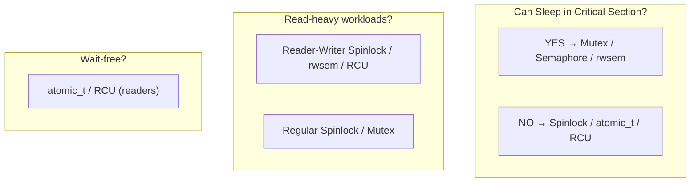
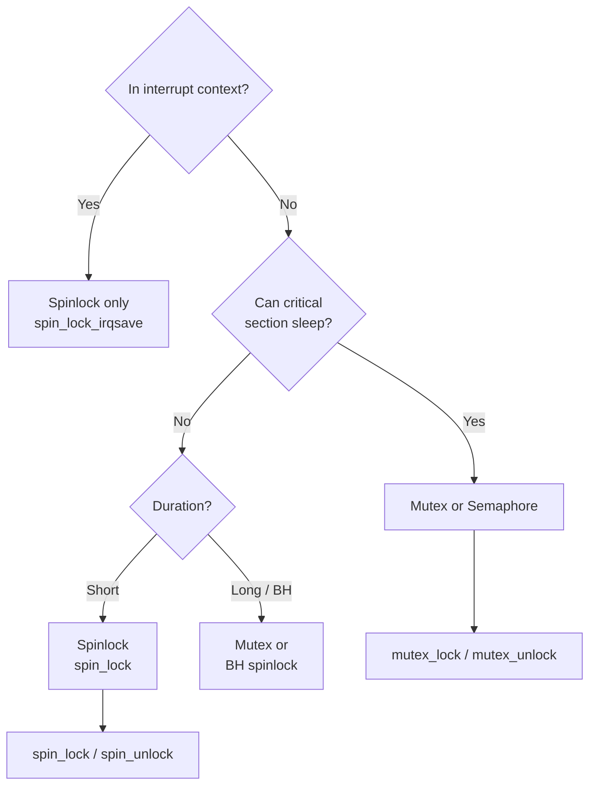

# 03 — Locking

## 1. What is Locking?

**Locking** is the primary technique for protecting critical regions. A **lock** ensures that only one execution path can be in the critical section at a time.

```
Lock → Enter critical section → Do work → Unlock → Others proceed
```

---

## 2. Kernel Lock Types Overview



---

## 3. Properties of a Good Lock

| Property | Description |
|----------|-------------|
| **Mutual exclusion** | Only one holder at a time |
| **Progress** | If no one holds it, someone will get it |
| **Bounded waiting** | No starvation — everyone eventually gets it |
| **Low overhead** | Acquisition should be fast (no syscall for uncontended) |

---

## 4. Spinlocks (Brief)

```c
DEFINE_SPINLOCK(my_lock);

spin_lock(&my_lock);
/* critical section — busy-waits on other CPUs */
spin_unlock(&my_lock);
```
- **Busy-waits** (spins in a loop) until lock is free
- For short critical sections
- Cannot sleep while holding

---

## 5. Mutexes (Brief)

```c
DEFINE_MUTEX(my_mutex);

mutex_lock(&my_mutex);
/* critical section — can sleep here */
mutex_unlock(&my_mutex);
```
- **Sleeps** if lock is held by someone else
- For longer critical sections in process context
- Cannot use in interrupt context

---

## 6. When to Use Which Lock



---

## 7. Locking Granularity

- **Coarse-grained**: One lock for whole subsystem — simple but contention high
- **Fine-grained**: Per-object locks — complex but better parallel performance

```c
/* Coarse: one lock for all inodes */
static DEFINE_SPINLOCK(global_inode_lock);

/* Fine: per-inode lock (what Linux actually does) */
struct inode {
    spinlock_t   i_lock;
    /* ... */
};
```

---

## 8. Related Concepts
- [../09_Kernel_Synchronization_Methods/02_Spin_Locks.md](../09_Kernel_Synchronization_Methods/02_Spin_Locks.md)
- [../09_Kernel_Synchronization_Methods/05_Mutex.md](../09_Kernel_Synchronization_Methods/05_Mutex.md)
- [04_Deadlocks.md](./04_Deadlocks.md) — Lock ordering problems
