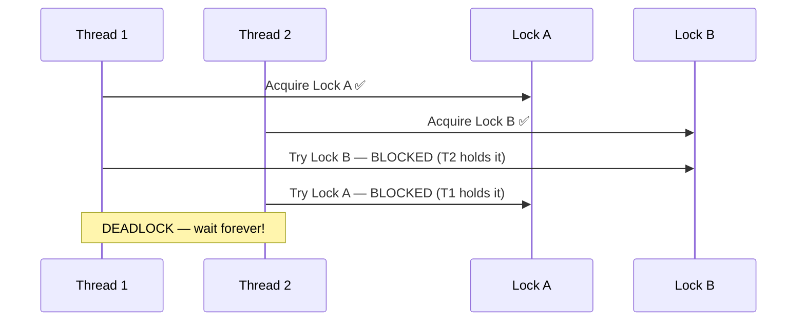
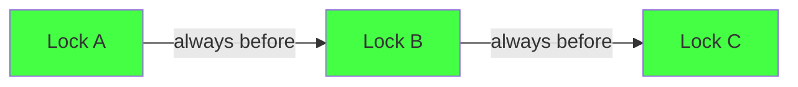

# 04 — Deadlocks

## 1. What is a Deadlock?

A **deadlock** occurs when two or more threads are each waiting for a resource held by the other — they wait forever.

---

## 2. The Classic Deadlock (Dining Philosophers)



---

## 3. Types of Deadlocks

### Self-Deadlock (Double Lock)
```c
spin_lock(&A);
spin_lock(&A);  /* Deadlock — trying to acquire already-held lock */
```

### AB-BA Deadlock
```c
/* Thread 1 */        /* Thread 2 */
spin_lock(&A);        spin_lock(&B);
spin_lock(&B);        spin_lock(&A);  /* Deadlock! */
```

### Interrupt Deadlock
```c
/* Process context */
spin_lock(&my_lock);
/* IRQ fires here! */
    /* IRQ handler */
    spin_lock(&my_lock);  /* DEADLOCK — process already holds it */
```
**Fix:** Use `spin_lock_irqsave()`.

---

## 4. Lock Ordering

Deadlocks can be **prevented** with consistent lock ordering: always acquire locks in the same order.

```c
/* Rule: always acquire A before B */
spin_lock(&A);
spin_lock(&B);
/* ... */
spin_unlock(&B);
spin_unlock(&A);  /* Release in reverse order */
```



---

## 5. Lockdep — Kernel's Deadlock Detector

The Linux kernel has a built-in **lock dependency tracker** called `lockdep`:

```c
/* Enable with: CONFIG_PROVE_LOCKING=y, CONFIG_LOCKDEP=y */

/* Lockdep tracks: */
/* - Lock classes (not individual instances) */
/* - Order of acquisition (builds dependency graph) */
/* - Detects cycles in the dependency graph */
/* - Reports on first detected violation */
```

**Example lockdep output:**
```
============================================
WARNING: possible circular locking dependency
--------------------------------------------
process/1234 is trying to acquire lock:
 (&A/1){+.+.}, at: funcA+0x12
but task is already holding lock:
 (&B/1){+.+.}, at: funcB+0x34

which lock already depends on the new lock.

the existing dependency chain (in reverse order) is:
-> (&A/1){+.+.} ops: ... { funcB }
-> (&B/1){+.+.} ops: ... { funcA }
```

---

## 6. Prevention Strategies

| Strategy | How |
|----------|-----|
| **Lock ordering** | Always acquire in the same global order |
| **Trylock + backoff** | `spin_trylock()` — fail instead of waiting |
| **Lock hierarchy** | Assign levels, never acquire lower-level lock while holding higher |
| **Avoid nested locks** | Redesign to need only one lock at a time |
| **RCU** | Lock-free reads, no ordering issues for readers |

---

## 7. Livelock

A **livelock** is similar to deadlock, but threads keep changing state in response to each other without making progress:

```c
/* Livelock example with trylock: */
while (!spin_trylock(&A))
    spin_unlock(&B);  /* Both threads keep releasing, retrying */
```

---

## 8. Related Concepts
- [03_Locking.md](./03_Locking.md) — Lock types
- [../09_Kernel_Synchronization_Methods/02_Spin_Locks.md](../09_Kernel_Synchronization_Methods/02_Spin_Locks.md) — Spinlocks
- [05_Concurrency_In_Kernel.md](./05_Concurrency_In_Kernel.md) — Why concurrency is unavoidable
