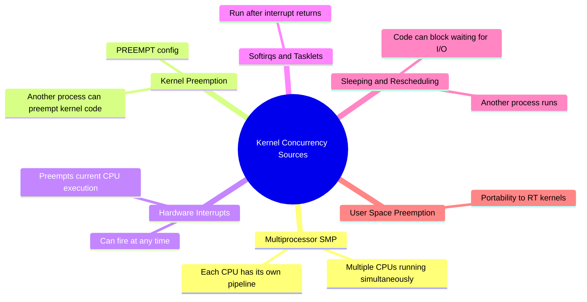
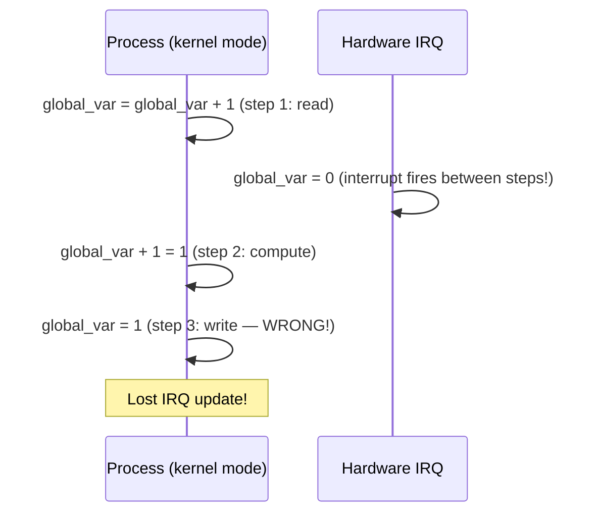
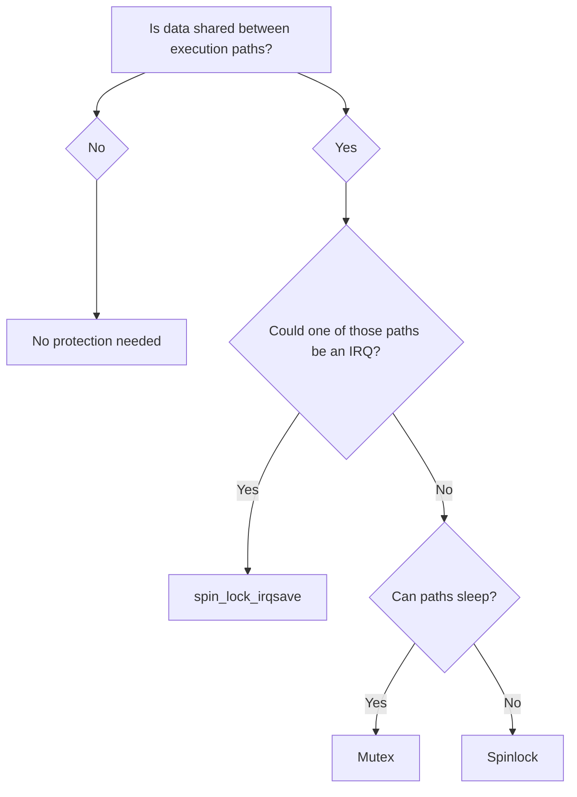

# 05 — Concurrency in the Kernel

## 1. Sources of Concurrency in Linux

The kernel is inherently concurrent due to multiple independent sources:



---

## 2. On a Single CPU (Uniprocessor)

Even without SMP, concurrency exists:



**Key insight:** Even on UP (uniprocessor), IRQs create concurrency.

---

## 3. On SMP (Symmetric Multiprocessing)

```
CPU 0                CPU 1
──────────────       ──────────────
kernel_func()        kernel_func()
  access list ─────────── access list
  (simultaneous read/write → corruption)
```

Linux is a **fully preemptive SMP-aware kernel**. Every data structure accessible from multiple CPUs needs protection.

---

## 4. Kernel Preemption

Since Linux 2.6, the kernel is **preemptible** (`CONFIG_PREEMPT`):
- A higher-priority task can preempt kernel code mid-execution
- This means kernel code must protect itself even on UP

```c
/* Without CONFIG_PREEMPT: kernel code was "safe" on UP (though IRQs still matter) */
/* With CONFIG_PREEMPT: kernel code CAN be preempted at any point */

static int counter;
counter++;  /* Might be preempted between load and store! */

/* Fix: use spinlock (disables preemption) or atomic_inc() */
```

---

## 5. What Data Needs Protection

| Data | Protection Needed |
|------|-----------------|
| Global kernel variables | Spinlock or atomic_t |
| Per-CPU variables (`DEFINE_PER_CPU`) | Usually none (by definition per-CPU) |
| Stack variables (local to function) | None (not shared) |
| Heap objects accessed only by one task | None |
| Heap objects shared across tasks/CPUs | Spinlock, mutex, RCU |
| Hardware registers (MMIO) | Usually none (serialized by bus) |

---

## 6. Summary: When to Protect



---

## 7. Related Concepts
- [02_Race_Conditions.md](./02_Race_Conditions.md) — What goes wrong
- [../09_Kernel_Synchronization_Methods/](../09_Kernel_Synchronization_Methods/) — All available synchronization primitives
- [../03_Process_Scheduling/05_Preemption.md](../03_Process_Scheduling/05_Preemption.md) — Kernel preemption
