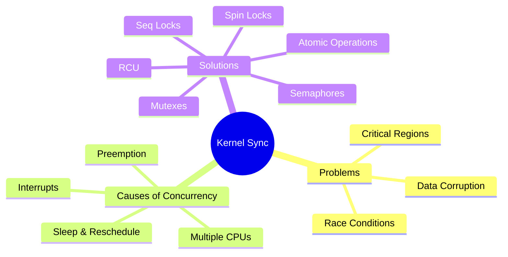

# Chapter 08 — Introduction to Kernel Synchronization

## Overview

When multiple execution paths access shared data concurrently, **synchronization** is required to prevent **race conditions** and data corruption.

## Topics

| File | Topic |
|------|-------|
| [01_Critical_Regions.md](./01_Critical_Regions.md) | What is a critical region |
| [02_Race_Conditions.md](./02_Race_Conditions.md) | Race conditions — causes and examples |
| [03_Locking.md](./03_Locking.md) | Locking principles and approaches |
| [04_Deadlocks.md](./04_Deadlocks.md) | Deadlocks, livelocks, detection |
| [05_Concurrency_In_Kernel.md](./05_Concurrency_In_Kernel.md) | Sources of concurrency in Linux |
