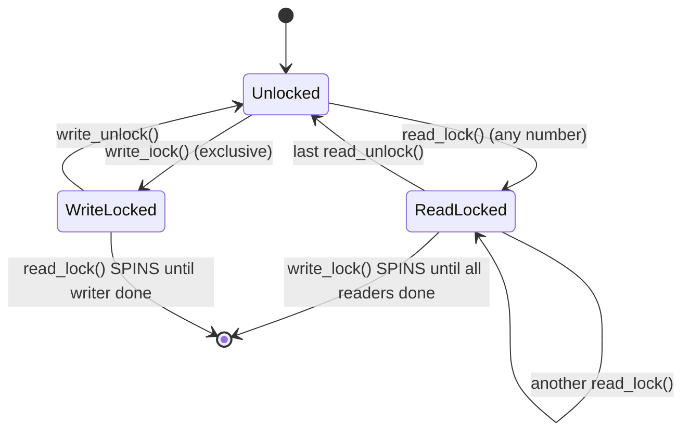

# 03 — Reader-Writer Spin Locks

## 1. Concept

A **reader-writer spinlock** (`rwlock_t`) allows **multiple concurrent readers** OR **one exclusive writer**, but not both simultaneously.

**Use case:** Data read frequently but written rarely (e.g., routing tables, file system caches).

---

## 2. API

```c
rwlock_t my_rwlock = __RW_LOCK_UNLOCKED(my_rwlock);
/* or: DEFINE_RWLOCK(my_rwlock); */

/* Reader */
read_lock(&my_rwlock);
/* ... read shared data (multiple readers OK) ... */
read_unlock(&my_rwlock);

/* Writer */
write_lock(&my_rwlock);
/* ... modify shared data (exclusive) ... */
write_unlock(&my_rwlock);

/* IRQ-safe versions */
read_lock_irqsave(&my_rwlock, flags);
read_unlock_irqrestore(&my_rwlock, flags);
write_lock_irqsave(&my_rwlock, flags);
write_unlock_irqrestore(&my_rwlock, flags);
```

---

## 3. Behavior Diagram



---

## 4. Writer Starvation Warning

Standard `rwlock_t` can **starve writers** if readers continuously hold the lock:
- New readers can always acquire while other readers hold
- Writer must wait for ALL current readers to finish
- If readers keep arriving, writer never gets in

**Solution:** Use `seqlock_t` (Chapter 09/07) or RCU (Chapter 09/08) for writer-priority or lock-free reads.

---

## 5. Usage Example: Kernel Routing Table

```c
/* net/ipv4/fib_frontend.c pattern */
static DEFINE_RWLOCK(fib_rules_lock);

/* Route lookup (read) — happens millions of times/sec */
static struct fib_result fib_lookup(struct net *net, struct flowi4 *flp)
{
    struct fib_result res;
    read_lock(&fib_rules_lock);
    fib_rules_lookup(net->ipv4.rules_ops, flowi4_to_flowi(flp), 0, &res);
    read_unlock(&fib_rules_lock);
    return res;
}

/* Route update (write) — happens rarely */
static int fib_add_rule(struct net *net, struct fib_rule *rule)
{
    write_lock(&fib_rules_lock);
    list_add(&rule->list, &net->ipv4.rules_list);
    write_unlock(&fib_rules_lock);
    return 0;
}
```

---

## 6. vs rwsem (Sleeping RW Lock)

| | rwlock_t | rwsem |
|-|---------|-------|
| Can holder sleep? | No | Yes |
| Use in IRQ context? | Yes | No |
| Waiting behavior | Spin | Sleep |
| Overhead | Low | Higher |

For sleepable read-write locking, use `struct rw_semaphore` (`rwsem`):
```c
DECLARE_RWSEM(my_rwsem);
down_read(&my_rwsem);
up_read(&my_rwsem);
down_write(&my_rwsem);
up_write(&my_rwsem);
```

---

## 7. Source Files

| File | Description |
|------|-------------|
| `include/linux/rwlock.h` | rwlock_t API |
| `include/linux/rwsem.h` | rw_semaphore |
| `kernel/locking/rwsem.c` | rwsem implementation |

---

## 8. Related Concepts
- [02_Spin_Locks.md](./02_Spin_Locks.md) — Basic spinlock
- [07_Seq_Locks.md](./07_Seq_Locks.md) — Writer-priority alternative
- [08_RCU.md](./08_RCU.md) — Lock-free reads with RCU
