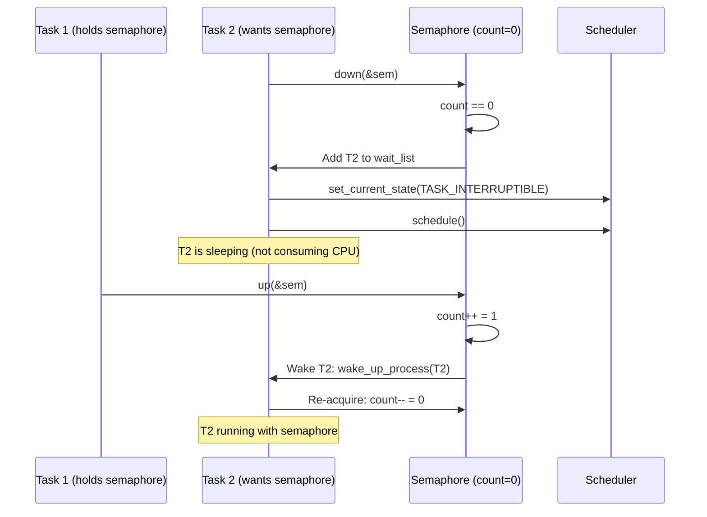

# 04 — Semaphores

## 1. What is a Semaphore?

A **semaphore** is a sleeping lock with a **count**:
- When count > 0: task can acquire (decrements count)
- When count == 0: task **sleeps** until another task releases (increments count)

**Types:**
- **Binary semaphore (mutex-like)**: initialized to 1 — mutual exclusion
- **Counting semaphore**: initialized to N — allows N concurrent accessors

---

## 2. Data Structure

```c
/* include/linux/semaphore.h */
struct semaphore {
    raw_spinlock_t  lock;       /* Protect internal state */
    unsigned int    count;      /* Current count */
    struct list_head wait_list; /* Tasks waiting */
};
```

---

## 3. API

```c
/* Static initialization */
static DEFINE_SEMAPHORE(my_sem);       /* Counting semaphore, count=1 */

/* Dynamic initialization */
struct semaphore my_sem;
sema_init(&my_sem, 1);   /* Init with count n */

/* Acquire (decrement count, sleep if 0) */
down(&my_sem);                         /* Uninterruptible sleep */
down_interruptible(&my_sem);           /* Returns -EINTR on signal */
down_killable(&my_sem);                /* Returns -EINTR on fatal signal only */
down_trylock(&my_sem);                 /* Returns 0 if acquired, 1 if not */
down_timeout(&my_sem, jiffies);        /* Timeout version */

/* Release (increment count, wake waiters) */
up(&my_sem);
```

---

## 4. Sleeping Flow



---

## 5. Semaphore vs Mutex

| Property | Semaphore | Mutex |
|----------|-----------|-------|
| Ownership | None (any task can `up`) | Owner-only can unlock |
| Can count > 1? | Yes | No |
| Interrupt context? | No (sleeps) | No (sleeps) |
| Priority inheritance? | No | Yes (kernel mutex) |
| Preferred for? | Counting resources | Mutual exclusion |

> In modern Linux, **prefer `mutex_lock()` over binary semaphores**. Mutexes have better debugging, priority inheritance, and adaptive spinning.

---

## 6. Counting Semaphore Example

```c
/* Use case: limit concurrent connections to N=5 */
static DEFINE_SEMAPHORE(connection_sem);
static int max_connections = 5;

void init_semaphore(void)
{
    sema_init(&connection_sem, max_connections);
}

int handle_connection(void)
{
    /* Acquire one slot */
    if (down_interruptible(&connection_sem))
        return -EINTR;
    
    /* Process connection */
    do_connection_work();
    
    /* Release slot */
    up(&connection_sem);
    return 0;
}
```

---

## 7. Source Files

| File | Description |
|------|-------------|
| `include/linux/semaphore.h` | API |
| `kernel/locking/semaphore.c` | Implementation |

---

## 8. Related Concepts
- [05_Mutex.md](./05_Mutex.md) — Preferred over binary semaphore
- [06_Completion_Variables.md](./06_Completion_Variables.md) — One-shot synchronized event
