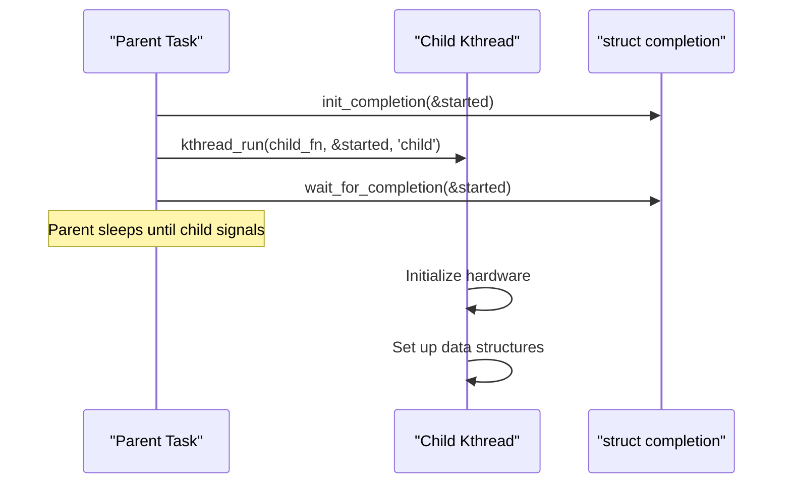

# 06 — Completion Variables

## 1. What is a Completion Variable?

A **completion variable** is a simple one-shot synchronization mechanism: **wait until some event occurs**.

Think of it as: "Signal me when you're done."

Compared to semaphores initialized to 0, completions are:
- More semantically clear
- Slightly optimized for the "wait once" case
- Cannot miss a signal that fires before waiter arrives

---

## 2. Data Structure

```c
/* include/linux/completion.h */
struct completion {
    unsigned int    done;           /* 0 = not done, N = done N times */
    struct swait_queue_head wait;   /* Waiting tasks */
};
```

---

## 3. API

```c
/* Static initialization */
DECLARE_COMPLETION(my_comp);
/* or: */
static DECLARE_COMPLETION_ONSTACK(my_comp);  /* For stack variables */

/* Dynamic initialization */
struct completion my_comp;
init_completion(&my_comp);

/* Re-initialize for reuse */
reinit_completion(&my_comp);

/* Wait (block) until completed */
wait_for_completion(&my_comp);                      /* Uninterruptible */
wait_for_completion_interruptible(&my_comp);        /* -ERESTARTSYS on signal */
wait_for_completion_killable(&my_comp);             /* -ERESTARTSYS on fatal signal */
wait_for_completion_timeout(&my_comp, timeout);     /* Returns remaining jiffies or 0 */

/* Signal completion (wake all waiters) */
complete(&my_comp);          /* Wake ONE waiter */
complete_all(&my_comp);      /* Wake ALL waiters */
```

---

## 4. Classic Usage: Thread Startup Notification


    Child->>Comp: complete(&started)
    Note over Parent: Woken up — child is ready
    Parent->>Parent: Continue (child is ready)
```

```c
/* Example implementation */
struct completion started;

static int child_thread(void *data)
{
    struct completion *started = data;

    /* Do initialization work */
    if (init_hardware() < 0) {
        /* Signal parent even on error — else parent waits forever */
        complete(started);
        return -EIO;
    }

    /* Signal parent we're ready */
    complete(started);

    /* Now run main loop */
    while (!kthread_should_stop()) {
        do_work();
        schedule();
    }
    return 0;
}

static int start_child(void)
{
    init_completion(&started);

    task = kthread_run(child_thread, &started, "my_child");
    if (IS_ERR(task))
        return PTR_ERR(task);

    /* Wait for child to initialize */
    wait_for_completion(&started);
    return 0;
}
```

---

## 5. Device Driver Example: DMA Completion

```c
struct my_dma {
    struct completion   dma_done;
    dma_addr_t          phys;
    void                *virt;
};

/* Called from DMA interrupt handler */
static void dma_irq_handler(void *data)
{
    struct my_dma *dma = data;
    complete(&dma->dma_done);  /* Wake the waiting DMA transaction */
}

/* Function waiting for DMA */
int do_dma_transfer(struct my_dma *dma, void *buf, size_t len)
{
    reinit_completion(&dma->dma_done);

    /* Start DMA */
    start_dma(dma, buf, len);

    /* Wait up to 5 seconds */
    if (!wait_for_completion_timeout(&dma->dma_done, 5 * HZ)) {
        dev_err(dev, "DMA timeout!\n");
        return -ETIMEDOUT;
    }

    return 0;
}
```

---

## 6. Completion vs Semaphore

| Property | Completion | Semaphore (count=0) |
|----------|-----------|-------------------|
| Semantic | "Wait for event" | "Acquire resource" |
| Signal before wait? | Handled (done flag) | May lose |
| wake_all | `complete_all()` | Loop `up()` |
| Clarity | Higher | Lower |
| Preferred for? | One-shot events | Counting |

---

## 7. Source Files

| File | Description |
|------|-------------|
| `include/linux/completion.h` | API |
| `kernel/sched/completion.c` | Implementation |

---

## 8. Related Concepts
- [04_Semaphores.md](./04_Semaphores.md) — Alternative sleeping mechanism
- [05_Mutex.md](./05_Mutex.md) — Mutual exclusion
- [../02_Process_Management/06_Threads_In_Linux.md](../02_Process_Management/06_Threads_In_Linux.md) — Kernel threads
