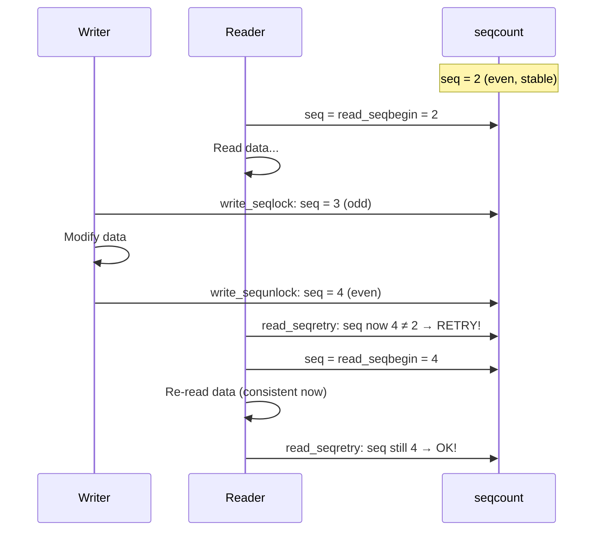

# 07 — Seq Locks

## 1. What is a Seq Lock?

A **sequence lock** (`seqlock_t`) is a lightweight read-write mechanism that **favors writers** and allows readers to proceed **without blocking** — but readers may need to **retry** if a write occurred during their read.

**Key property:** Reads are optimistic — they never block but check for consistency.

---

## 2. Data Structure

```c
/* include/linux/seqlock.h */
typedef struct {
    struct seqcount seqcount;  /* Sequence counter (always even = stable) */
    spinlock_t lock;           /* Protects writers */
} seqlock_t;
```

**The sequence counter:**
- **Even** = data is stable (no write in progress)
- **Odd** = write in progress
- Writer increments: even → odd (start), odd → even (done)
- Reader checks before and after: if changed, retry

---

## 3. API

```c
/* Initialize */
seqlock_t my_seqlock = __SEQLOCK_UNLOCKED(my_seqlock);
/* or: DEFINE_SEQLOCK(my_seqlock); */

/* Writer side (exclusive) */
write_seqlock(&my_seqlock);       /* Increment seq to ODD, acquire spinlock */
/* --- modify shared data --- */
write_sequnlock(&my_seqlock);     /* Increment seq to EVEN, release spinlock */

/* Reader side (lock-free, may retry) */
unsigned int seq;
do {
    seq = read_seqbegin(&my_seqlock);  /* Read current seq */
    /* --- read shared data --- */
} while (read_seqretry(&my_seqlock, seq));  /* Retry if seq changed */
```

---

## 4. Seqlock Flow



---

## 5. Real Example: jiffies

The most famous use of seqlocks in the kernel is `jiffies_64`:

```c
/* kernel/time/timer.c */
DEFINE_SEQLOCK(jiffies_lock);
u64 jiffies_64 __cacheline_aligned_in_smp = INITIAL_JIFFIES;

/* Timer interrupt updates jiffies: */
write_seqlock(&jiffies_lock);
jiffies_64++;
write_sequnlock(&jiffies_lock);

/* Code reading jiffies: */
u64 get_jiffies64(void)
{
    unsigned long seq;
    u64 ret;
    
    do {
        seq = read_seqbegin(&jiffies_lock);
        ret = jiffies_64;
    } while (read_seqretry(&jiffies_lock, seq));
    
    return ret;
}
```

---

## 6. seqcount (Without Lock)

If you already hold a lock on the write side, use `seqcount_t` directly:

```c
seqcount_t my_seq;
seqcount_init(&my_seq);

/* Writer (already holding some other lock) */
write_seqcount_begin(&my_seq);
/* modify */
write_seqcount_end(&my_seq);

/* Reader */
unsigned int seq;
do {
    seq = read_seqcount_begin(&my_seq);
    /* read */
} while (read_seqcount_retry(&my_seq, seq));
```

---

## 7. When to Use Seqlocks

| Use seqlock when | Don't use seqlock when |
|-----------------|----------------------|
| Writes are rare | Writes are frequent (readers retry too much) |
| Reads are frequent | Data contains pointers (read retry doesn't undo pointer dereference) |
| Data is simple (integers, jiffies) | Critical to not retry (real-time code) |
| Writer priority needed | You need blocking behavior |

---

## 8. Source Files

| File | Description |
|------|-------------|
| `include/linux/seqlock.h` | Full API |
| `kernel/time/timer.c` | jiffies usage |

---

## 9. Related Concepts
- [03_Reader_Writer_Spin_Locks.md](./03_Reader_Writer_Spin_Locks.md) — Blocking RW alternative
- [08_RCU.md](./08_RCU.md) — Truly lock-free reads with pointers
- [../10_Timers_And_Time_Management/](../10_Timers_And_Time_Management/) — jiffies and time keeping
