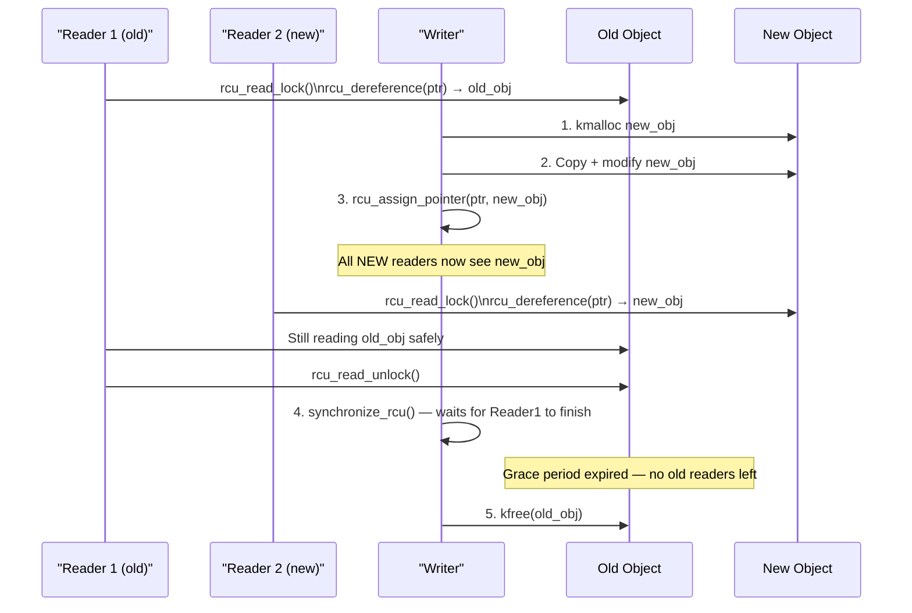
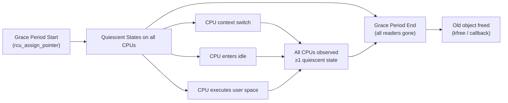

# 08 — RCU (Read-Copy-Update)

## 1. What is RCU?

**Read-Copy-Update (RCU)** is a synchronization mechanism where:
- **Readers** are **completely lock-free** — never block, never spin
- **Writers** make changes to a **copy**, then atomically publish
- **Old copies** are freed only after all pre-existing readers finish (grace period)

RCU is used in performance-critical code: routing tables, kernel modules list, task list, inode cache.

---

## 2. Core Concepts

### Read Side
```c
rcu_read_lock();        /* Marks start of RCU read-side critical section */
/* ... read RCU-protected data ... */
rcu_read_unlock();      /* Marks end — defers reclamation of old objects */
```

### Write Side
```c
/* 1. Make a copy of the data structure */
/* 2. Modify the copy */
/* 3. Atomically publish via rcu_assign_pointer() */
/* 4. Wait for existing readers to finish (grace period) */
/* 5. Free the old version */
```

---

## 3. RCU Update Flow



---

## 4. API

```c
/* Read side */
rcu_read_lock();                  /* Enter RCU read-side critical section */
rcu_read_unlock();                /* Exit */
ptr = rcu_dereference(rcu_ptr);   /* Safe pointer dereference (compiler + memory barrier) */

/* Write side: publish pointer */
rcu_assign_pointer(rcu_ptr, new_val);  /* Atomic publish with memory barrier */

/* Write side: wait for readers */
synchronize_rcu();        /* Blocks until all pre-existing readers exit */
call_rcu(&head, func);    /* Async: call func after all pre-existing readers exit */
kfree_rcu(obj, rcu_head); /* Convenience: free obj after grace period */
```

---

## 5. Complete Example: Updatable Pointer

```c
#include <linux/rcupdate.h>

struct config {
    int max_size;
    char name[64];
    struct rcu_head rcu;   /* For kfree_rcu */
};

/* RCU-protected pointer */
static struct config __rcu *current_config;

/* Reader (can be called from anywhere, including softirq) */
int get_max_size(void)
{
    int size;
    struct config *cfg;

    rcu_read_lock();
    cfg = rcu_dereference(current_config);
    size = cfg ? cfg->max_size : -1;
    rcu_read_unlock();

    return size;
}

/* Writer (process context only) */
int update_config(int new_max, const char *new_name)
{
    struct config *old_cfg;
    struct config *new_cfg;

    /* 1. Allocate and initialize new config */
    new_cfg = kmalloc(sizeof(*new_cfg), GFP_KERNEL);
    if (!new_cfg)
        return -ENOMEM;
    new_cfg->max_size = new_max;
    strncpy(new_cfg->name, new_name, sizeof(new_cfg->name) - 1);

    /* 2. Install new config (atomic) */
    old_cfg = rcu_dereference_protected(current_config, 1);
    rcu_assign_pointer(current_config, new_cfg);

    /* 3. Free old config after grace period */
    if (old_cfg)
        kfree_rcu(old_cfg, rcu);  /* kfree_rcu = call_rcu + kfree */

    return 0;
}
```

---

## 6. RCU List Operations

RCU-safe variants of list operations:

```c
/* include/linux/rculist.h */

/* Add node to RCU list (writer) */
list_add_rcu(&new_entry->list, &head);
list_add_tail_rcu(&new_entry->list, &head);

/* Delete from RCU list (writer) */
list_del_rcu(&entry->list);
/* Then: synchronize_rcu(); kfree(entry); */
/* Or: call_rcu(&entry->rcu, entry_free_fn); */

/* Iterate RCU list (reader — must be in rcu_read_lock section) */
rcu_read_lock();
list_for_each_entry_rcu(entry, &head, list) {
    /* safe read of entry */
}
rcu_read_unlock();
```

---

## 7. Grace Periods and Quiescent States


```

---

## 8. RCU Variants

| Variant | Use case |
|---------|---------|
| `rcu` | General purpose |
| `rcu_bh` | For code that disables BH |
| `rcu_sched` | For code that disables scheduling |
| `srcu` | Sleepable RCU (read side can sleep) |
| `RCU_TASKS_*` | For task_struct list |

---

## 9. Source Files

| File | Description |
|------|-------------|
| `include/linux/rcupdate.h` | Core RCU API |
| `include/linux/rculist.h` | RCU list operations |
| `kernel/rcu/tree.c` | Tree-based RCU implementation |
| `Documentation/RCU/` | Extensive RCU documentation |

---

## 10. Related Concepts
- [07_Seq_Locks.md](./07_Seq_Locks.md) — Lock-free reads for simple data
- [03_Reader_Writer_Spin_Locks.md](./03_Reader_Writer_Spin_Locks.md) — Simpler RW alternative
- [../05_Kernel_Data_Structures/01_Linked_Lists.md](../05_Kernel_Data_Structures/01_Linked_Lists.md) — list_head used with RCU
