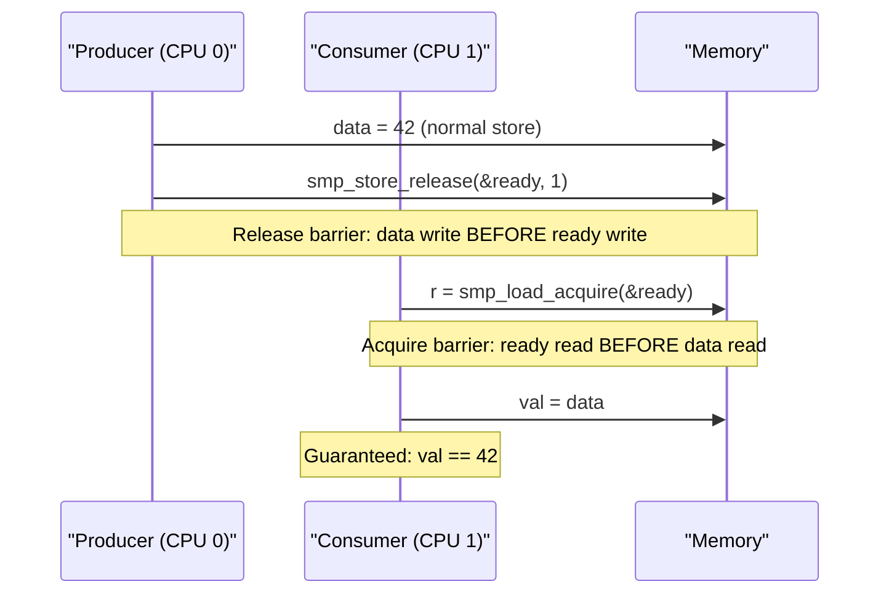

# 09 — Memory Ordering and Barriers

## 1. The Problem: CPU and Compiler Reordering

Modern CPUs and compilers **reorder** memory operations to improve performance. This is fine for single-threaded code but can break multi-CPU synchronization.

```c
/* Programmer writes: */
data = 42;         /* (1) Write data */
flag = 1;          /* (2) Signal data is ready */

/* CPU/compiler might execute: */
flag = 1;          /* (2) REORDERED FIRST! */
data = 42;         /* (1) Executed after */

/* Result: Another CPU reads flag=1 but data is still stale! */
```

---

## 2. Types of Reordering

| Type | Description |
|------|-------------|
| Compiler reordering | Compiler reorders for optimization |
| CPU store-store reordering | Two writes executed out of order |
| CPU load-load reordering | Two reads executed out of order |
| CPU load-store reordering | Load and store swapped |
| CPU store-load reordering | Store before load can be reordered (most CPUs) |

**x86 is strongly ordered:** Only store-load may be reordered. ARM/RISC-V are weakly ordered.

---

## 3. Memory Barrier APIs

```c
/* Full barrier — prevents all reordering across it */
smp_mb();     /* read-write memory barrier */
mb();         /* Same but also for MMIO (includes CPU + MMIO) */

/* Read barrier — prevent load reordering */
smp_rmb();    /* All prior loads complete before subsequent loads */
rmb();        /* Includes MMIO reads */

/* Write barrier — prevent store reordering */
smp_wmb();    /* All prior stores complete before subsequent stores */
wmb();        /* Includes MMIO writes */

/* Compiler-only barrier (no CPU instruction) */
barrier();    /* Prevents compiler from reordering across this point */

/* Acquire/Release semantics */
smp_load_acquire(&var);       /* Load + acquire barrier after */
smp_store_release(&var, val); /* Release barrier before + store */
```

---

## 4. Fix: Producer-Consumer with Barrier

```c
/* Producer */
WRITE_ONCE(data, 42);
smp_wmb();              /* Ensure data write completes before flag write */
WRITE_ONCE(flag, 1);

/* Consumer */
while (!READ_ONCE(flag)) { }  /* Wait for flag */
smp_rmb();                     /* Ensure flag read completes before data read */
val = READ_ONCE(data);         /* Now guaranteed to see 42 */
```

---

## 5. WRITE_ONCE / READ_ONCE

```c
/* Without: compiler may read/write only once and cache in register */
/* This loop may never exit if compiler caches 'done' in a register: */
while (!done) { }

/* With: compiler reads variable every iteration */
while (!READ_ONCE(done)) { }

/* Prevents "load fusing" and "store tearing" */
WRITE_ONCE(ptr, new_val);  /* Atomic single-width store */
READ_ONCE(ptr);            /* Atomic single-width load */
```

---

## 6. Acquire/Release Pattern


```

---

## 7. Memory Model: LKMM

The Linux Kernel Memory Model (LKMM) formally defines allowed reorderings. Key rules:
- Spinlocks: `spin_lock` is acquire, `spin_unlock` is release
- RCU: `rcu_read_lock` is acquire, `synchronize_rcu` adds barrier
- Atomics with `_acquire/_release/_relaxed` suffix control ordering

---

## 8. I/O Memory Barriers (MMIO)

```c
/* For memory-mapped I/O registers: */
writel(val, reg);     /* Write to MMIO */
wmb();                /* Ensure write reaches hardware before next write */
writel(val2, reg2);

readl(reg);           /* Read from MMIO */
rmb();                /* Ensure read completes before acting on result */
```

---

## 9. Source Files

| File | Description |
|------|-------------|
| `include/linux/compiler.h` | WRITE_ONCE, READ_ONCE, barrier() |
| `include/asm-generic/barrier.h` | Generic barrier definitions |
| `arch/x86/include/asm/barrier.h` | x86-specific barriers |
| `Documentation/memory-barriers.txt` | Comprehensive 4000-line doc |
| `tools/memory-model/` | LKMM formal model |

---

## 10. Related Concepts
- [01_Atomic_Operations.md](./01_Atomic_Operations.md) — Atomic ops with implicit barriers
- [08_RCU.md](./08_RCU.md) — RCU uses barriers internally
- [02_Spin_Locks.md](./02_Spin_Locks.md) — Spinlocks provide implicit acquire/release
