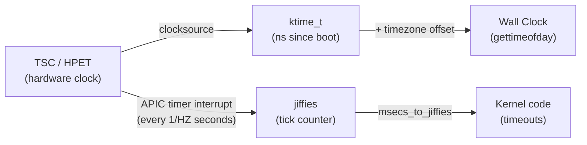
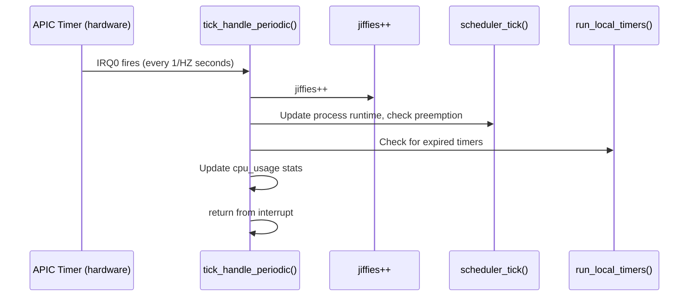

# 01 — Jiffies and HZ

## 1. What are Jiffies?

`jiffies` is a global counter that increments once per **timer interrupt tick**. It is the kernel's basic unit of time.

```c
/* include/linux/jiffies.h */
extern unsigned long volatile jiffies;
extern u64 jiffies_64;  /* 64-bit version — doesn't wrap for 584 million years */
```

---

## 2. HZ — Timer Interrupt Frequency

`HZ` is the number of timer interrupts per second. It is a compile-time constant:

```c
/* Typical values: */
/* CONFIG_HZ = 100  → 10ms resolution — servers, embedded */
/* CONFIG_HZ = 250  → 4ms resolution — desktop default */
/* CONFIG_HZ = 300  → 3.33ms resolution — some mobile */
/* CONFIG_HZ = 1000 → 1ms resolution — low-latency desktops */
```

```bash
# Check current HZ:
grep "^CONFIG_HZ=" /boot/config-$(uname -r)
# Or at runtime:
getconf CLK_TCK   # Usually returns 100 (USER_HZ, not CONFIG_HZ)
```

---

## 3. Jiffies Arithmetic

```c
/* Convert between jiffies and time */
unsigned long j;

j = jiffies + HZ;          /* 1 second from now */
j = jiffies + 2*HZ;        /* 2 seconds from now */
j = jiffies + HZ/2;        /* 500ms from now */
j = jiffies + msecs_to_jiffies(250);  /* 250ms */
j = jiffies + usecs_to_jiffies(500);  /* 500us */

/* Convert jiffies back to time */
unsigned long ms = jiffies_to_msecs(jiffies);
unsigned long us = jiffies_to_usecs(jiffies);
```

---

## 4. Comparing Jiffies (Wrapping!)

**WARNING:** `jiffies` wraps around after ~49.7 days (32-bit) or never (64-bit). Always use the provided macros:

```c
/* CORRECT: Use time_after / time_before (handle wrap-around) */
if (time_after(jiffies, timeout))      /* jiffies > timeout */
    /* timeout expired */;
    
if (time_before(jiffies, deadline))    /* jiffies < deadline */
    /* still have time */;

if (time_after_eq(jiffies, deadline))  /* jiffies >= deadline */
    /* expired */;

/* WRONG: Direct comparison — fails on wrap-around */
if (jiffies > timeout)  /* BUG: fails when jiffies wraps! */
```

---

## 5. Jiffies vs Wall Time



---

## 6. Real Wall Clock Time

```c
/* Get current wall clock time in nanoseconds */
struct timespec64 ts;
ktime_get_real_ts64(&ts);          /* CLOCK_REALTIME */
ktime_get_ts64(&ts);               /* CLOCK_MONOTONIC (no leap second jumps) */
ktime_get_boottime_ts64(&ts);      /* CLOCK_BOOTTIME (includes suspend time) */

/* ktime_t — single nanosecond value */
ktime_t now = ktime_get();                 /* Monotonic */
ktime_t real = ktime_get_real();           /* Wall clock */
s64 ns = ktime_to_ns(ktime_get());         /* Convert to nanoseconds */
```

---

## 7. Timer Tick Flow



---

## 8. Source Files

| File | Description |
|------|-------------|
| `include/linux/jiffies.h` | jiffies, HZ, time_after, conversions |
| `kernel/time/timer.c` | jiffies update, timer wheel |
| `kernel/time/timekeeping.c` | ktime_get, wall clock |
| `arch/x86/kernel/time.c` | x86 timer setup |

---

## 9. Related Concepts
- [02_Kernel_Timers.md](./02_Kernel_Timers.md) — Using jiffies for timeouts
- [03_High_Resolution_Timers.md](./03_High_Resolution_Timers.md) — Nanosecond timers
- [05_Clocksource_And_Clockevents.md](./05_Clocksource_And_Clockevents.md) — Hardware abstraction
