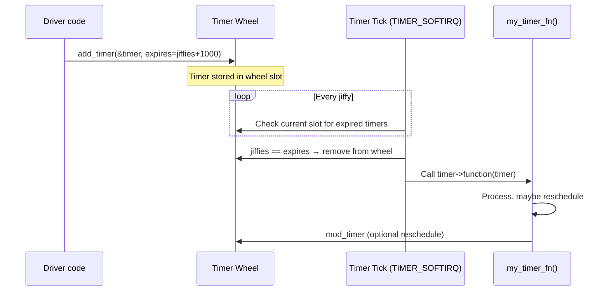

# 02 — Kernel Timers (timer_list)

## 1. What is a Kernel Timer?

A **kernel timer** (`struct timer_list`) is a mechanism to run a function at a **future time**, specified in jiffies. They run in **softirq context** (TIMER_SOFTIRQ) — cannot sleep.

---

## 2. Data Structure

```c
/* include/linux/timer.h */
struct timer_list {
    struct hlist_node   entry;      /* Timer wheel entry */
    unsigned long       expires;    /* Expiration time in jiffies */
    void                (*function)(struct timer_list *);  /* Callback */
    u32                 flags;      /* TIMER_* flags */
    /* ... lockdep, stats ... */
};
```

---

## 3. API

```c
/* Declare and initialize */
struct timer_list my_timer;
timer_setup(&my_timer, my_timer_fn, 0);  /* Modern (kernel 4.15+) */

/* Or with embedded struct (common pattern): */
struct my_device {
    struct timer_list timer;
    /* ... */
};
timer_setup(&dev->timer, my_timer_fn, 0);

/* Add/start timer */
my_timer.expires = jiffies + msecs_to_jiffies(500);  /* Expire in 500ms */
add_timer(&my_timer);

/* Modify expiry time */
mod_timer(&my_timer, jiffies + HZ);   /* Cancels old, re-sets to 1s */

/* Cancel timer (safe to call even if not active) */
del_timer(&my_timer);              /* Does NOT wait for callback */
del_timer_sync(&my_timer);         /* Waits for callback to finish */

/* Check if timer is active */
timer_pending(&my_timer);
```

---

## 4. Timer Callback

```c
static void my_timer_fn(struct timer_list *t)
{
    struct my_device *dev = from_timer(dev, t, timer);
    /* from_timer = container_of(t, type, member) */
    
    /* DO: */
    /* - Access shared data with spinlock */
    /* - Schedule tasklet/work queue for slow work */
    /* - Reschedule self (for periodic timers) */
    
    /* DO NOT: */
    /* - Sleep */
    /* - Block */
    /* - Call mutex_lock */
    
    /* Reschedule for next 1 second */
    mod_timer(&dev->timer, jiffies + HZ);
}
```

---

## 5. Timer Execution Flow



---

## 6. Timer Wheel

The kernel uses a **hierarchical timer wheel** for O(1) timer insertion and lookup:

```
Level 0: 256 slots, each = 1 jiffy
Level 1: 64 slots, each = 256 jiffies (~2.5s at HZ=100)
Level 2: 64 slots, each = 16384 jiffies
Level 3: 64 slots, each = 1M jiffies
Level 4: 64 slots, each = 67M jiffies
```

- Timer is placed in appropriate slot based on `expires - jiffies`
- At each tick, check level-0 current slot
- Cascade down higher levels as lower levels roll over

---

## 7. Periodic Timer Pattern

```c
struct my_monitor {
    struct timer_list poll_timer;
    unsigned long     interval;  /* jiffies */
    atomic_t          running;
};

static void poll_timer_fn(struct timer_list *t)
{
    struct my_monitor *mon = from_timer(mon, t, poll_timer);
    
    /* Check hardware status */
    if (check_hardware_error())
        handle_error();
    
    /* Reschedule if still running */
    if (atomic_read(&mon->running))
        mod_timer(&mon->poll_timer, jiffies + mon->interval);
}

static void start_monitoring(struct my_monitor *mon)
{
    atomic_set(&mon->running, 1);
    mon->interval = msecs_to_jiffies(100);  /* Poll every 100ms */
    timer_setup(&mon->poll_timer, poll_timer_fn, 0);
    mod_timer(&mon->poll_timer, jiffies + mon->interval);
}

static void stop_monitoring(struct my_monitor *mon)
{
    atomic_set(&mon->running, 0);
    del_timer_sync(&mon->poll_timer);
}
```

---

## 8. Source Files

| File | Description |
|------|-------------|
| `include/linux/timer.h` | API |
| `kernel/time/timer.c` | Timer wheel implementation |

---

## 9. Related Concepts
- [01_Jiffies_And_HZ.md](./01_Jiffies_And_HZ.md) — jiffies reference
- [03_High_Resolution_Timers.md](./03_High_Resolution_Timers.md) — Nanosecond precision timers
- [04_Delaying_Execution.md](./04_Delaying_Execution.md) — Synchronous delays
