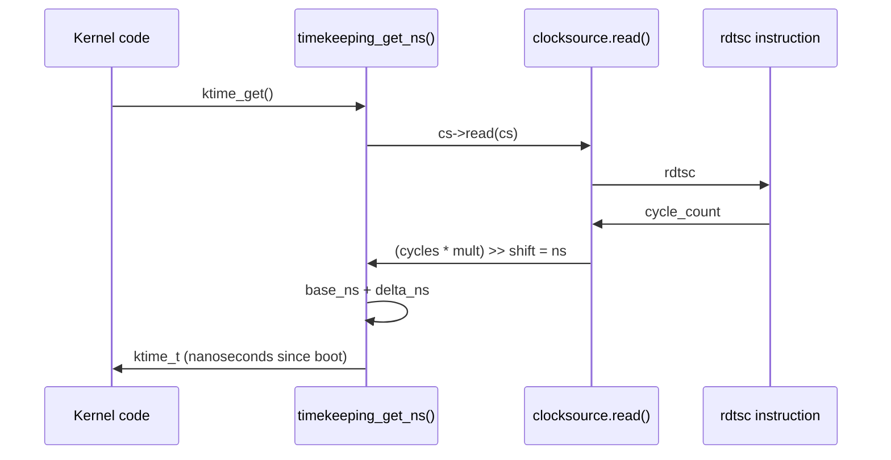

# 05 — Clocksource and Clockevents

## 1. Clocksource vs Clockevents

| | Clocksource | Clockevent |
|-|-------------|-----------|
| Purpose | **Read** current time | **Program** next interrupt |
| Direction | Passive (you read it) | Active (programs hardware IRQ) |
| Examples | TSC, HPET, ACPI PM | APIC timer, HPET, PIT |
| API | `clocksource_register_hz()` | `clockevents_register_device()` |

---

## 2. Clocksource — Timekeeping

```c
/* include/linux/clocksource.h */
struct clocksource {
    const char  *name;
    u64         (*read)(struct clocksource *cs);   /* Read current cycle count */
    u64         mask;          /* Bitmask for valid bits */
    u32         mult;          /* Multiplier for ns conversion */
    u32         shift;         /* Shift for ns conversion: ns = (cycles * mult) >> shift */
    s64         max_idle_ns;   /* Max allowed idle time */
    int         rating;        /* Quality: 1 = bad, 500 = perfect */
    /* ... */
};
```

**Rating system:**
| Rating | Source | Notes |
|--------|--------|-------|
| 500 | TSC (stable) | Best: per-CPU, fast |
| 400 | HPET | Stable across CPUs |
| 300 | ACPI PM timer | Slower but reliable |
| 200 | PIT | Fallback |

---

## 3. x86 Clocksources

```
TSC (Time Stamp Counter)   — rdtsc instruction, per-CPU, nanosecond precision
HPET (High Precision Event Timer) — system-wide, ~100ns precision
ACPI PM Timer             — 3.58 MHz, system-wide but slow
PIT (8253)                — legacy, 1.19 MHz, rarely used
```

```bash
# See available and current clocksource:
cat /sys/devices/system/clocksource/clocksource0/available_clocksource
cat /sys/devices/system/clocksource/clocksource0/current_clocksource

# Force specific clocksource (for debugging):
echo hpet > /sys/devices/system/clocksource/clocksource0/current_clocksource
```

---

## 4. ktime_get() Flow



---

## 5. Clockevent — Timer Programming

```c
/* include/linux/clockchips.h */
struct clock_event_device {
    const char  *name;
    int         (*set_next_event)(unsigned long evt,
                                  struct clock_event_device *);
    int         (*set_state_oneshot)(struct clock_event_device *);
    int         (*set_state_periodic)(struct clock_event_device *);
    void        (*event_handler)(struct clock_event_device *);
    u64         max_delta_ns;
    u64         min_delta_ns;
    /* ... */
};
```

---

## 6. Tickless / NO_HZ Kernel

Modern kernels support **NO_HZ** (tickless idle) — no timer interrupt when CPU is idle:

```bash
# Check tickless mode:
grep "nohz" /boot/config-$(uname -r)
# CONFIG_NO_HZ_IDLE=y  — stop tick when CPU is idle
# CONFIG_NO_HZ_FULL=y  — stop tick when only one task running (RT/HPC)
```

```mermaid
flowchart TD
    A{CPU idle?} -- Yes --> B[Program APIC timer for\nnext active timer expiry\n(could be seconds away)]
    B --> C[CPU enters C-state sleep]
    A -- No --> D[APIC timer fires every 1/HZ\nnormal tick]
```

---

## 7. Source Files

| File | Description |
|------|-------------|
| `include/linux/clocksource.h` | clocksource struct |
| `kernel/time/clocksource.c` | Registration, selection |
| `kernel/time/timekeeping.c` | ktime_get(), clock reads |
| `arch/x86/kernel/tsc.c` | TSC clocksource |
| `drivers/clocksource/hpet.c` | HPET clocksource |

---

## 8. Related Concepts
- [01_Jiffies_And_HZ.md](./01_Jiffies_And_HZ.md) — High-level time abstractions
- [03_High_Resolution_Timers.md](./03_High_Resolution_Timers.md) — Uses clockevents for nanosecond precision
