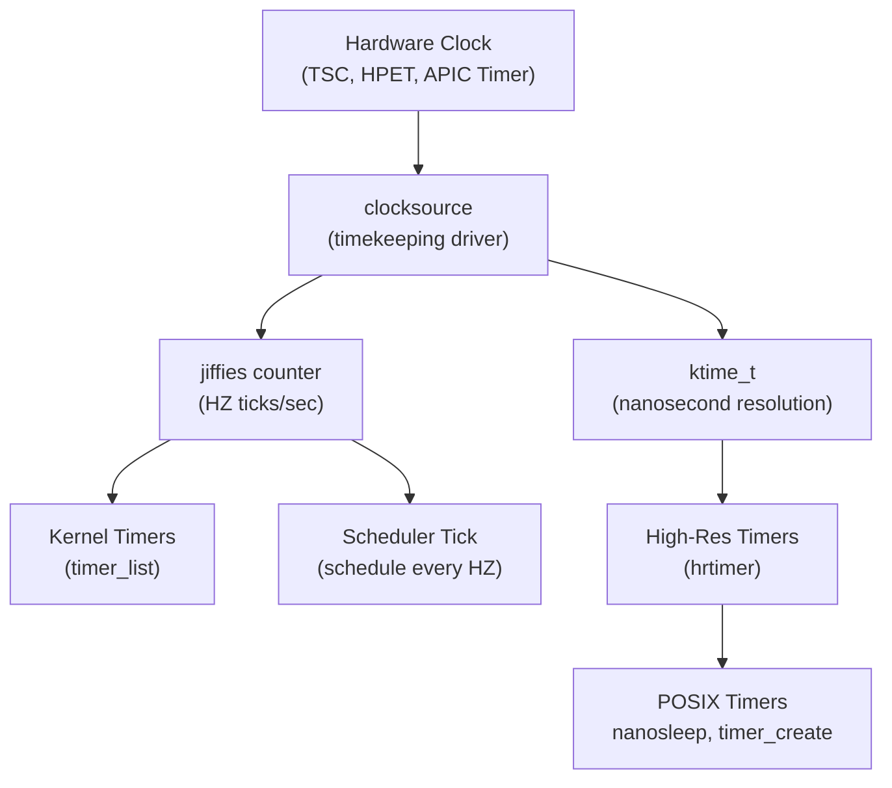

# Chapter 10 — Timers and Time Management

## Overview

The Linux kernel tracks time, provides timeout mechanisms, and runs periodic tasks using a rich timer infrastructure.



## Topics

| File | Topic |
|------|-------|
| [01_Jiffies_And_HZ.md](./01_Jiffies_And_HZ.md) | jiffies, HZ, tick rate |
| [02_Kernel_Timers.md](./02_Kernel_Timers.md) | struct timer_list, legacy timers |
| [03_High_Resolution_Timers.md](./03_High_Resolution_Timers.md) | hrtimer, nanosecond precision |
| [04_Delaying_Execution.md](./04_Delaying_Execution.md) | msleep, udelay, schedule_timeout |
| [05_Clocksource_And_Clockevents.md](./05_Clocksource_And_Clockevents.md) | Hardware clock infrastructure |

## Key Kernel Files

```
include/linux/jiffies.h        — jiffies, HZ, time_after() macros
include/linux/timer.h          — timer_list
include/linux/hrtimer.h        — hrtimer
kernel/time/timer.c            — timer implementation
kernel/time/hrtimer.c          — hrtimer implementation
kernel/time/timekeeping.c      — time keeping core
```
