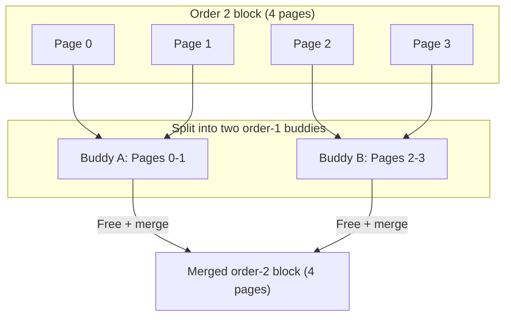

# 02 — Buddy Allocator

## 1. What is the Buddy Allocator?

The **buddy allocator** manages **physical pages** in power-of-2 blocks. It is the lowest-level page allocator in Linux.

- Allocates blocks of **1, 2, 4, 8, ... 2^MAX_ORDER pages** (up to 4 MiB with order=10)
- **External fragmentation resistant** — free adjacent buddies are merged
- Used by kmalloc, vmalloc, and slab allocators as the page pool

---

## 2. Buddy System Concept



Two blocks are **buddies** if:
1. Same size (order)
2. Adjacent physically
3. Aligned to their size

---

## 3. Free Lists (free_area)

```c
/* include/linux/mmzone.h */
struct zone {
    struct free_area    free_area[MAX_ORDER]; /* One list per order */
};

struct free_area {
    struct list_head    free_list[MIGRATE_TYPES]; /* Multiple migration types */
    unsigned long       nr_free;   /* Number of free blocks at this order */
};
```

```
free_area[0]: list of 1-page free blocks (4 KiB)
free_area[1]: list of 2-page free blocks (8 KiB)
free_area[2]: list of 4-page free blocks (16 KiB)
...
free_area[10]: list of 1024-page free blocks (4 MiB)
```

---

## 4. Allocation Algorithm

```mermaid
flowchart TD
    A["alloc_pages(order=2)"] --> B["Check free_area[2]"]
    B -- "Has free block" --> C[Remove from free_area[2]]
    B -- "Empty" --> D["Check free_area[3]"]
    D -- "Has free block" --> E["Split order-3 block:\nGive order-2 half\nPut order-2 remainder in free_area[2]"]
    D -- "Empty" --> F["Check free_area[4]... repeat"]
    C --> G[Return pages]
    E --> G
```

---

## 5. Freeing = Merging

```mermaid
flowchart TD
    A["free_pages(page, order=1)"] --> B[Calculate buddy_pfn]
    B --> C{Buddy free in free_area[1]?}
    C -- No --> D[Add to free_area[1] list]
    C -- Yes --> E[Remove buddy from free_area[1]]
    E --> F[Merge: combined block is order=2]
    F --> G{Buddy of merged block free in free_area[2]?}
    G -- No --> H[Add to free_area[2] list]
    G -- Yes --> I[Repeat merging...]
```

---

## 6. API

```c
/* Include */
#include <linux/gfp.h>

/* Allocate 2^order contiguous pages */
struct page *page = alloc_pages(GFP_KERNEL, order);
struct page *page = alloc_page(GFP_KERNEL);  /* order=0, 1 page */

/* Get kernel virtual address */
void *virt = page_address(page);

/* Or combined: */
unsigned long ptr = __get_free_pages(GFP_KERNEL, order);
unsigned long ptr = get_zeroed_page(GFP_KERNEL);  /* Zero-filled */

/* Free */
__free_pages(page, order);
__free_page(page);           /* order=0 */
free_pages(ptr, order);
free_page(ptr);
```

---

## 7. Memory High Watermarks

```bash
# Check buddy allocator state:
cat /proc/buddyinfo

# Node 0, zone      DMA      1  0  0  0  0  0  0  0  1  1  3
# Node 0, zone   Normal  12345  4567  2345  1234  678  301  150  72  31  15  3
#                  ↑ free blocks at order 0→10
```

---

## 8. Source Files

| File | Description |
|------|-------------|
| `mm/page_alloc.c` | Core buddy allocator |
| `include/linux/gfp.h` | GFP flags, alloc_pages |
| `mm/compaction.c` | Defragmentation (free page migration) |

---

## 9. Related Concepts
- [01_Pages_And_Zones.md](./01_Pages_And_Zones.md) — What gets allocated
- [03_Slab_Allocator.md](./03_Slab_Allocator.md) — Built on top of buddy allocator
- [05_GFP_Flags.md](./05_GFP_Flags.md) — GFP flags for allocation
