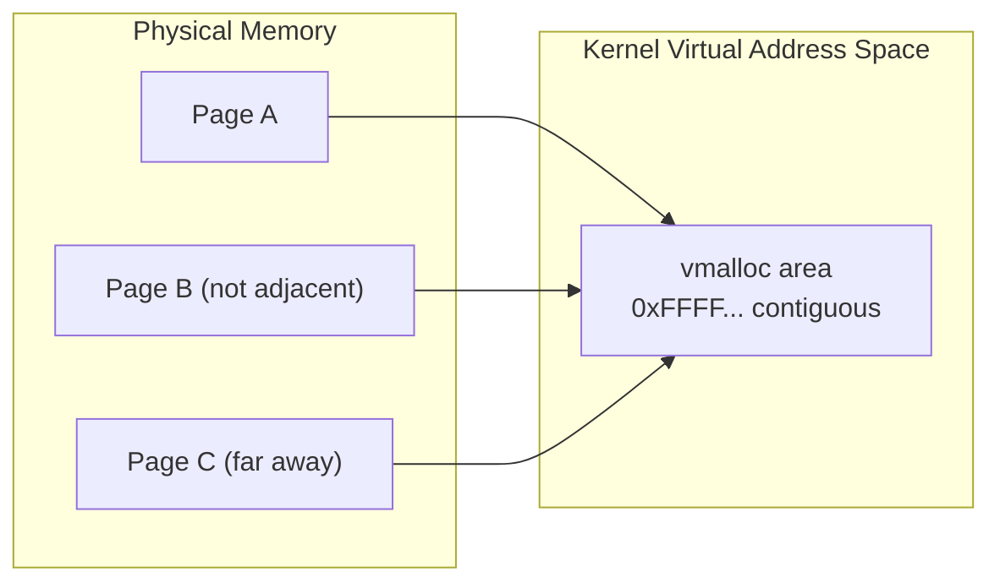
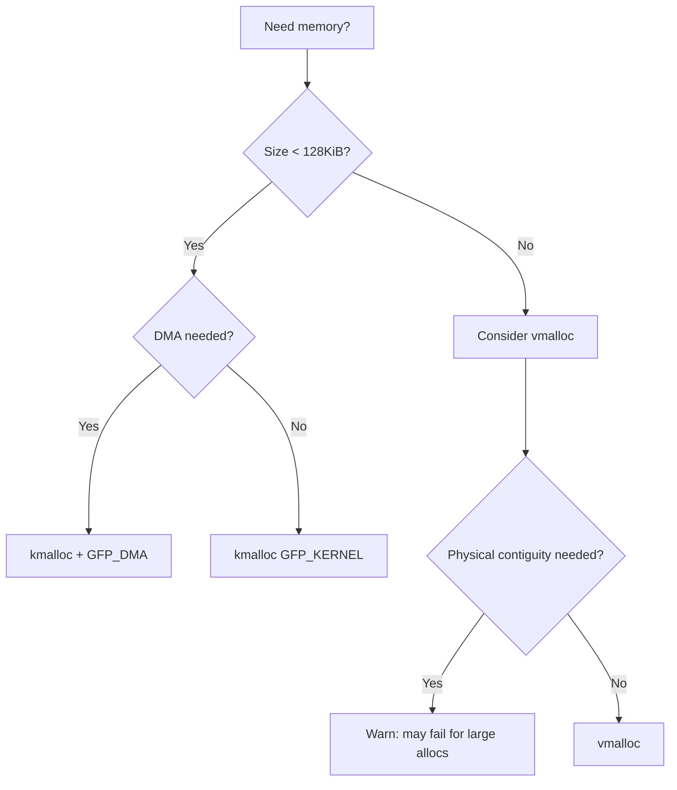

# 04 — kmalloc and vmalloc

## 1. Overview

| API | Contiguous | Can Sleep? | Limit | Use Case |
|-----|-----------|-----------|-------|----------|
| `kmalloc` | Physical + Virtual | Depends on GFP | ~4 MiB | General, DMA buffers |
| `kzalloc` | Physical + Virtual | Depends on GFP | ~4 MiB | zero-filled kmalloc |
| `vmalloc` | Virtual only | Yes (GFP_KERNEL) | GBs | Large, non-DMA buffers |

---

## 2. kmalloc

```c
#include <linux/slab.h>

/* Allocate */
void *p = kmalloc(size, GFP_KERNEL);    /* Can sleep */
void *p = kmalloc(size, GFP_ATOMIC);    /* Cannot sleep — use in IRQ */
void *p = kzalloc(size, GFP_KERNEL);    /* kmalloc + memset(0) */
void *p = kmalloc_array(n, size, GFP_KERNEL); /* Array of n items */
void *p = kcalloc(n, size, GFP_KERNEL); /* Array + zero */

/* Resize */
void *p2 = krealloc(p, new_size, GFP_KERNEL);

/* Free */
kfree(p);    /* ALWAYS safe if p == NULL */
kfree_sensitive(p); /* Clears before free (crypto/security) */
```

### Size classes (backed by slab caches):
```
8, 16, 32, 64, 96, 128, 192, 256, 512, 1024, 2048, 4096, 8192, ...
```

- `kmalloc()` rounds up to nearest slab size class
- Backed by `kmalloc-<size>` slab caches (visible in `/proc/slabinfo`)

---

## 3. vmalloc

```c
#include <linux/vmalloc.h>

/* Allocate virtually contiguous (physically non-contiguous) */
void *p = vmalloc(size);
void *p = vzalloc(size);       /* Zero-filled */
void *p = vmalloc_user(size);  /* User-mappable (mmap-able) */

/* Free */
vfree(p);
```


```

- vmalloc pages are **individually mapped** into the kernel page table
- More overhead than kmalloc (page table manipulation, TLB pressure)
- Cannot be used for **DMA** (physical discontiguity)

---

## 4. kmalloc vs vmalloc Decision


```

---

## 5. kfree_rcu Pattern (Common SMP pattern)

```c
struct mydata {
    struct rcu_head rcu;
    int val;
};

/* Free after RCU grace period — no need to wait */
kfree_rcu(ptr, rcu);  /* ptr->rcu is struct rcu_head member */
```

---

## 6. Pitfalls

```c
/* BAD: Not checking return value */
char *buf = kmalloc(SIZE, GFP_KERNEL);
memcpy(buf, src, SIZE);   /* NULL dereference if OOM */

/* GOOD: Always check */
char *buf = kmalloc(SIZE, GFP_KERNEL);
if (!buf)
    return -ENOMEM;

/* BAD: Integer overflow in size calculation */
ptr = kmalloc(n * sizeof(struct x), GFP_KERNEL); /* may overflow */

/* GOOD: use kmalloc_array */
ptr = kmalloc_array(n, sizeof(struct x), GFP_KERNEL);
```

---

## 7. Source Files

| File | Description |
|------|-------------|
| `mm/slab_common.c` | kmalloc dispatch |
| `mm/vmalloc.c` | vmalloc implementation |
| `include/linux/slab.h` | kmalloc API |
| `include/linux/vmalloc.h` | vmalloc API |

---

## 8. Related Concepts
- [03_Slab_Allocator.md](./03_Slab_Allocator.md) — Underlying kmalloc mechanism
- [05_GFP_Flags.md](./05_GFP_Flags.md) — Which GFP flag to use
- [06_Per_CPU_Allocations.md](./06_Per_CPU_Allocations.md) — Lock-free alternatives
