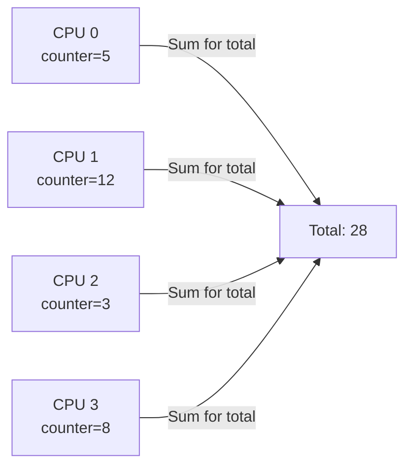
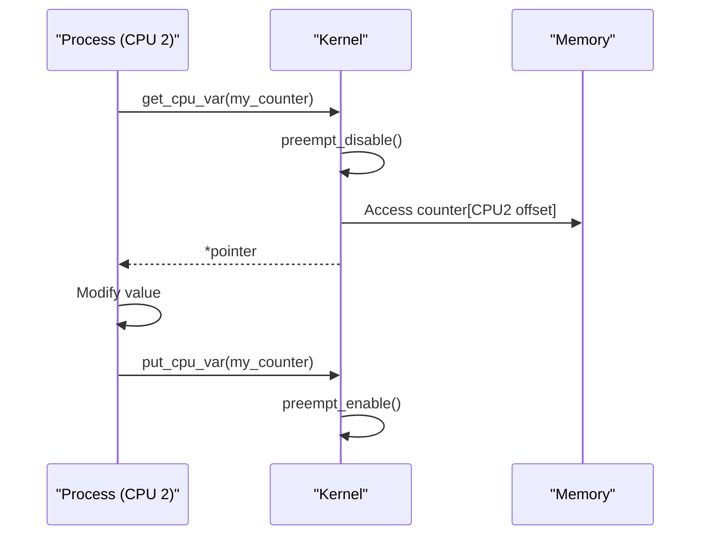

# 06 — Per-CPU Allocations

## 1. Why Per-CPU?

Per-CPU variables eliminate locking by giving each CPU its **own copy**.


```

- **No cache line bouncing** — CPUs never fight for the same memory
- **No spinlock needed** for CPU-local operations
- Used for counters, state caches, runqueues, network queues

---

## 2. Static Per-CPU Variables

```c
#include <linux/percpu.h>

/* Declare */
DEFINE_PER_CPU(int, my_counter);
DEFINE_PER_CPU(struct mystate, per_cpu_state);

/* Access own CPU (disables preemption automatically) */
int val = get_cpu_var(my_counter);   /* preemption disabled */
get_cpu_var(my_counter)++;
put_cpu_var(my_counter);             /* preemption re-enabled */

/* Alternatively — manual preemption control */
preempt_disable();
per_cpu(my_counter, smp_processor_id())++;
preempt_enable();

/* Access other CPU's copy */
per_cpu(my_counter, cpu_id) = 0;
```

---

## 3. Dynamic Per-CPU Allocations

```c
#include <linux/percpu.h>

/* Allocate */
int __percpu *counter = alloc_percpu(int);
struct myobj __percpu *objs = alloc_percpu(struct myobj);

/* Access */
int *local = get_cpu_ptr(counter);   /* Disable preemption, get pointer */
(*local)++;
put_cpu_ptr(counter);

/* Or with per_cpu_ptr */
preempt_disable();
int *p = per_cpu_ptr(counter, smp_processor_id());
(*p)++;
preempt_enable();

/* Access other CPU */
int *other = per_cpu_ptr(counter, target_cpu);

/* Free */
free_percpu(counter);
```

---

## 4. Per-CPU Flow Diagram


```

---

## 5. Real Examples in Kernel

```c
/* net/core/net-procfs.c — per-CPU network stats */
DEFINE_PER_CPU(struct softnet_data, softnet_data);

/* kernel/sched/core.c — per-CPU runqueue */
DEFINE_PER_CPU_SHARED_ALIGNED(struct rq, runqueues);

/* mm/vmstat.c — per-CPU zone stats */
DEFINE_PER_CPU(struct vm_event_state, vm_event_states);
```

---

## 6. this_cpu Operations (Optimized)

```c
/* No preempt_disable needed — uses processor-native atomics */
this_cpu_inc(my_counter);
this_cpu_add(my_counter, 5);
this_cpu_read(my_counter);
this_cpu_write(my_counter, val);
this_cpu_cmpxchg(my_counter, old, new);
```

These use `%gs` or `%fs` segment prefix on x86 for single-instruction access — no explicit preemption disabling needed.

---

## 7. Comparison Table

| Method | Lock needed | Can migrate? | Use when |
|--------|------------|-------------|----------|
| `get_cpu_var` | No | No | Simple per-CPU stats/counters |
| `alloc_percpu` | No | No | Dynamic, varying-type data |
| `this_cpu_*` | No | No | Highest performance path |
| `per_cpu_ptr(x, cpu)` | Maybe | Yes | Cross-CPU access |

---

## 8. Source Files

| File | Description |
|------|-------------|
| `include/linux/percpu.h` | Main API |
| `include/linux/percpu-defs.h` | DEFINE_PER_CPU macros |
| `mm/percpu.c` | Dynamic allocator |
| `arch/x86/include/asm/percpu.h` | x86 optimizations |

---

## 9. Related Concepts
- [../09_Kernel_Synchronization_Methods/01_Atomic_Operations.md](../09_Kernel_Synchronization_Methods/01_Atomic_Operations.md) — Alternative lock-free method
- [04_kmalloc_And_vmalloc.md](./04_kmalloc_And_vmalloc.md) — Heap allocation comparison
