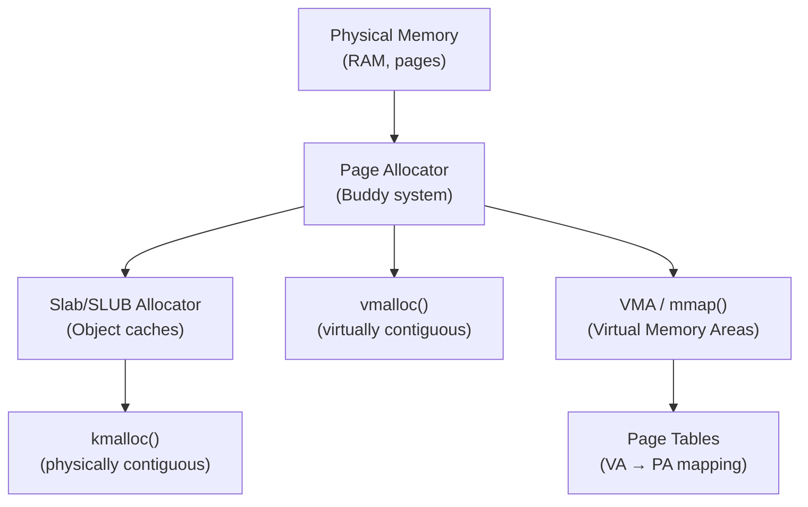

# Chapter 11 — Memory Management

## Overview

Memory management is one of the most complex kernel subsystems. It handles physical memory allocation, virtual memory mapping, page reclaim, and the slab allocator.



## Topics

| File | Topic |
|------|-------|
| [01_Pages_And_Zones.md](./01_Pages_And_Zones.md) | Physical memory: pages, zones, nodes |
| [02_Buddy_Allocator.md](./02_Buddy_Allocator.md) | Buddy system: page-level allocation |
| [03_Slab_Allocator.md](./03_Slab_Allocator.md) | SLAB/SLUB object caches |
| [04_kmalloc_And_vmalloc.md](./04_kmalloc_And_vmalloc.md) | kmalloc, kfree, vmalloc |
| [05_GFP_Flags.md](./05_GFP_Flags.md) | GFP_KERNEL, GFP_ATOMIC flags |
| [06_Per_CPU_Allocations.md](./06_Per_CPU_Allocations.md) | Per-CPU variables |

## Key Files

```
include/linux/mm.h             — Core memory management API
include/linux/slab.h           — Slab allocator API
include/linux/gfp.h            — GFP flags
mm/page_alloc.c                — Buddy allocator
mm/slab.c / mm/slub.c          — Slab allocators
mm/vmalloc.c                   — vmalloc
```
