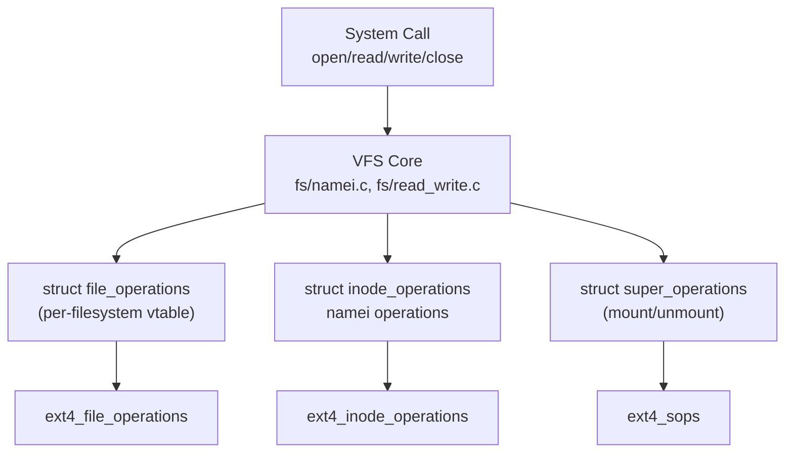
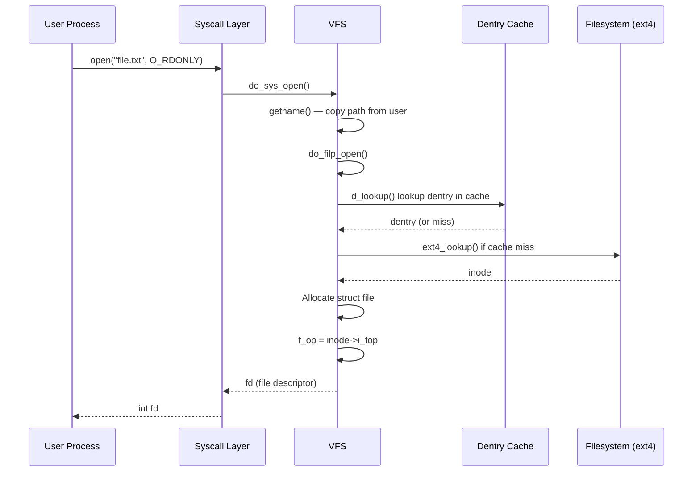

# 01 — VFS Overview

## 1. What is the VFS?

The **Virtual Filesystem Switch (VFS)** is an object-oriented abstraction layer in the Linux kernel that:

- Provides a **uniform file API** (`open`, `read`, `write`, `close`, `stat`, `mmap`)
- Translates generic calls into **filesystem-specific operations**
- Allows mixing local, network, pseudo filesystems transparently

---

## 2. VFS Architecture



---

## 3. Key Data Structures Relationship


---

## 4. VFS Object Operations (Vtables)

| Structure | Operations Struct | Purpose |
|-----------|------------------|---------|
| `super_block` | `super_operations` | Mount, unmount, sync, alloc_inode |
| `inode` | `inode_operations` | create, mkdir, lookup, rename, link |
| `file` | `file_operations` | read, write, llseek, mmap, ioctl |
| `dentry` | `dentry_operations` | hash, compare, revalidate |
| `address_space` | `address_space_operations` | readpage, writepage, direct_IO |

---

## 5. File Open Flow



---

## 6. Filesystem Registration

```c
/* Each filesystem registers itself */
static struct file_system_type ext4_fs_type = {
    .owner   = THIS_MODULE,
    .name    = "ext4",
    .mount   = ext4_mount,
    .kill_sb = kill_block_super,
    .fs_flags = FS_REQUIRES_DEV,
};

/* Registration at module init */
static int __init ext4_init_fs(void)
{
    return register_filesystem(&ext4_fs_type);
}
```

---

## 7. Source Files

| File | Description |
|------|-------------|
| `fs/namei.c` | Path resolution, lookup |
| `fs/open.c` | open/close system calls |
| `fs/read_write.c` | read/write dispatch |
| `fs/inode.c` | Inode cache |
| `fs/dcache.c` | Dentry cache |
| `fs/super.c` | Superblock management |
| `include/linux/fs.h` | All VFS structures |

---

## 8. Related Topics
- [02_Superblock.md](./02_Superblock.md)
- [03_Inode.md](./03_Inode.md)
- [04_Dentry.md](./04_Dentry.md)
- [05_File_Object.md](./05_File_Object.md)
