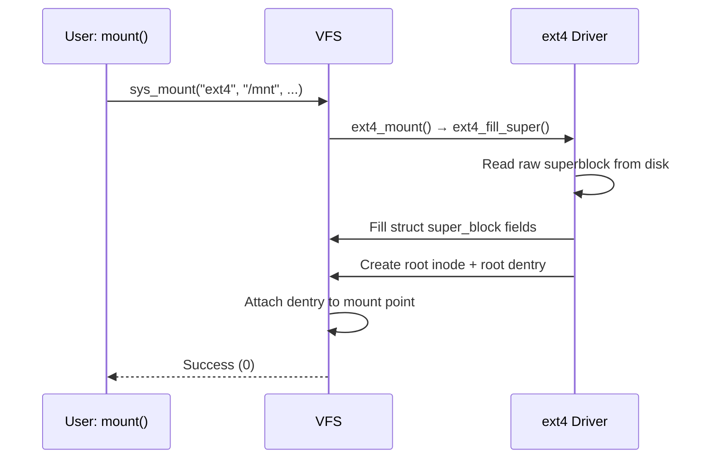

# 02 — Superblock

## 1. What is the Superblock?

The **superblock** represents a **mounted filesystem instance**. It contains:
- Filesystem metadata (block size, total blocks, free blocks)
- Pointers to the root inode
- The filesystem's operation vtable

One `super_block` is created per `mount()` call.

---

## 2. struct super_block

```c
/* include/linux/fs.h */
struct super_block {
    struct list_head    s_list;         /* List of all superblocks */
    dev_t               s_dev;          /* Device identifier */
    unsigned char       s_blocksize_bits;
    unsigned long       s_blocksize;    /* Block size in bytes */
    loff_t              s_maxbytes;     /* Max file size */
    struct file_system_type *s_type;   /* Filesystem type */
    const struct super_operations *s_op; /* Superblock operations */
    const struct dquot_operations    *dq_op;
    const struct quotactl_ops        *s_qcop;
    const struct export_operations   *s_export_op;
    unsigned long       s_flags;        /* Mount flags (MS_RDONLY, etc.) */
    unsigned long       s_magic;        /* Filesystem magic number */
    struct dentry       *s_root;        /* Root dentry */
    struct rw_semaphore s_umount;       /* Unmount semaphore */
    int                 s_count;        /* Reference count */
    struct list_head    s_inodes;       /* All inodes of this SB */
    struct list_head    s_dirty;        /* Dirty inodes */
    struct mutex        s_lock;
    char                s_id[32];       /* Device name */
    void                *s_fs_info;     /* Filesystem private data */
};
```

---

## 3. Superblock Operations

```c
struct super_operations {
    struct inode *(*alloc_inode)(struct super_block *sb);
    void         (*destroy_inode)(struct inode *);
    void         (*dirty_inode)(struct inode *, int flags);
    int          (*write_inode)(struct inode *, struct writeback_control *);
    void         (*evict_inode)(struct inode *);
    void         (*put_super)(struct super_block *);  /* umount */
    int          (*sync_fs)(struct super_block *sb, int wait);
    int          (*statfs)(struct dentry *, struct kstatfs *);
    int          (*remount_fs)(struct super_block *, int *, char *);
    void         (*umount_begin)(struct super_block *);
};
```

---

## 4. Mount Flow



---

## 5. Example — Reading Filesystem Info

```bash
# statfs() output (backed by super_block data)
stat -f /
  File: "/"
  ID: ... Namelen: 255 Type: ext2/ext3
  Block size: 4096  Fundamental block size: 4096
  Blocks: Total: 20000000  Free: 10000000  Available: 9000000
```

---

## 6. Source Files

| File | Description |
|------|-------------|
| `fs/super.c` | Superblock lifecycle |
| `fs/ext4/super.c` | ext4_fill_super() |
| `include/linux/fs.h` | `struct super_block` |
| `fs/mount.h` | Mount structure |

---

## 7. Related Topics
- [01_VFS_Overview.md](./01_VFS_Overview.md)
- [03_Inode.md](./03_Inode.md)
