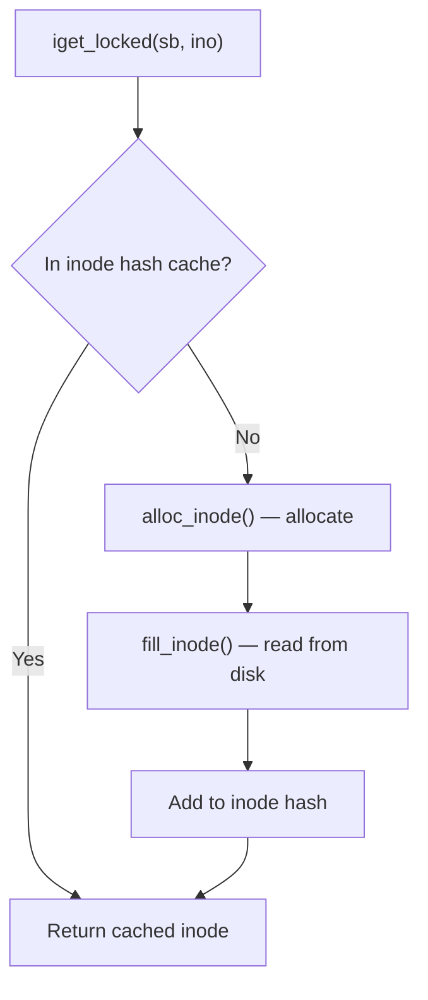

# 03 — Inode

## 1. What is an Inode?

An **inode** (index node) stores all metadata about a file or directory **except its name**:
- File type, permissions, size, timestamps
- Pointer to data blocks on disk
- Link count, owner (UID/GID)

The **name → inode** mapping is stored in the **dentry**.

---

## 2. struct inode

```c
/* include/linux/fs.h */
struct inode {
    umode_t             i_mode;       /* File type + permissions */
    unsigned short      i_opflags;
    kuid_t              i_uid;        /* Owner UID */
    kgid_t              i_gid;        /* Owner GID */
    unsigned int        i_flags;

    const struct inode_operations  *i_op;  /* inode ops vtable */
    struct super_block             *i_sb;  /* Owning superblock */
    struct address_space           *i_mapping; /* Page cache mapping */

    unsigned long       i_ino;        /* Inode number */
    union {
        const unsigned int  i_nlink;   /* Hard link count */
    };
    dev_t               i_rdev;       /* Device for block/char files */
    loff_t              i_size;       /* File size in bytes */
    struct timespec64   i_atime;      /* Last access time */
    struct timespec64   i_mtime;      /* Last modification time */
    struct timespec64   i_ctime;      /* Last status change */
    spinlock_t          i_lock;       /* Protects i_blocks, i_bytes */
    unsigned short      i_bytes;
    u8                  i_blkbits;
    u8                  i_write_hint;
    blkcnt_t            i_blocks;     /* Number of 512-byte blocks */

    unsigned long       i_state;      /* State flags */
    struct mutex        i_mutex;
    unsigned long       dirtied_when; /* jiffies when dirtied */

    struct hlist_node   i_hash;       /* Inode hash for lookup */
    struct list_head    i_io_list;    /* Writeback tracking */
    struct list_head    i_lru;        /* LRU list entry */
    struct list_head    i_sb_list;    /* All inodes on this sb */

    union {
        struct hlist_head   i_dentry;  /* Dentry aliases */
    };
    u64                 i_version;
    atomic64_t          i_sequence;
    atomic_t            i_count;       /* Reference count */
    atomic_t            i_dio_count;
    atomic_t            i_writecount;

    const struct file_operations *i_fop; /* Default file ops */
    struct file_lock_context *i_flctx;
    struct address_space    i_data;      /* Pagecache for this inode */
    void                *i_private;      /* Filesystem private data */
};
```

---

## 3. Inode Operations

```c
struct inode_operations {
    int     (*create)(struct user_namespace *, struct inode *,
                      struct dentry *, umode_t, bool);
    struct dentry *(*lookup)(struct inode *, struct dentry *, unsigned int);
    int     (*link)(struct dentry *, struct inode *, struct dentry *);
    int     (*unlink)(struct inode *, struct dentry *);
    int     (*symlink)(struct user_namespace *, struct inode *,
                       struct dentry *, const char *);
    int     (*mkdir)(struct user_namespace *, struct inode *,
                     struct dentry *, umode_t);
    int     (*rmdir)(struct inode *, struct dentry *);
    int     (*rename)(struct user_namespace *, struct inode *, struct dentry *,
                      struct inode *, struct dentry *, unsigned int);
    int     (*getattr)(struct user_namespace *, const struct path *,
                       struct kstat *, u32, unsigned int);
    int     (*setattr)(struct user_namespace *, struct dentry *,
                       struct iattr *);
    ssize_t (*listxattr)(struct dentry *, char *, size_t);
    int     (*get_acl)(struct inode *, int, bool);
};
```

---

## 4. Inode State Flags

| Flag | Meaning |
|------|---------|
| `I_DIRTY_SYNC` | Metadata modified (needs sync) |
| `I_DIRTY_DATASYNC` | Data needs fdatasync |
| `I_DIRTY_PAGES` | Pages need writeback |
| `I_NEW` | Being created |
| `I_FREEING` | About to be freed |
| `I_CLEAR` | Cleared, no data valid |
| `I_REFERENCED` | Recently referenced (LRU) |

---

## 5. Inode Cache

Inodes are cached in:
1. **Inode cache** — hash table per superblock
2. **LRU list** — `inode_lru`, aged and reclaimed under memory pressure



---

## 6. Source Files

| File | Description |
|------|-------------|
| `fs/inode.c` | Inode lifecycle, cache |
| `include/linux/fs.h` | `struct inode` |
| `fs/ext4/inode.c` | ext4 inode read/write |

---

## 7. Related Topics
- [02_Superblock.md](./02_Superblock.md)
- [04_Dentry.md](./04_Dentry.md)
- [05_File_Object.md](./05_File_Object.md)
