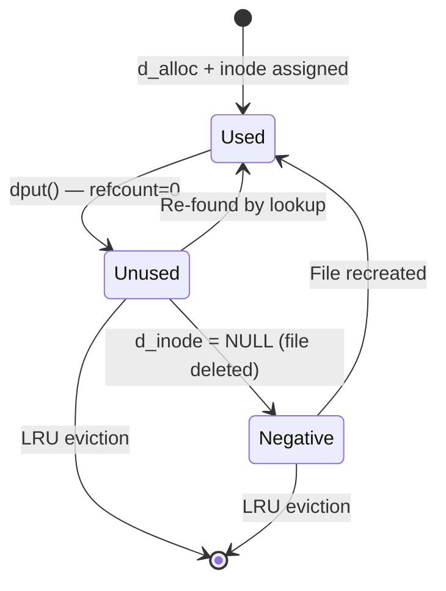
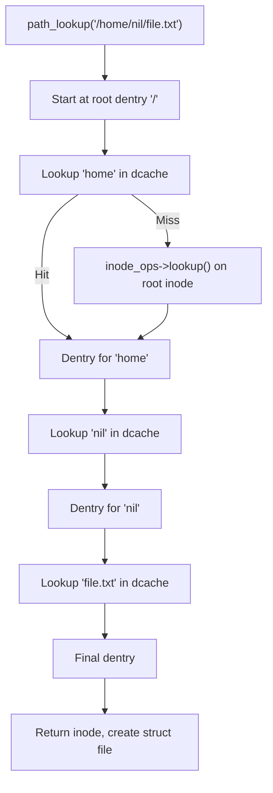

# 04 — Dentry

## 1. What is a Dentry?

A **dentry** (directory entry) maps a **filename component → inode**.

- `/home/nil/file.txt` → 3 dentries: `home`, `nil`, `file.txt`
- Dentries are cached in the **dcache** for fast path lookup
- Negative dentries cache "file does not exist" lookups

---

## 2. struct dentry

```c
/* include/linux/dcache.h */
struct dentry {
    unsigned int        d_flags;        /* Protected by d_lock */
    seqcount_spinlock_t d_seq;          /* Per-dentry seqlock */
    struct hlist_bl_node d_hash;        /* Lookup hash list */
    struct dentry       *d_parent;      /* Parent directory */
    struct qstr         d_name;         /* Filename (hash + string) */
    struct inode        *d_inode;       /* Inode (NULL for negative) */
    unsigned char       d_iname[DNAME_INLINE_LEN]; /* Short name inline */

    struct lockref      d_lockref;      /* Count + spinlock */
    const struct dentry_operations *d_op;
    struct super_block  *d_sb;          /* Superblock */
    unsigned long       d_time;         /* Revalidation time */
    void                *d_fsdata;      /* Filesystem private */

    union {
        struct list_head    d_lru;      /* LRU list */
        wait_queue_head_t  *d_wait;     /* in-lookup wait queue */
    };
    struct list_head    d_child;        /* Parent's child list */
    struct list_head    d_subdirs;      /* Our children */
    union {
        struct hlist_node d_alias;      /* Inode alias list */
        struct hlist_bl_node d_in_lookup_hash;
    };
};
```

---

## 3. Dentry States



---

## 4. Path Resolution



---

## 5. Dentry Operations Vtable

```c
struct dentry_operations {
    int    (*d_revalidate)(struct dentry *, unsigned int);  /* For NFS */
    int    (*d_weak_revalidate)(struct dentry *, unsigned int);
    int    (*d_hash)(const struct dentry *, struct qstr *);
    int    (*d_compare)(const struct dentry *, 
                        unsigned int, const char *, const struct qstr *);
    int    (*d_delete)(const struct dentry *);
    int    (*d_init)(struct dentry *);
    void   (*d_release)(struct dentry *);
    void   (*d_iput)(struct dentry *, struct inode *);
    char   *(*d_dname)(struct dentry *, char *, int);
};
```

---

## 6. Negative Dentries

```c
/* Lookup for non-existent file — creates negative dentry */
d_inode(dentry) == NULL  /* negative dentry */

/* Benefits: */
/* - Subsequent lookups of same non-existent file are fast */
/* - Commonly used in pathnames like "configure" auto-tool probing */
```

---

## 7. Source Files

| File | Description |
|------|-------------|
| `fs/dcache.c` | Dentry cache (dcache) |
| `fs/namei.c` | Path walk and lookup |
| `include/linux/dcache.h` | `struct dentry` |

---

## 8. Related Topics
- [03_Inode.md](./03_Inode.md)
- [05_File_Object.md](./05_File_Object.md)
- [06_Directory_Entry_Cache.md](./06_Directory_Entry_Cache.md)
