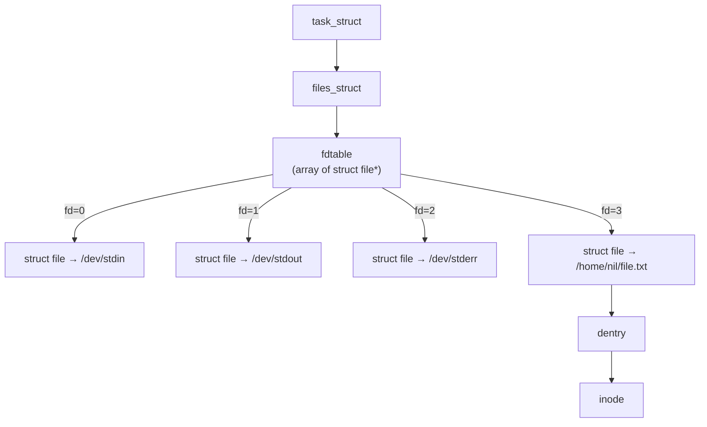
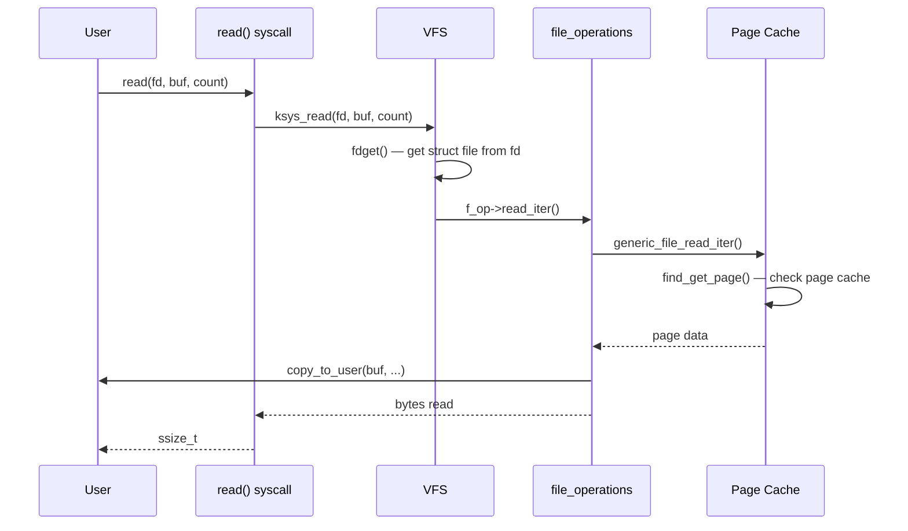

# 05 — File Object

## 1. What is the File Object?

`struct file` represents an **open file description** — created by `open()`, destroyed on `close()`.

- Each process gets a **file descriptor** (int) → points to a `struct file`
- Multiple processes/threads can share the **same** `struct file` (via `dup()` or fork)
- Multiple `struct file` objects can point to the **same inode**

---

## 2. struct file

```c
/* include/linux/fs.h */
struct file {
    union {
        struct llist_node   f_llist;
        struct rcu_head     f_rcuhead;
        unsigned int        f_iocb_flags;
    };
    struct path             f_path;       /* Dentry + vfsmount */
    struct inode            *f_inode;     /* Cached inode */
    const struct file_operations *f_op;  /* Operations vtable */

    spinlock_t              f_lock;
    atomic_long_t           f_count;      /* Reference count */
    unsigned int            f_flags;      /* O_RDONLY, O_NONBLOCK... */
    fmode_t                 f_mode;       /* FMODE_READ, FMODE_WRITE */
    struct mutex            f_pos_lock;
    loff_t                  f_pos;        /* Current file position */
    struct fown_struct      f_owner;      /* Async notification owner */
    const struct cred       *f_cred;      /* Credentials at open time */
    struct file_ra_state    f_ra;         /* Readahead state */

    u64                     f_version;
    void                    *private_data; /* Filesystem/driver private */
    struct address_space    *f_mapping;   /* Page cache */
};
```

---

## 3. file_operations Vtable

```c
struct file_operations {
    struct module *owner;
    loff_t   (*llseek)(struct file *, loff_t, int);
    ssize_t  (*read)(struct file *, char __user *, size_t, loff_t *);
    ssize_t  (*write)(struct file *, const char __user *, size_t, loff_t *);
    ssize_t  (*read_iter)(struct kiocb *, struct iov_iter *);
    ssize_t  (*write_iter)(struct kiocb *, struct iov_iter *);
    int      (*iopoll)(struct kiocb *, struct io_comp_batch *, unsigned int);
    int      (*iterate_shared)(struct file *, struct dir_context *);
    __poll_t (*poll)(struct file *, struct poll_table_struct *);
    long     (*unlocked_ioctl)(struct file *, unsigned int, unsigned long);
    long     (*compat_ioctl)(struct file *, unsigned int, unsigned long);
    int      (*mmap)(struct file *, struct vm_area_struct *);
    int      (*open)(struct inode *, struct file *);
    int      (*flush)(struct file *, fl_owner_t id);
    int      (*release)(struct inode *, struct file *);
    int      (*fsync)(struct file *, loff_t, loff_t, int datasync);
    int      (*fasync)(int, struct file *, int);
};
```

---

## 4. File Descriptor Table



---

## 5. read() System Call Flow



---

## 6. File Flags and Modes

| Flag/Mode | Value | Description |
|-----------|-------|-------------|
| `O_RDONLY` | 0 | Open read-only |
| `O_WRONLY` | 1 | Open write-only |
| `O_RDWR` | 2 | Open read-write |
| `O_NONBLOCK` | bit | Non-blocking I/O |
| `O_APPEND` | bit | Append on write |
| `O_TRUNC` | bit | Truncate file |
| `FMODE_READ` | internal | Readable |
| `FMODE_WRITE` | internal | Writable |
| `FMODE_EXEC` | internal | Being exec'd |

---

## 7. Source Files

| File | Description |
|------|-------------|
| `fs/open.c` | open/close/read/write |
| `fs/read_write.c` | read/write dispatch |
| `include/linux/fs.h` | `struct file`, `file_operations` |
| `fs/file.c` | File descriptor table management |
| `include/linux/fdtable.h` | `files_struct`, `fdtable` |

---

## 8. Related Topics
- [03_Inode.md](./03_Inode.md)
- [04_Dentry.md](./04_Dentry.md)
- [06_Directory_Entry_Cache.md](./06_Directory_Entry_Cache.md)
