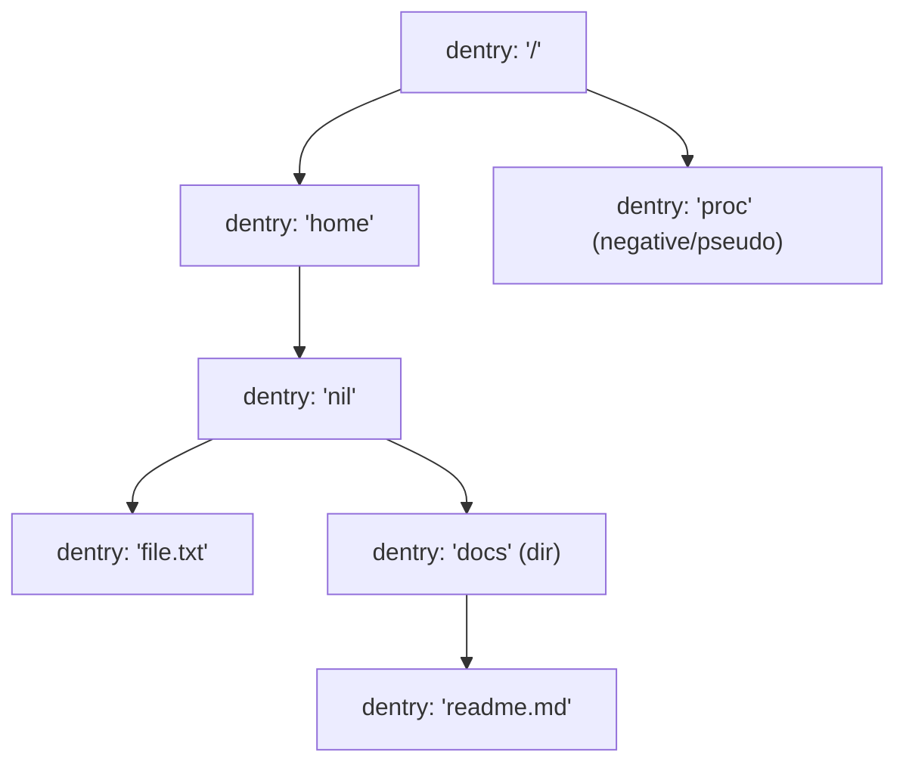
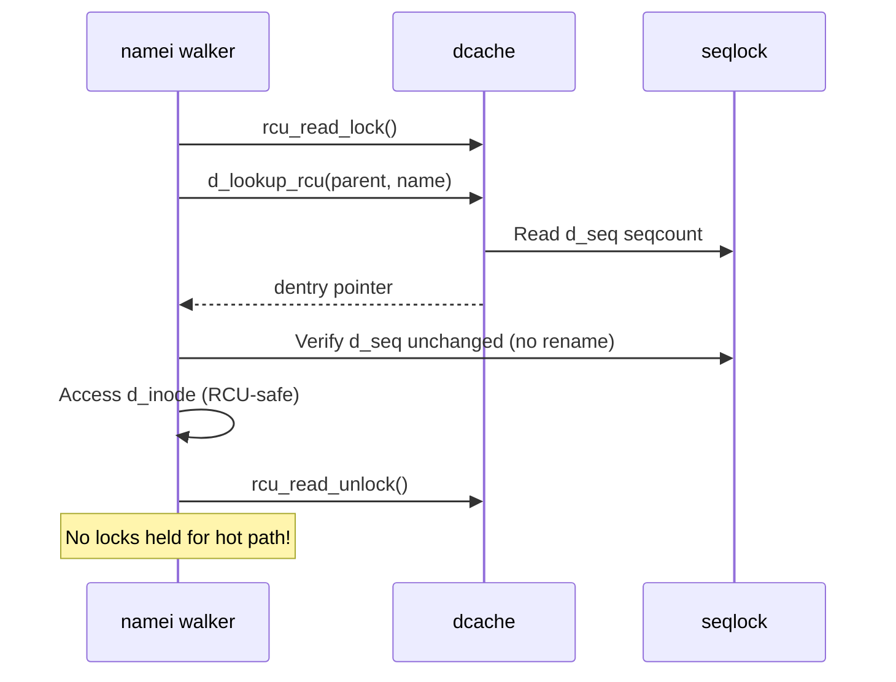

# 06 — Directory Entry Cache (dcache)

## 1. What is the dcache?

The **dcache** (dentry cache) is an in-memory hash table of recently accessed `struct dentry` objects.

Purpose:
- **Speed up path resolution** — avoid disk reads for frequently accessed paths
- Cache negative lookups (file doesn't exist)
- Maintain the filesystem namespace tree in memory

---

## 2. dcache Structure



---

## 3. dcache Hash Table

```c
/* fs/dcache.c */
static struct hlist_bl_head *dentry_hashtable;
/* Hash by: parent_dentry + name hash */

static inline struct hlist_bl_head *d_hash(unsigned int hash)
{
    return dentry_hashtable + (hash >> d_hash_shift);
}
```

**Lookup:**
1. Hash = hash(parent_dentry, filename)
2. Search chain in hash bucket
3. Compare `d_name` and `d_parent`

---

## 4. LRU and Shrinking

```mermaid
flowchart TD
    A[dput() — ref drops to 0] --> B[Add to LRU list]
    B --> C{Memory pressure?}
    C -- No --> D[Stay in LRU for future hits]
    C -- Yes --> E["shrink_dcache_sb()\nor prune_dcache_sb()"]
    E --> F{Negative dentry?}
    F -- Yes --> G[Free immediately]
    F -- No --> H[Call d_delete() — notify FS]
    H --> I[dentry_kill() — free memory]
```

---

## 5. RCU Pathwalk

Modern Linux uses **RCU-walk** for lockless path resolution:



---

## 6. Key API

```c
/* Lookup in dcache */
struct dentry *d = d_lookup(parent, &name);  /* Returns with ref */
struct dentry *d = d_find_alias(inode);       /* Find dentry for inode */

/* Allocate new dentry */
struct dentry *d = d_alloc(parent, &name);
d_add(d, inode);    /* Link dentry to inode */
d_instantiate(d, inode);

/* Negative dentry */
d_add(d, NULL);     /* inode=NULL = negative */

/* Pathname from dentry */
char *path = dentry_path_raw(dentry, buf, buflen);

/* Invalidate */
d_invalidate(dentry);
d_drop(dentry);
```

---

## 7. Mount Points

```c
/* struct vfsmount — overlaid on dentry for mount points */
struct vfsmount {
    struct dentry   *mnt_root;    /* Root of this mount */
    struct super_block *mnt_sb;   /* Superblock */
    int              mnt_flags;
};

/* struct path — complete path = dentry + vfsmount */
struct path {
    struct vfsmount *mnt;
    struct dentry   *dentry;
};
```

---

## 8. Statistics

```bash
# View dcache statistics:
cat /proc/sys/fs/dentry-state
# nr_dentry  nr_unused  age_limit  want_pages  nr_negative  dummy
#  1234567    234567      45         0           56789         0

# Tuning:
sysctl fs.dentry-state
```

---

## 9. Source Files

| File | Description |
|------|-------------|
| `fs/dcache.c` | Core dcache implementation |
| `fs/namei.c` | Path walk using dcache |
| `include/linux/dcache.h` | `struct dentry`, API |
| `fs/mount.c` | Vfsmount management |

---

## 10. Related Topics
- [04_Dentry.md](./04_Dentry.md) — struct dentry details
- [01_VFS_Overview.md](./01_VFS_Overview.md) — VFS overview
