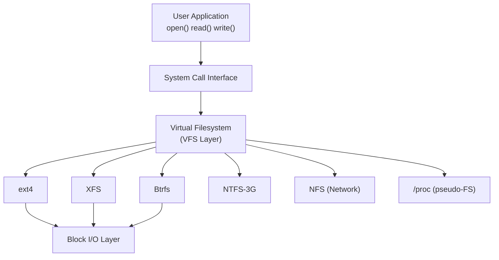

# Chapter 12 — Virtual Filesystem (VFS)

## Overview

The **VFS** is an abstraction layer that provides a uniform interface to all filesystems.

## Key Objects

| Object | Struct | Description |
|--------|--------|-------------|
| Superblock | `super_block` | Mounted filesystem instance |
| Inode | `inode` | File metadata (permissions, size, type) |
| Dentry | `dentry` | Directory entry (name → inode mapping) |
| File | `file` | Open file (per process per open) |

## Topics

1. [01_VFS_Overview.md](./01_VFS_Overview.md)
2. [02_Superblock.md](./02_Superblock.md)
3. [03_Inode.md](./03_Inode.md)
4. [04_Dentry.md](./04_Dentry.md)
5. [05_File_Object.md](./05_File_Object.md)
6. [06_Directory_Entry_Cache.md](./06_Directory_Entry_Cache.md)
