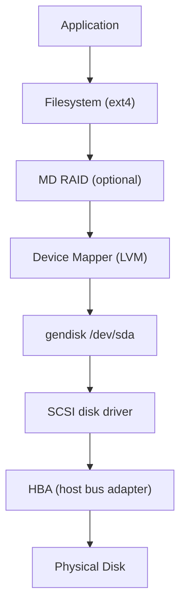

# 01 — Block Devices

## 1. Block vs Character Devices

| Feature | Block Device | Character Device |
|---------|-------------|-----------------|
| Access | Random access by block number | Sequential byte stream |
| Buffering | Page cache buffered | Usually unbuffered |
| Examples | `/dev/sda`, `/dev/nvme0n1` | `/dev/tty`, `/dev/null` |
| Struct | `block_device` | `cdev` |

---

## 2. Block Device Representation

```c
/* include/linux/blk_types.h */
struct block_device {
    sector_t            bd_start_sect;  /* First sector on device */
    sector_t            bd_nr_sectors;  /* Number of sectors */
    struct gendisk      *bd_disk;       /* Disk descriptor */
    unsigned int        bd_block_size;  /* Block/sector size */
    u8                  bd_partno;      /* Partition number */
    spinlock_t          bd_size_lock;
    struct super_block  *bd_super;      /* Filesystem using this device */
    struct inode        *bd_inode;      /* Inode for block device file */
    /* ... */
};
```

---

## 3. gendisk

```c
/* include/linux/genhd.h */
struct gendisk {
    int              major;           /* Major device number */
    int              first_minor;     /* First minor number */
    int              minors;          /* Total minors (partitions) */
    char             disk_name[DISK_NAME_LEN]; /* "sda", "nvme0n1" */

    struct block_device_operations *fops; /* Device operations */
    struct request_queue *queue;     /* I/O request queue */
    void             *private_data;

    sector_t         part0_sectors;  /* Total sectors */
    struct disk_stat __percpu *stats;
};
```

---

## 4. Device Major/Minor Numbers

```bash
ls -l /dev/sda*
# brw-rw---- 1 root disk 8, 0 /dev/sda    (major=8, minor=0 = whole disk)
# brw-rw---- 1 root disk 8, 1 /dev/sda1   (minor=1 = partition 1)
# brw-rw---- 1 root disk 8, 2 /dev/sda2   (minor=2 = partition 2)

cat /proc/devices   # Shows major number assignments
```

---

## 5. Block Device Stack



---

## 6. sector_t

- **Sector** = 512 bytes (traditional), 4096 bytes (4K native)
- All block I/O addressed in **sectors** at the block layer
- Filesystem uses **blocks** (usually 4096 bytes = 8 sectors)

```c
typedef u64 sector_t;  /* Sector number absolute on disk */
#define SECTOR_SHIFT  9  /* 1 sector = 2^9 = 512 bytes */
#define SECTOR_SIZE   (1 << SECTOR_SHIFT)
```

---

## 7. Source Files

| File | Description |
|------|-------------|
| `block/genhd.c` | gendisk lifecycle |
| `fs/block_dev.c` | block_device |
| `include/linux/genhd.h` | gendisk struct |
| `include/linux/blkdev.h` | Block device API |

---

## 8. Related Topics
- [02_Bio_Structure.md](./02_Bio_Structure.md) — How I/O is described
- [04_Request_Queue.md](./04_Request_Queue.md) — I/O queue management
