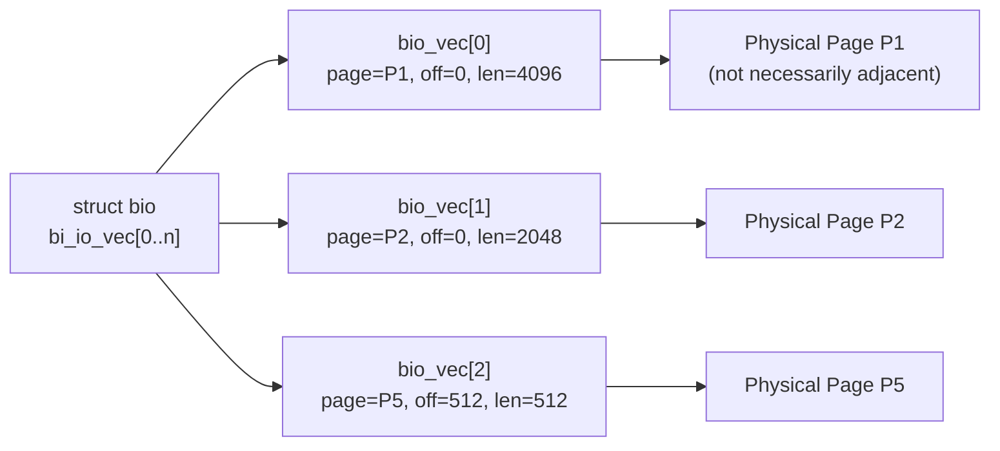
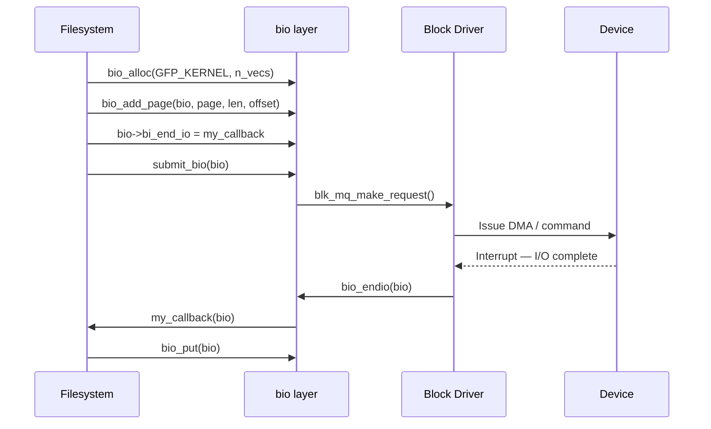

# 02 — struct bio

## 1. What is a bio?

`struct bio` (**block I/O**) is the **unit of block I/O** in the kernel.

- Describes one or more contiguous I/O operations (scatter-gather)
- Created by filesystems, VM, DIO layers
- Passed to the block device driver via the request queue

---

## 2. struct bio

```c
/* include/linux/blk_types.h */
struct bio {
    struct bio          *bi_next;         /* Request queue list */
    struct block_device *bi_bdev;         /* Target device */
    blk_opf_t           bi_opf;          /* REQ_OP_READ/WRITE | flags */
    unsigned short      bi_flags;
    unsigned short      bi_ioprio;
    blk_status_t        bi_status;        /* Completion status */

    union {
        struct blk_plug     *bi_plug;     /* Inline plugging */
        struct bio_vec      *bi_io_vec;   /* Inline S/G list */
    };

    struct bvec_iter    bi_iter;  {
        sector_t        bi_sector;   /* Current sector */
        unsigned int    bi_size;     /* Remaining I/O bytes */
        unsigned int    bi_idx;      /* index into bi_io_vec */
    };

    bio_end_io_t        *bi_end_io;       /* Completion callback */
    void                *bi_private;      /* Private data for end_io */

    unsigned short      bi_vcnt;          /* Number of bio_vecs */
    unsigned short      bi_max_vecs;      /* Maximum bio_vecs */
    atomic_t            __bi_cnt;         /* Reference count */
    struct bio_vec      *bi_io_vec;       /* Scatter-gather array */
    struct bio_set      *bi_pool;         /* Allocation pool */

    struct bio_vec      bi_inline_vecs[]; /* Inline vectors */
};
```

---

## 3. struct bio_vec — Scatter-Gather Entry

```c
struct bio_vec {
    struct page *bv_page;     /* Physical page */
    unsigned int bv_len;      /* Length in bytes */
    unsigned int bv_offset;   /* Offset within page */
};
```



---

## 4. bio Operations (bi_opf)

| Constant | Meaning |
|----------|---------|
| `REQ_OP_READ` | Read from device |
| `REQ_OP_WRITE` | Write to device |
| `REQ_OP_DISCARD` | Discard/TRIM sectors |
| `REQ_OP_FLUSH` | Flush device write cache |
| `REQ_OP_WRITE_ZEROES` | Write zeros efficiently |
| `REQ_SYNC` | Synchronous I/O |
| `REQ_FUA` | Force unit access (write-through) |
| `REQ_PREFLUSH` | Flush cache before write |

---

## 5. bio Lifecycle



---

## 6. Example: Direct bio submission

```c
/* Allocate bio */
struct bio *bio = bio_alloc(GFP_KERNEL, 1);
bio->bi_bdev    = bdev;
bio->bi_iter.bi_sector = sector;
bio_set_op_attrs(bio, REQ_OP_WRITE, REQ_SYNC);

/* Add one page of data */
bio_add_page(bio, page, PAGE_SIZE, 0);

/* Set completion callback */
bio->bi_end_io  = my_end_io;
bio->bi_private = my_context;

/* Submit */
submit_bio(bio);
```

---

## 7. Source Files

| File | Description |
|------|-------------|
| `block/bio.c` | bio lifecycle |
| `include/linux/bio.h` | struct bio, bio_vec API |
| `include/linux/blk_types.h` | REQ_OP_* constants |

---

## 8. Related Topics
- [01_Block_Devices.md](./01_Block_Devices.md)
- [03_IO_Schedulers.md](./03_IO_Schedulers.md)
