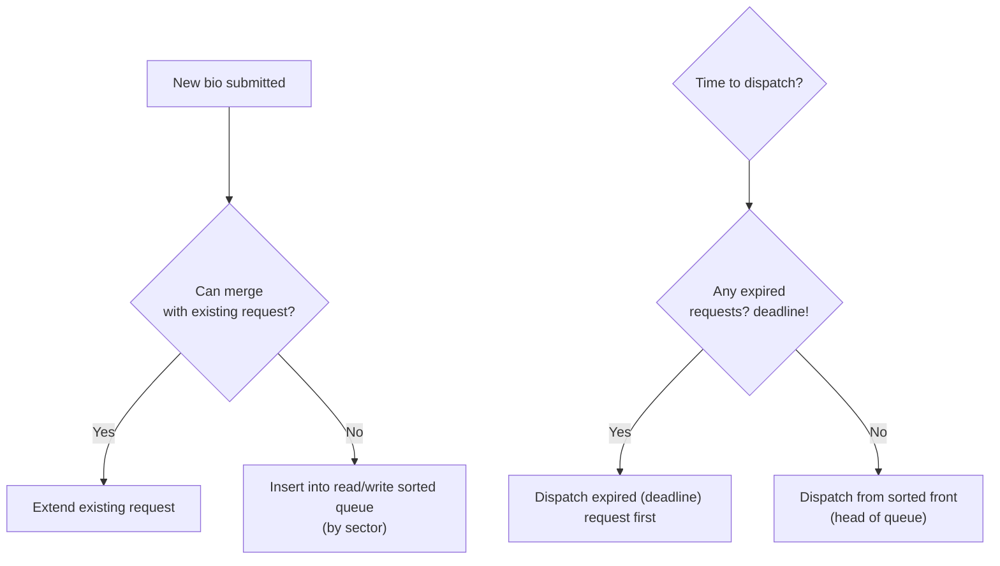
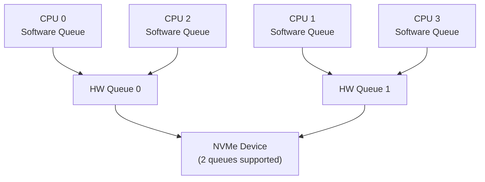

# 03 — I/O Schedulers

## 1. What is an I/O Scheduler?

The **I/O scheduler** (also called **elevator**) reorders and merges I/O requests before sending to the driver — to maximize throughput and minimize seek time.

---

## 2. Available Schedulers (Linux 5.x+)

| Scheduler | Type | Best For |
|-----------|------|----------|
| `none` | FIFO | NVMe SSDs (no seek cost) |
| `mq-deadline` | Deadline-based | HDDs, mixed workloads |
| `bfq` | Budget Fair Queuing | Desktop, per-process fairness |
| `kyber` | Token-bucket | High-IOPS SSDs, low-latency |

```bash
# Check and change scheduler:
cat /sys/block/sda/queue/scheduler
# [mq-deadline] kyber bfq none

echo "bfq" > /sys/block/sda/queue/scheduler
```

---

## 3. mq-deadline Scheduler



Key parameters:
```bash
/sys/block/sda/queue/iosched/read_expire   # default 500ms
/sys/block/sda/queue/iosched/write_expire  # default 5000ms
/sys/block/sda/queue/iosched/writes_starved # prefer reads before writes
```

---

## 4. BFQ Scheduler

- Gives each process/cgroup its own virtual time
- Proportional share I/O: processes get fair slice of bandwidth
- Ideal for desktop (audio/video while compiling won't stutter)

```bash
# Set per-process weight via cgroups:
echo 200 > /sys/fs/cgroup/blkio/mygroup/blkio.bfq.weight
```

---

## 5. Multi-Queue (blk-mq) Architecture

Modern block layer uses **multiple hardware queues** (blk-mq):



- One **software queue per CPU** → reduces lock contention
- Maps to **hardware queues** based on IRQ affinity
- Scheduler operates on software queues

---

## 6. Merging

Before dispatching, adjacent requests are merged:

- **Front merge**: New request extends existing one at the front
- **Back merge**: New request extends existing one at the back
- **Plug/unplug**: Bio accumulated in `blk_plug` to batch submissions

```c
/* blk_plug batches requests before submitting */
blk_start_plug(&plug);
/* ... submit multiple bios ... */
blk_finish_plug(&plug);   /* Flushes accumulated requests */
```

---

## 7. Source Files

| File | Description |
|------|-------------|
| `block/mq-deadline.c` | mq-deadline scheduler |
| `block/bfq-iosched.c` | BFQ scheduler |
| `block/kyber-iosched.c` | Kyber scheduler |
| `block/blk-mq.c` | Multi-queue framework |
| `block/blk-merge.c` | Request merging |

---

## 8. Related Topics
- [02_Bio_Structure.md](./02_Bio_Structure.md)
- [04_Request_Queue.md](./04_Request_Queue.md)
