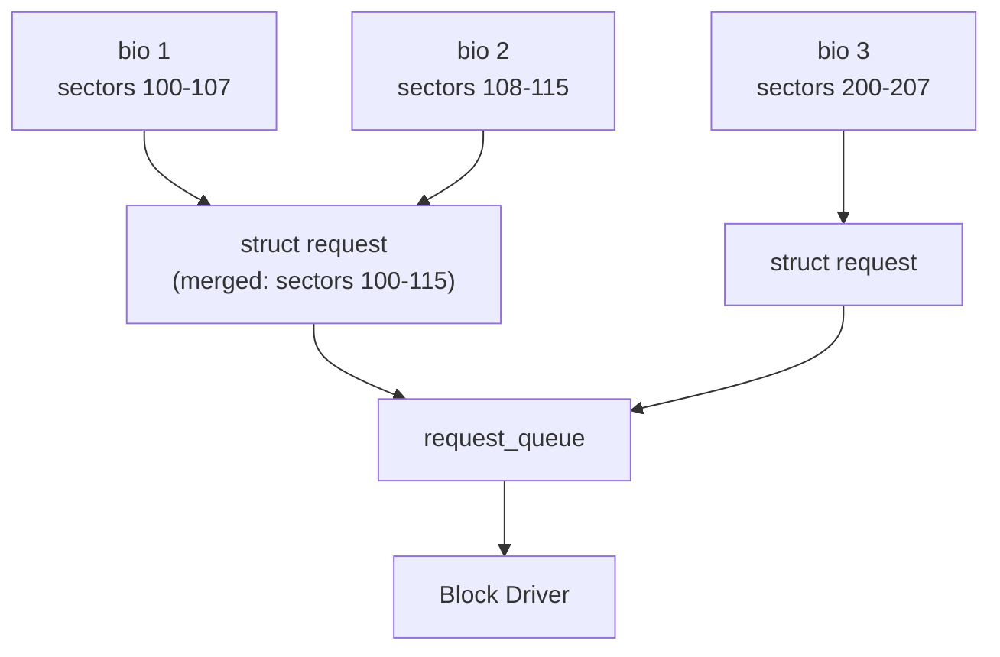
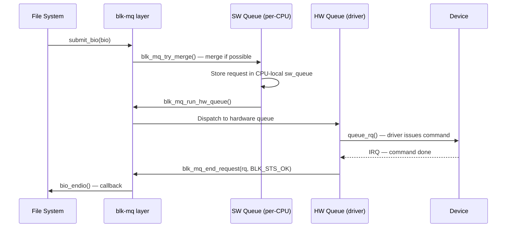

# 04 — Request Queue

## 1. What is the Request Queue?

`struct request_queue` is the queue of pending I/O requests for a block device.

- Links the I/O scheduler to the block device driver
- Enforces congestion, merging, plug/unplug
- With blk-mq: per-CPU software queues + N hardware queues

---

## 2. struct request_queue (simplified)

```c
/* include/linux/blkdev.h */
struct request_queue {
    struct blk_mq_ops   *mq_ops;     /* Driver operations */
    struct elevator_queue *elevator;  /* I/O scheduler */
    
    spinlock_t          queue_lock;
    struct kobject      kobj;         /* sysfs representation */
    
    unsigned long       queue_flags;  /* QUEUE_FLAG_* */
    unsigned int        nr_requests;  /* Queue depth */
    
    unsigned int        dma_alignment;
    unsigned int        dma_pad_mask;
    unsigned int        limits_init;
    struct queue_limits limits;       /* segment size, max bio size */
    
    struct blk_mq_tag_set  *tag_set;
    struct list_head        tag_set_list;
    
    /* Statistics */
    struct blk_queue_stats *stats;
};
```

---

## 3. Request vs bio



- Multiple `bio` objects can be **merged** into one `request`
- `struct request` is the scheduler's unit of work

---

## 4. blk-mq Request Flow



---

## 5. Queue Limits

```c
/* Maximum request sizes enforced by request_queue */
struct queue_limits {
    unsigned int    max_sectors;       /* Max sectors per request */
    unsigned int    max_segment_size;  /* Max bytes per S/G segment */
    unsigned short  max_segments;      /* Max S/G segments */
    unsigned int    logical_block_size;
    unsigned int    physical_block_size;
    unsigned int    io_min;           /* Minimum I/O size */
    unsigned int    io_opt;           /* Optimal I/O size */
};
```

---

## 6. Plugging

```c
/* Group multiple bios — avoid per-bio queue submissions */
struct blk_plug plug;
blk_start_plug(&plug);

for (i = 0; i < n; i++)
    submit_bio(bios[i]);

blk_finish_plug(&plug);  /* Flush — dispatches all accumulated requests */
```

---

## 7. Source Files

| File | Description |
|------|-------------|
| `block/blk-mq.c` | blk-mq core |
| `block/blk-core.c` | Request lifecycle |
| `block/blk-settings.c` | Queue limits API |
| `include/linux/blkdev.h` | `struct request_queue`, `struct request` |

---

## 8. Related Topics
- [02_Bio_Structure.md](./02_Bio_Structure.md)
- [03_IO_Schedulers.md](./03_IO_Schedulers.md)
- [05_Block_Driver_Interface.md](./05_Block_Driver_Interface.md)
