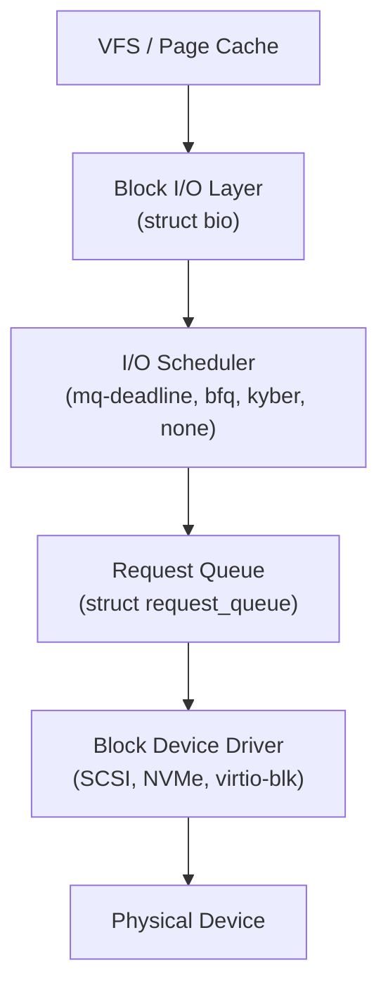

# Chapter 13 — Block I/O Layer

## Overview

The **Block I/O Layer** manages all I/O to block devices (HDDs, SSDs, NVMe, etc.).

## Topics

1. [01_Block_Devices.md](./01_Block_Devices.md)
2. [02_Bio_Structure.md](./02_Bio_Structure.md)
3. [03_IO_Schedulers.md](./03_IO_Schedulers.md)
4. [04_Request_Queue.md](./04_Request_Queue.md)
5. [05_Block_Driver_Interface.md](./05_Block_Driver_Interface.md)
