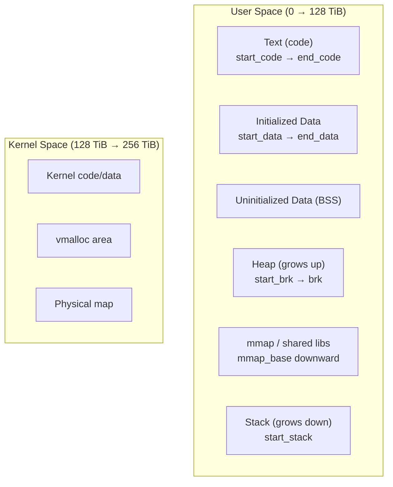

# 01 — mm_struct

## 1. What is mm_struct?

`mm_struct` is the **memory descriptor** of a process — it describes the entire virtual address space.

Each process (except kernel threads) has one `mm_struct`. Threads **share** the same `mm_struct`.

---

## 2. struct mm_struct

```c
/* include/linux/mm_types.h */
struct mm_struct {
    struct {
        struct maple_tree   mm_mt;       /* VMA tree (kernel 6.1+) */
        unsigned long       mmap_base;   /* Base of mmap area */
        unsigned long       mmap_legacy_base;
        unsigned long       task_size;   /* Size of task virtual memory */
        pgd_t               *pgd;        /* Page global directory (HW) */

        atomic_t            mm_users;    /* Threads using this mm */
        atomic_t            mm_count;    /* Reference count */

        int                 map_count;   /* Number of VMAs */

        spinlock_t          page_table_lock;
        struct rw_semaphore mmap_lock;   /* Protect VMA tree */

        struct list_head    mmlist;      /* List of all mm_structs */

        /* Virtual addresses of key regions */
        unsigned long       start_code, end_code;
        unsigned long       start_data, end_data;
        unsigned long       start_brk, brk;   /* Heap */
        unsigned long       start_stack;       /* Stack bottom */
        unsigned long       arg_start, arg_end;/* argv */
        unsigned long       env_start, env_end;/* envp */

        unsigned long       rss;         /* Resident Set Size */
        unsigned long       total_vm;    /* Total pages mapped */
        unsigned long       locked_vm;   /* Pages locked in RAM */
        unsigned long       pinned_vm;
        unsigned long       data_vm;     /* VM_WRITE, !VM_SHARED, !VM_STACK */
        unsigned long       exec_vm;     /* VM_EXEC, !VM_WRITE, !VM_STACK */
        unsigned long       stack_vm;    /* VM_GROWSDOWN */

        unsigned long       def_flags;   /* Default VMA flags */

        struct mm_rss_stat  rss_stat;    /* Per-mm RSS tracking */

        spinlock_t          arg_lock;
        struct linux_binfmt *binfmt;     /* Exec format (ELF, etc.) */

        mm_context_t        context;     /* Arch-specific (ASID, etc.) */
        unsigned long       flags;       /* AS_MEMBARRIER, etc. */

        struct user_namespace *user_ns;
        struct file __rcu   *exe_file;   /* /proc/pid/exe */
    } __randomize_layout;
};
```

---

## 3. Virtual Address Space Layout (x86-64)



---

## 4. mm_users vs mm_count

| Counter | Incremented by | Meaning |
|---------|---------------|---------|
| `mm_users` | Each thread using this mm | Active users (fork → clone) |
| `mm_count` | mm + swapper/kthread refs | Total references (mmget/mmdrop) |

```c
/* thread shares mm: */
mmget(mm);   /* mm_users++ */
mmput(mm);   /* mm_users-- → if 0, exit_mmap() */
```

---

## 5. Kernel Threads and mm

```c
/* Kernel threads have mm == NULL */
if (current->mm == NULL)
    /* I am a kernel thread */

/* Lazy TLB mode — borrow mm for TLB purposes only */
current->active_mm  /* May point to borrowed mm */
```

---

## 6. /proc/pid/maps Example

```bash
cat /proc/1234/maps
# Start-End         Perm Offset Dev    Inode  Pathname
# 00400000-00452000 r-xp 00000000 08:01 524290 /usr/bin/python3  (text)
# 00651000-00652000 r--p 00051000 08:01 524290 /usr/bin/python3  (rodata)
# 7f2a00000000-7f2a00021000 rw-p 00000000 00:00 0                (heap)
# 7ffd12345000-7ffd12366000 rw-p 00000000 00:00 0 [stack]
```

---

## 7. Source Files

| File | Description |
|------|-------------|
| `include/linux/mm_types.h` | `struct mm_struct` |
| `kernel/fork.c` | `copy_mm()` — fork |
| `mm/mmap.c` | VMA management |
| `fs/proc/task_mmu.c` | /proc/pid/maps |

---

## 8. Related Topics
- [02_Virtual_Memory_Areas.md](./02_Virtual_Memory_Areas.md)
- [03_Page_Tables.md](./03_Page_Tables.md)
