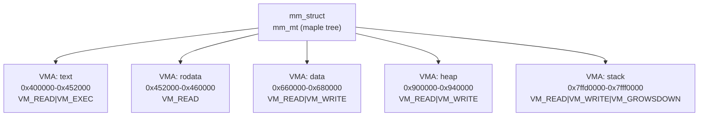

# 02 — Virtual Memory Areas (VMAs)

## 1. What is a VMA?

A `vm_area_struct` (VMA) represents a **contiguous virtual address region** in a process's address space with uniform properties (permissions, backing, type).

---

## 2. struct vm_area_struct

```c
/* include/linux/mm_types.h */
struct vm_area_struct {
    unsigned long   vm_start;   /* Start virtual address (inclusive) */
    unsigned long   vm_end;     /* End virtual address (exclusive) */
    
    struct mm_struct *vm_mm;    /* Owning mm_struct */
    pgprot_t        vm_page_prot; /* Page table protection bits */
    unsigned long   vm_flags;   /* VM_READ, VM_WRITE, VM_EXEC, etc. */

    union {
        struct {
            struct rb_node  rb;        /* In mm->mm_rb (legacy) */
            unsigned long   rb_subtree_gap;
        } shared;
    };

    /* Linked list (in address order) */
    struct vm_area_struct *vm_next, *vm_prev;

    /* For file-backed VMAs */
    struct file     *vm_file;       /* Backing file (NULL for anon) */
    unsigned long   vm_pgoff;       /* File offset in pages */

    const struct vm_operations_struct *vm_ops; /* VMA operations */
    void            *vm_private_data;
};
```

---

## 3. VMA Flags

| Flag | Meaning |
|------|---------|
| `VM_READ` | Pages can be read |
| `VM_WRITE` | Pages can be written |
| `VM_EXEC` | Pages can be executed |
| `VM_SHARED` | Shared mapping (MAP_SHARED) |
| `VM_MAYREAD/WRITE/EXEC` | Can be set by mprotect |
| `VM_GROWSDOWN` | Stack grows downward |
| `VM_GROWSUP` | Stack grows upward (some arches) |
| `VM_LOCKED` | Pages locked (mlock) |
| `VM_IO` | Memory-mapped I/O (no swap) |
| `VM_DONTCOPY` | Don't copy on fork |
| `VM_DONTEXPAND` | Can't expand via mremap |
| `VM_ACCOUNT` | Tracked by VM accounting |
| `VM_HUGETLB` | Uses huge pages |
| `VM_PFNMAP` | PFN-mapped (no struct page) |

---

## 4. VMA Tree Structure



---

## 5. vm_operations_struct

```c
struct vm_operations_struct {
    void  (*open)(struct vm_area_struct *area);
    void  (*close)(struct vm_area_struct *area);
    /* Called on page fault */
    vm_fault_t (*fault)(struct vm_fault *vmf);
    /* Called for huge page faults */
    vm_fault_t (*huge_fault)(struct vm_fault *vmf, 
                              enum page_entry_size pe_size);
    /* For special memory (pfnmap) */
    int   (*access)(struct vm_area_struct *vma, unsigned long addr,
                    void *buf, int len, int write);
};
```

---

## 6. VMA Lookup

```c
/* Find VMA containing address 'addr' */
struct vm_area_struct *vma = find_vma(mm, addr);
/* Returns first VMA where vma->vm_end > addr */

/* Check address is valid in VMA */
if (vma && vma->vm_start <= addr)
    /* addr is within VMA */
```

---

## 7. mprotect Example

```c
/* Change permissions on a VMA */
/* User space: */
mprotect(addr, len, PROT_READ | PROT_EXEC);

/* Kernel: splits/merges VMAs as needed */
/* do_mprotect() → mprotect_fixup() → change_prot_range() */
```

---

## 8. Source Files

| File | Description |
|------|-------------|
| `mm/mmap.c` | VMA creation/deletion |
| `mm/mprotect.c` | Permission changes |
| `mm/vma.c` | VMA utilities (kernel 6.x) |
| `include/linux/mm_types.h` | `struct vm_area_struct` |

---

## 9. Related Topics
- [01_mm_struct.md](./01_mm_struct.md)
- [03_Page_Tables.md](./03_Page_Tables.md)
- [04_Page_Faults.md](./04_Page_Faults.md)
- [05_mmap.md](./05_mmap.md)
