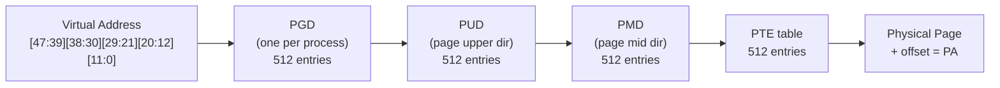
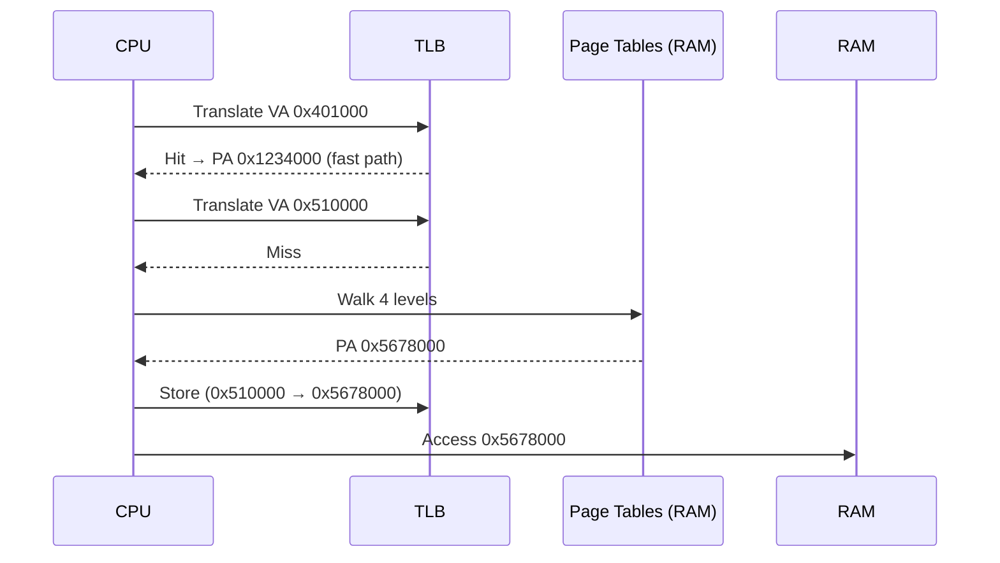

# 03 — Page Tables

## 1. What are Page Tables?

Page tables map **virtual addresses → physical addresses**.

- Maintained per-process (`mm_struct.pgd`)
- Walked by hardware MMU on every memory access (cached in TLB)
- 4-level on x86-64: PGD → P4D → PUD → PMD → PTE

---

## 2. 4-Level Page Table (x86-64, 48-bit VA)

```
Virtual Address (48 bits):
  Bit 47..39 = PGD index (9 bits)
  Bit 38..30 = P4D/PUD index (9 bits)
  Bit 29..21 = PMD index (9 bits)
  Bit 20..12 = PTE index (9 bits)
  Bit 11..0  = Page offset (12 bits = 4096 bytes)
```



---

## 3. Page Table Entry (PTE)

```c
/* arch/x86/include/asm/pgtable_types.h */
typedef struct { pteval_t pte; } pte_t;

/* Key PTE bits: */
#define _PAGE_PRESENT   0x001   /* Page is present in memory */
#define _PAGE_RW        0x002   /* Read/write (0=read-only) */
#define _PAGE_USER      0x004   /* User-accessible */
#define _PAGE_DIRTY     0x040   /* Page has been written */
#define _PAGE_ACCESSED  0x020   /* Page has been read/written */
#define _PAGE_NX        (1ULL<<63) /* No execute (NX bit) */
```

---

## 4. Kernel Page Table API

```c
/* Walking page tables manually */
pgd_t *pgd = pgd_offset(mm, address);
if (!pgd_present(*pgd)) { /* not mapped */ }

p4d_t *p4d = p4d_offset(pgd, address);
pud_t *pud = pud_offset(p4d, address);
pmd_t *pmd = pmd_offset(pud, address);
pte_t *pte = pte_offset_map(pmd, address);

/* Read physical page from PTE */
struct page *page = pte_page(*pte);

pte_unmap(pte);  /* Required after pte_offset_map */
```

---

## 5. TLB (Translation Lookaside Buffer)



---

## 6. TLB Invalidation

```c
/* Flush entire TLB for current CPU */
flush_tlb_all();

/* Flush one address */
flush_tlb_page(vma, addr);

/* After context switch (CR3 reload flushes TLB automatically) */
```

With PCID (Process Context ID) on x86-64, context switches don't always flush TLB.

---

## 7. Huge Pages

- **2 MiB huge pages**: Skip PMD → PTE level; PTE stored at PMD
- **1 GiB gigantic pages**: Skip PUD level entirely
- Fewer TLB entries needed → better performance for large mappings

```c
/* mmap with huge pages */
mmap(NULL, size, PROT_READ|PROT_WRITE,
     MAP_PRIVATE|MAP_ANONYMOUS|MAP_HUGETLB, -1, 0);
```

---

## 8. Source Files

| File | Description |
|------|-------------|
| `arch/x86/include/asm/pgtable.h` | x86-64 page table API |
| `mm/memory.c` | Core page-table manipulation |
| `mm/pgtable-generic.c` | Generic helpers |
| `arch/x86/mm/tlb.c` | TLB flush operations |

---

## 9. Related Topics
- [02_Virtual_Memory_Areas.md](./02_Virtual_Memory_Areas.md)
- [04_Page_Faults.md](./04_Page_Faults.md)
- [../11_Memory_Management/01_Pages_And_Zones.md](../11_Memory_Management/01_Pages_And_Zones.md)
