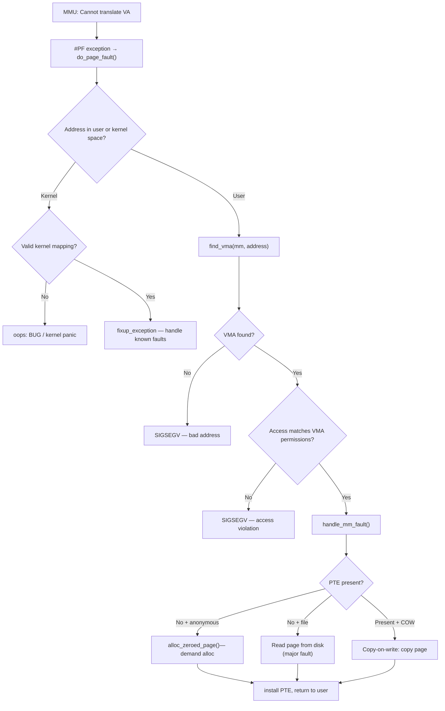
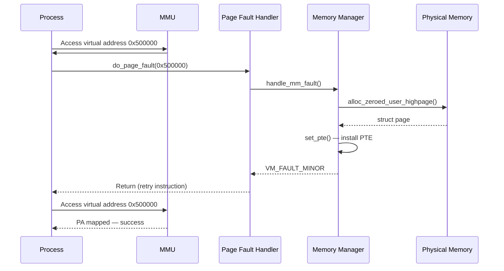

# 04 — Page Faults

## 1. What is a Page Fault?

A **page fault** is an exception triggered by the MMU when a virtual address cannot be translated:

| Type | Cause | Action |
|------|-------|--------|
| Minor (soft) | Page mapped but not in memory (demand paging, swap) | Load from swap/file |
| Major (hard) | Page not mapped at all | Load from disk |
| Spurious | Race condition, resolved without I/O | Return immediately |
| Invalid/Bad | Access violation, NULL deref, stack overflow | SIGSEGV |

---

## 2. Page Fault Handler Flow



---

## 3. Key Functions

```c
/* arch/x86/mm/fault.c */
DEFINE_IDTENTRY_RAISIRF(page_fault)
{
    do_page_fault(regs, error_code, address);
}

/* mm/memory.c */
vm_fault_t handle_mm_fault(struct vm_area_struct *vma,
                            unsigned long address,
                            unsigned int flags,
                            struct pt_regs *regs);
```

---

## 4. Demand Paging



---

## 5. Copy-on-Write (COW) Fault

```c
/*
 * Fork: parent and child share same pages, both read-only.
 * On first write by child → COW page fault:
 */
static vm_fault_t do_cow_fault(struct vm_fault *vmf)
{
    struct page *old_page = vm_normal_page(...);
    struct page *new_page = alloc_page_vma(GFP_HIGHUSER_MOVABLE, ...);
    
    copy_user_highpage(new_page, old_page, ...);
    /* Install new writable PTE for new_page */
    /* unmap old_page from this process */
}
```

---

## 6. vm_fault Structure

```c
struct vm_fault {
    const struct {
        struct vm_area_struct *vma;  /* Faulting VMA */
        gfp_t           gfp_mask;
        pgoff_t         pgoff;       /* Logical page offset */
        unsigned long   address;     /* Faulting virtual address */
        unsigned long   real_address;
    };
    enum fault_flag     flags;   /* FAULT_FLAG_WRITE, FAULT_FLAG_USER */
    pmd_t               *pmd;
    pud_t               *pud;
    pte_t               orig_pte;
    struct page         *cow_page;  /* Pre-allocated COW page */
    struct page         *page;      /* Resulting page */
    pte_t               *pte;
    spinlock_t          *ptl;       /* PT lock */
};
```

---

## 7. Source Files

| File | Description |
|------|-------------|
| `arch/x86/mm/fault.c` | x86 page fault entry |
| `mm/memory.c` | `handle_mm_fault()`, COW, demand alloc |
| `mm/swapin.c` | Swap page faults |
| `mm/filemap.c` | File-backed page faults |

---

## 8. Related Topics
- [03_Page_Tables.md](./03_Page_Tables.md)
- [../02_Process_Management/04_Copy_On_Write.md](../02_Process_Management/04_Copy_On_Write.md)
- [05_mmap.md](./05_mmap.md)
