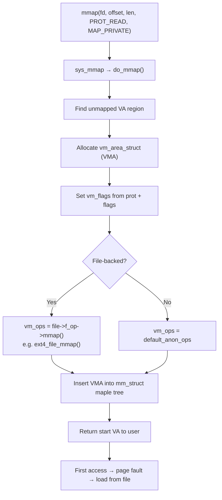
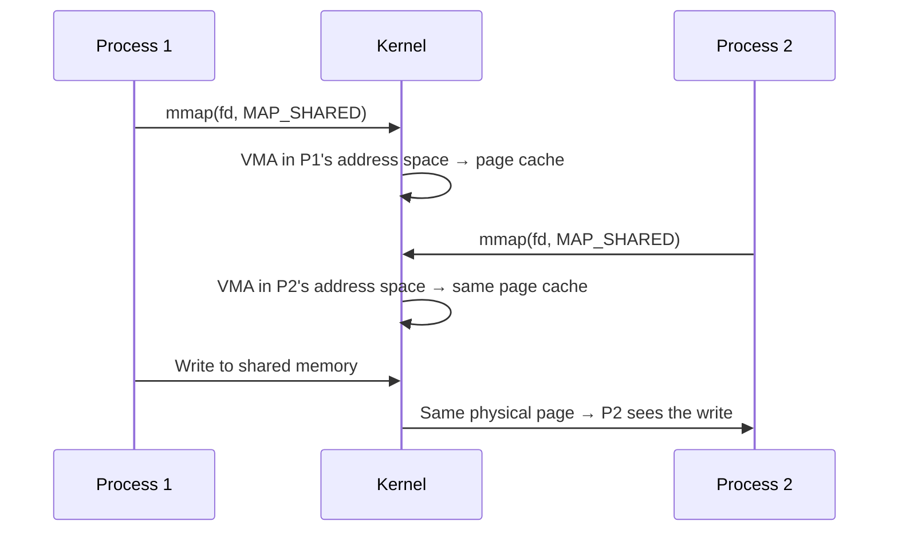

# 05 — mmap

## 1. What is mmap?

`mmap()` **maps files or devices into the process's virtual address space**.

Uses:
- Map files for faster I/O (no read/write syscalls)
- Allocate anonymous memory (heap, stack)
- Share memory between processes (MAP_SHARED)
- Load ELF segments (executable, dynamic libs)

---

## 2. mmap System Call

```c
#include <sys/mman.h>

void *addr = mmap(
    NULL,          /* Suggested start address (NULL = kernel chooses) */
    length,        /* Size of mapping in bytes */
    prot,          /* PROT_READ | PROT_WRITE | PROT_EXEC | PROT_NONE */
    flags,         /* MAP_* flags */
    fd,            /* File descriptor (-1 for anonymous) */
    offset         /* File offset (must be page-aligned) */
);

/* Unmap */
munmap(addr, length);
```

---

## 3. MAP_* Flags

| Flag | Meaning |
|------|---------|
| `MAP_PRIVATE` | Copy-on-write; changes not visible to others |
| `MAP_SHARED` | Changes written to file; visible to all |
| `MAP_ANONYMOUS` | Not backed by file (fd=-1) |
| `MAP_FIXED` | Use exact address (dangerous — overwrites existing) |
| `MAP_LOCKED` | Lock pages (mlock) |
| `MAP_HUGETLB` | Use huge pages |
| `MAP_POPULATE` | Pre-fault pages (avoids demand paging) |
| `MAP_NORESERVE` | Don't reserve swap space |

---

## 4. PROT Flags

| Flag | Effect |
|------|--------|
| `PROT_READ` | Readable |
| `PROT_WRITE` | Writable |
| `PROT_EXEC` | Executable |
| `PROT_NONE` | No access (used for guard pages) |

---

## 5. mmap Internals



---

## 6. File-backed mmap Example

```c
int fd = open("data.bin", O_RDONLY);
struct stat st;
fstat(fd, &st);

/* Map entire file */
void *data = mmap(NULL, st.st_size, PROT_READ, MAP_SHARED, fd, 0);
close(fd);  /* fd can be closed after mmap */

/* Access file contents directly as memory */
uint32_t val = *(uint32_t *)(data + 100);

munmap(data, st.st_size);
```

---

## 7. Shared Memory Between Processes



---

## 8. Anonymous mmap (Heap Alternative)

```c
/* Allocate 1 MiB anonymous memory */
void *buf = mmap(NULL, 1 << 20, PROT_READ | PROT_WRITE,
                 MAP_PRIVATE | MAP_ANONYMOUS, -1, 0);
                 
/* Same as what malloc uses internally for large allocations */
/* Uses brk() for small allocations (< 128 KiB by default) */
```

---

## 9. Source Files

| File | Description |
|------|-------------|
| `mm/mmap.c` | do_mmap(), do_munmap() |
| `mm/memory.c` | mmap page fault handling |
| `include/linux/mm.h` | mmap structs and API |
| `include/uapi/linux/mman.h` | MAP_*, PROT_* flags |

---

## 10. Related Topics
- [02_Virtual_Memory_Areas.md](./02_Virtual_Memory_Areas.md)
- [04_Page_Faults.md](./04_Page_Faults.md)
- [../15_Page_Cache_And_Page_Writeback/01_Page_Cache_Overview.md](../15_Page_Cache_And_Page_Writeback/01_Page_Cache_Overview.md)
