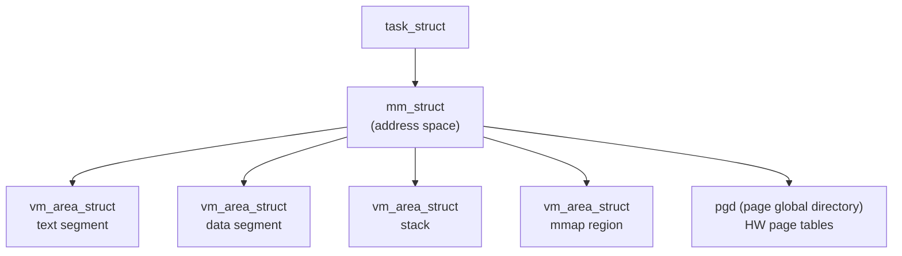

# Chapter 14 — Process Address Space

## Overview

Each process has its own **virtual address space** managed by the kernel.

## Topics

1. [01_mm_struct.md](./01_mm_struct.md)
2. [02_Virtual_Memory_Areas.md](./02_Virtual_Memory_Areas.md)
3. [03_Page_Tables.md](./03_Page_Tables.md)
4. [04_Page_Faults.md](./04_Page_Faults.md)
5. [05_mmap.md](./05_mmap.md)
