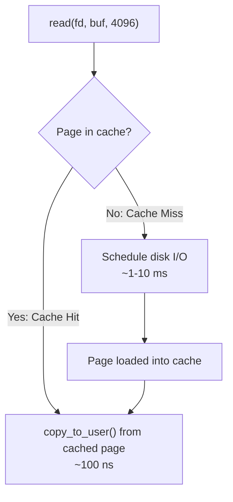
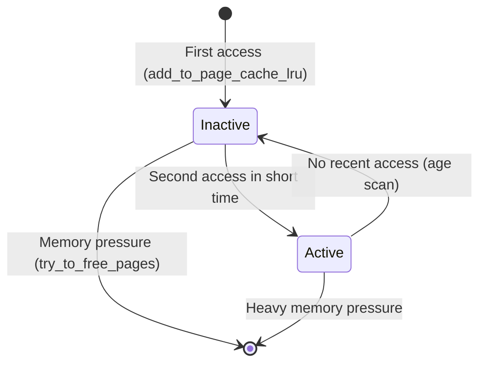
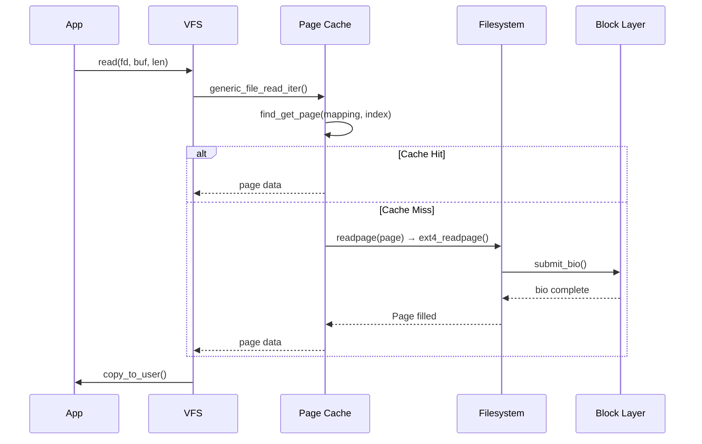

# 01 — Page Cache Overview

## 1. What is the Page Cache?

The **page cache** stores disk data in memory pages — the primary I/O cache in Linux.

- All file reads go through the page cache
- Writes are cached (write-back) and written to disk asynchronously
- `mmap()` file mappings are also backed by the page cache
- Swappable when memory is tight

---

## 2. Page Cache Benefits



---

## 3. Cache Lookup

```c
/* Find page in page cache */
struct page *page = find_get_page(mapping, index);
/* index = file offset / PAGE_SIZE */

if (page) {
    /* Cache hit: page is pinned */
    /* ... use page data ... */
    put_page(page);
} else {
    /* Cache miss: allocate and read from disk */
    page = page_cache_alloc(mapping);
    add_to_page_cache_lru(page, mapping, index, GFP_KERNEL);
    /* Submit bio to fill the page */
}
```

---

## 4. Page Cache Eviction (LRU)

Pages are aged by two LRU lists:



---

## 5. Cache Statistics

```bash
# Free shows cache size:
free -h
#       total    used    free   shared  buff/cache  available
# Mem:   16Gi    4.0Gi  1.0Gi   200Mi      11Gi       11Gi

# Detailed page cache info:
cat /proc/meminfo | grep -E 'Cached|Buffers|Active|Inactive'

# Drop page cache (for benchmarking):
echo 3 > /proc/sys/vm/drop_caches  # 1=pagecache, 2=dentries/inodes, 3=all
```

---

## 6. read() via Page Cache



---

## 7. Source Files

| File | Description |
|------|-------------|
| `mm/filemap.c` | Page cache core (find, add, readahead) |
| `mm/readahead.c` | Readahead algorithm |
| `mm/swap.c` | LRU list manipulation |
| `mm/vmscan.c` | Page reclaim/eviction |
| `include/linux/pagemap.h` | Page cache API |

---

## 8. Related Topics
- [02_address_space.md](./02_address_space.md) — address_space backing
- [03_Writeback_Mechanism.md](./03_Writeback_Mechanism.md) — Writing dirty pages back
