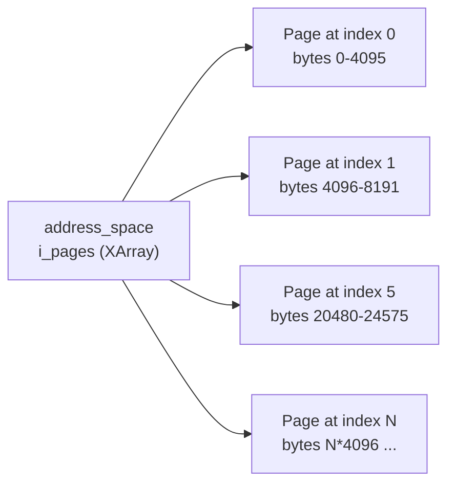
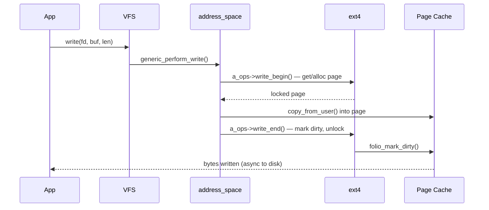

# 02 — address_space

## 1. What is address_space?

`struct address_space` is the **per-inode page cache**. It:
- Holds all cached pages for a file
- Provides the operations vtable for reading/writing pages
- Uses an XArray (`i_pages`) to index pages by file offset

---

## 2. struct address_space

```c
/* include/linux/fs.h */
struct address_space {
    struct inode        *host;          /* Owning inode */
    struct xarray       i_pages;        /* Cached pages (index = page offset) */
    struct rw_semaphore invalidate_lock; /* Protects page invalidation */
    gfp_t               gfp_mask;       /* GFP flags for page allocation */
    atomic_t            i_mmap_writable;/* mmap writable mappings count */
    struct rb_root_cached i_mmap;       /* Tree of private/shared mappings */
    struct rw_semaphore i_mmap_rwsem;   /* Protects i_mmap tree */
    unsigned long       nrpages;        /* Total pages in cache */
    pgoff_t             writeback_index;/* Writeback start hint */
    const struct address_space_operations *a_ops; /* Operations vtable */
    unsigned long       flags;          /* AS_EIO, AS_ENOSPC */
    errseq_t            wb_err;         /* Writeback error stamp */
    spinlock_t          private_lock;
    struct list_head    private_list;   /* For journaling (ext4 journal) */
    void                *private_data;
};
```

---

## 3. address_space_operations

```c
struct address_space_operations {
    int (*writepage)(struct page *page, struct writeback_control *wbc);
    void (*read_folio)(struct file *, struct folio *);
    /* Called after multiple pages become dirty */
    int (*writepages)(struct address_space *, struct writeback_control *);
    bool (*dirty_folio)(struct address_space *, struct folio *);
    void (*readahead)(struct readahead_control *);
    int (*write_begin)(struct file *, struct address_space *mapping,
                       loff_t pos, unsigned len,
                       struct page **pagep, void **fsdata);
    int (*write_end)(struct file *, struct address_space *mapping,
                     loff_t pos, unsigned len, unsigned copied,
                     struct page *page, void *fsdata);
    sector_t (*bmap)(struct address_space *, sector_t);
    void (*invalidate_folio)(struct folio *, size_t offset, size_t len);
    bool (*release_folio)(struct folio *, gfp_t);
    void (*free_folio)(struct folio *folio);
    ssize_t (*direct_IO)(struct kiocb *, struct iov_iter *iter);
    int (*migrate_folio)(struct address_space *, struct folio *dst,
                         struct folio *src, enum migrate_mode);
    int (*error_remove_folio)(struct address_space *, struct folio *);
};
```

---

## 4. XArray — Page Index



```c
/* Find page by file page index */
struct page *page = xa_load(&mapping->i_pages, index);

/* Insert */
xa_store(&mapping->i_pages, index, page, GFP_KERNEL);
```

---

## 5. write() Through address_space



---

## 6. Source Files

| File | Description |
|------|-------------|
| `include/linux/fs.h` | `struct address_space` |
| `mm/filemap.c` | Core page cache + address_space ops |
| `fs/ext4/inode.c` | ext4_aops — ext4's address_space_operations |
| `mm/folio-compat.c` | Folio compatibility (kernel 5.16+) |

---

## 7. Related Topics
- [01_Page_Cache_Overview.md](./01_Page_Cache_Overview.md)
- [03_Writeback_Mechanism.md](./03_Writeback_Mechanism.md)
