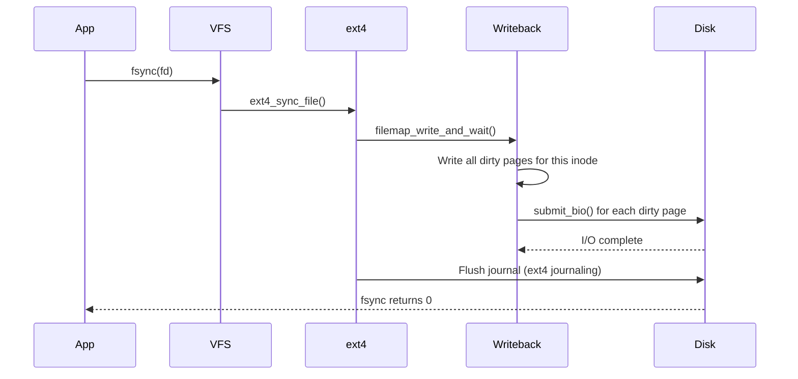

# 03 — Writeback Mechanism

## 1. What is Writeback?

**Writeback** is the process of flushing dirty (modified) pages from the page cache back to disk.

- Dirty pages are **not immediately written** to disk — batching improves performance
- Writeback is triggered by: time (30s default), dirty ratio threshold, sync(), fsync()

---

## 2. Dirty Page Thresholds

```bash
# Tunable thresholds:
cat /proc/sys/vm/dirty_ratio          # % of RAM: hard limit before writes block
cat /proc/sys/vm/dirty_background_ratio  # % of RAM: soft limit; start background WB
cat /proc/sys/vm/dirty_expire_centisecs  # Age (centisecs) before page is "old dirty"
cat /proc/sys/vm/dirty_writeback_centisecs  # Writeback thread wakeup interval
```

---

## 3. Writeback Trigger Points

```mermaid
flowchart TD
    A{Dirty pages exceed\ndirty_background_ratio?} -- Yes --> WakeWB["Wake writeback thread\n(background, non-blocking)"]
    
    B{Dirty pages exceed\ndirty_ratio?} -- Yes --> Throttle["Throttle writing process\n(process sleeps until pages written)"]
    
    C[sync() / fsync()] --> SyncWB["Synchronous writeback\n(wait for all dirty pages)"]
    
    D[Writeback timer fires\n(dirty_writeback_centisecs)] --> TimerWB["Flush old dirty pages\n(older than dirty_expire)"]
    
    WakeWB & TimerWB --> WB["wb_writeback() via bdi_writeback"]
    WB --> WritePages["writepages() per address_space"]
    WritePages --> Disk["Submit bio to block layer"]
```

---

## 4. writeback_control

```c
/* Controls how writeback behaves */
struct writeback_control {
    long            nr_to_write;    /* Pages to write */ 
    long            pages_skipped;
    loff_t          range_start;    /* File range start */
    loff_t          range_end;
    enum writeback_sync_modes sync_mode; /* WB_SYNC_NONE or WB_SYNC_ALL */
    unsigned        for_kupdate:1;  /* Triggered by timer */
    unsigned        for_background:1; /* Triggered by dirty ratio */
    unsigned        tagged_writepages:1;
    unsigned        for_sync:1;     /* sys_sync() */
};
```

---

## 5. Writeback via bdi (Backing Device Info)

```c
/* Each block device has a bdi_writeback struct */
struct bdi_writeback {
    struct backing_dev_info *bdi;
    struct list_head b_dirty;        /* Dirty inodes */
    struct list_head b_io;           /* Inodes being written */
    struct list_head b_more_io;      /* More IO needed */
    struct delayed_work dwork;       /* Writeback work item */
    /* ... */
};
```

---

## 6. fsync() — Force Writeback



---

## 7. Source Files

| File | Description |
|------|-------------|
| `mm/page-writeback.c` | Dirty limits, balance_dirty_pages |
| `fs/fs-writeback.c` | bdi_writeback, wb_writeback |
| `mm/writeback.c` | Writeback coordination |
| `include/linux/writeback.h` | writeback_control, sync modes |

---

## 8. Related Topics
- [04_Dirty_Page_Tracking.md](./04_Dirty_Page_Tracking.md)
- [05_pdflush_kworker.md](./05_pdflush_kworker.md)
