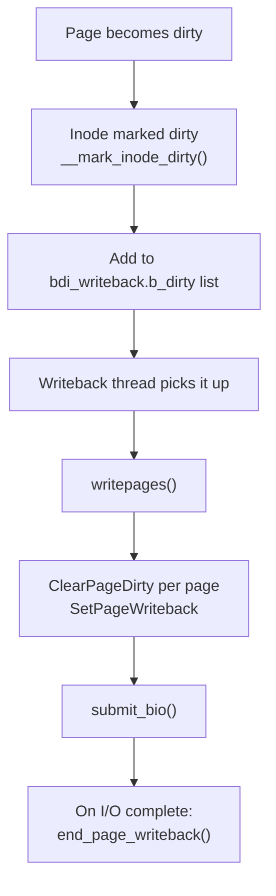
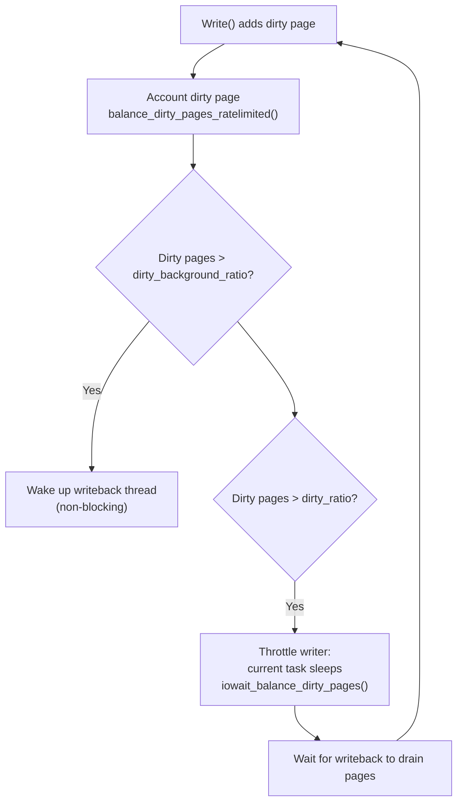

# 04 — Dirty Page Tracking

## 1. How are Pages Marked Dirty?

A page becomes **dirty** when userspace writes to it (via write() or mmap write).

```c
/* Mark a page dirty (from page cache write path) */
folio_mark_dirty(folio);

/* Internal — called by write_end() in address_space_operations */
static bool ext4_dirty_folio(struct address_space *mapping, struct folio *folio)
{
    return block_dirty_folio(mapping, folio);
}
```

---

## 2. Page Flags for Dirty Tracking

| Flag | Set by | Means |
|------|--------|-------|
| `PG_dirty` | write, mmap write | Page data modified |
| `PG_writeback` | start writeback | Currently being written to disk |
| `PG_uptodate` | readpage | Page data is current / valid |
| `PG_referenced` | page access | Recently accessed (LRU aging) |
| `PG_active` | active LRU | On active LRU list |

```c
/* Test and set page flags */
SetPageDirty(page);
ClearPageDirty(page);
PageDirty(page);             /* Returns bool */
TestClearPageDirty(page);    /* Atomic test-and-clear */

SetPageWriteback(page);
end_page_writeback(page);    /* Clears PG_writeback */
```

---

## 3. Inode Dirty Tracking



---

## 4. __mark_inode_dirty

```c
/* fs/fs-writeback.c */
void __mark_inode_dirty(struct inode *inode, int flags)
{
    /* flags: I_DIRTY_SYNC | I_DIRTY_DATASYNC | I_DIRTY_PAGES */
    
    if (flags & I_DIRTY_INODE) {
        /* Mark inode metadata dirty */
        inode->i_state |= flags;
    }
    
    /* Add to bdi_writeback dirty list if not already there */
    if (!list_empty(&inode->i_io_list))
        return;
    
    inode_io_list_move_locked(inode, wb, &wb->b_dirty);
    /* Wake writeback thread */
}
```

---

## 5. Dirty Limits



---

## 6. Per-BDI Dirty Limits

Each block device has its own dirty accounting:

```bash
cat /sys/class/bdi/8:0/max_ratio   # Per-device dirty limit
cat /sys/class/bdi/8:0/min_ratio   # Minimum share
```

---

## 7. Source Files

| File | Description |
|------|-------------|
| `mm/page-writeback.c` | Dirty limits, balance_dirty_pages |
| `fs/fs-writeback.c` | `__mark_inode_dirty()` |
| `include/linux/page-flags.h` | PG_dirty and all page flags |
| `include/linux/fs.h` | I_DIRTY_* inode flags |

---

## 8. Related Topics
- [03_Writeback_Mechanism.md](./03_Writeback_Mechanism.md)
- [05_pdflush_kworker.md](./05_pdflush_kworker.md)
