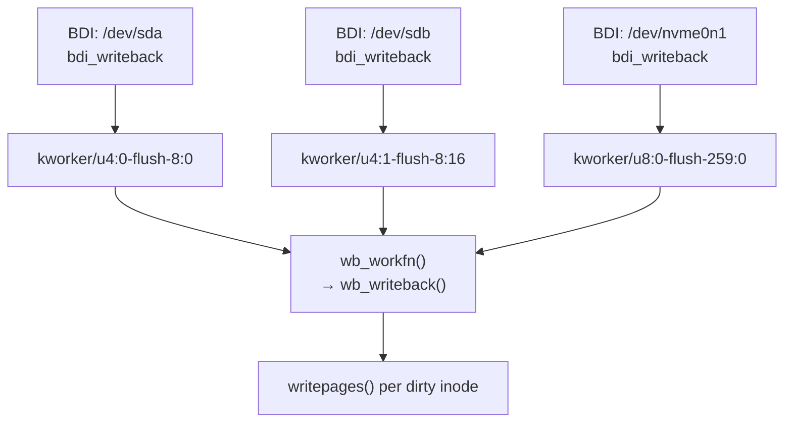
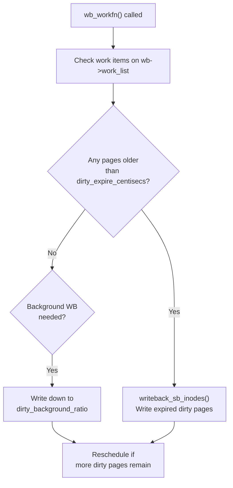

# 05 — pdflush / kworker (Writeback Threads)

## 1. History: pdflush → flusher threads

| Era | Mechanism | Description |
|-----|-----------|-------------|
| 2.4 | `bdflush` | Single global thread |
| 2.6 early | `pdflush` | Pool of threads, not per-device |
| 2.6.32+ | `flusher threads` | Per-BDI (per-device) threads |
| 3.x+ | `kworker/flush` | Workqueue-based, per-device |

---

## 2. Current Architecture (3.x+)

Each block device (BDI) has a dedicated **`bdi_writeback`** that uses kernel workqueues:



---

## 3. Writeback Thread Wakeup

```c
/* fs/fs-writeback.c */
static void wb_wakeup(struct bdi_writeback *wb)
{
    /* Schedule writeback work on the workqueue */
    mod_delayed_work(bdi_wq, &wb->dwork, 0);
}

/* Triggers:
 * 1. dirty_background_ratio exceeded
 * 2. dirty_writeback_centisecs timer fires  
 * 3. sync() / fsync() called
 * 4. Inode closes (final close)
 */
```

---

## 4. wb_writeback() Work Function



---

## 5. Seeing Writeback Threads

```bash
# List all flush/writeback threads:
ps aux | grep -E "flush|writeback|kworker.*flush"
# root  123  0.0  0.0  0  0 ?  S  kworker/u4:0-flush-8:0
# root  456  0.0  0.0  0  0 ?  S  kworker/u4:1-flush-8:16

# Monitor writeback activity:
cat /proc/vmstat | grep -E 'writeback|dirty'
# nr_dirty           1234
# nr_writeback       56
# nr_writeback_temp  0

# iostat shows actual disk writes:
iostat -x 1
```

---

## 6. sync() vs fsync() vs fdatasync()

| Call | Scope | Waits? | Metadata? |
|------|-------|--------|-----------|
| `sync()` | All filesystems | Returns immediately (schedules) | Yes |
| `syncfs(fd)` | One filesystem | Yes | Yes |
| `fsync(fd)` | One file | Yes | Yes (journal) |
| `fdatasync(fd)` | One file data | Yes | Only if needed |
| `msync(addr, len)` | mmap region | Yes | Depends on flags |

---

## 7. Source Files

| File | Description |
|------|-------------|
| `fs/fs-writeback.c` | Writeback thread, wb_workfn, wb_writeback |
| `mm/backing-dev.c` | BDI registration, thread setup |
| `mm/page-writeback.c` | balance_dirty_pages, threshold calculations |
| `include/linux/backing-dev.h` | `struct bdi_writeback` |

---

## 8. Related Topics
- [03_Writeback_Mechanism.md](./03_Writeback_Mechanism.md)
- [04_Dirty_Page_Tracking.md](./04_Dirty_Page_Tracking.md)
- [../07_Bottom_Halves_And_Deferring_Work/04_Work_Queues.md](../07_Bottom_Halves_And_Deferring_Work/04_Work_Queues.md)
