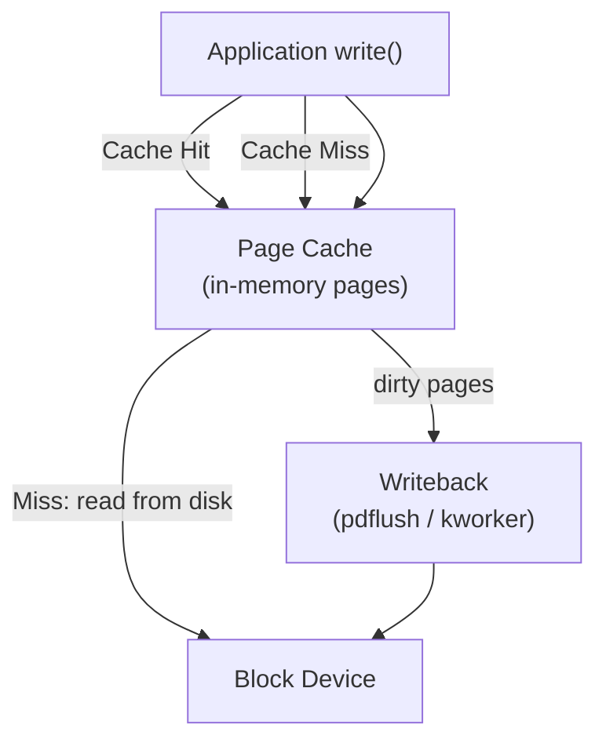

# Chapter 15 — Page Cache and Page Writeback

## Overview

The **page cache** caches file data in RAM to speed up file I/O.

## Topics

1. [01_Page_Cache_Overview.md](./01_Page_Cache_Overview.md)
2. [02_address_space.md](./02_address_space.md)
3. [03_Writeback_Mechanism.md](./03_Writeback_Mechanism.md)
4. [04_Dirty_Page_Tracking.md](./04_Dirty_Page_Tracking.md)
5. [05_pdflush_kworker.md](./05_pdflush_kworker.md)
