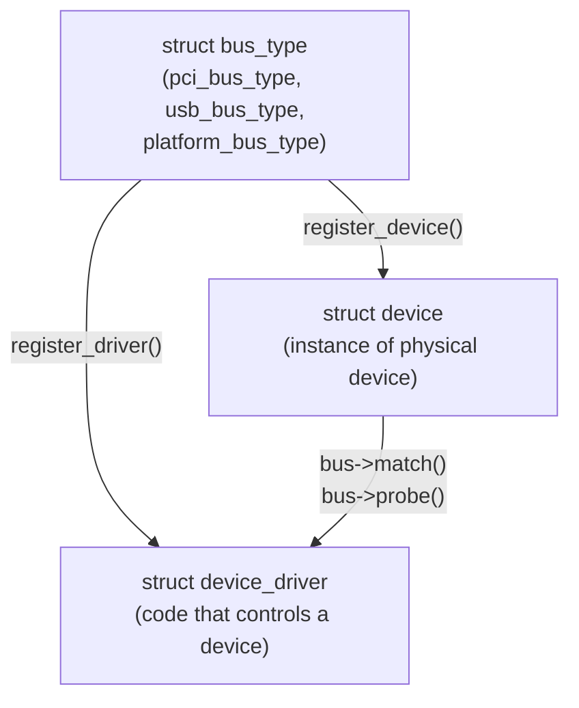
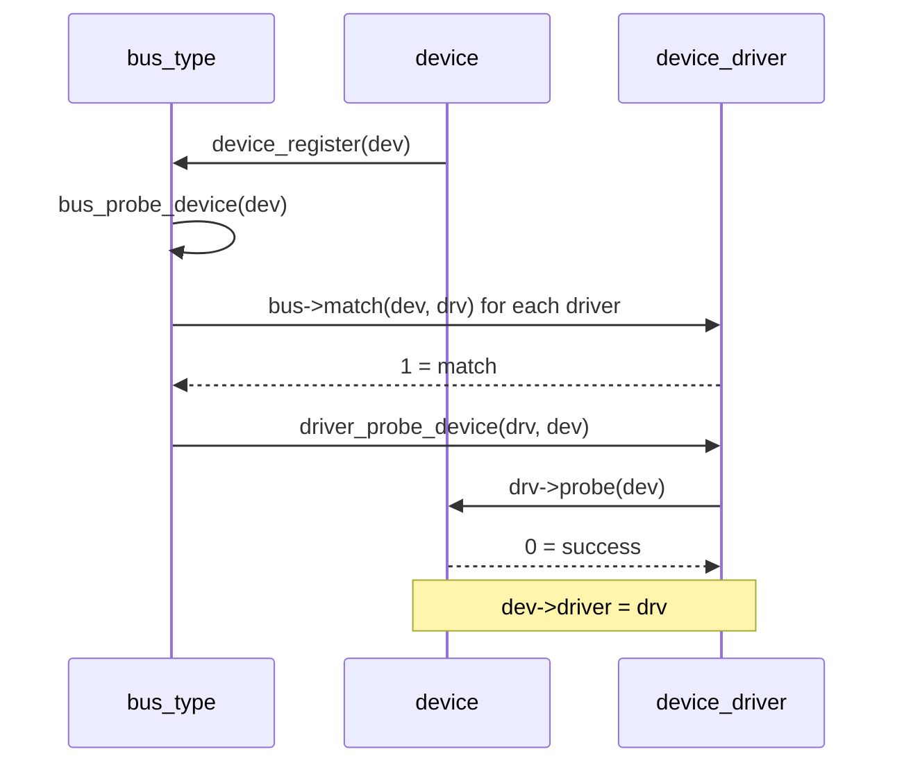

# 01 — Device Model

## 1. Why a Unified Device Model?

Before 2.6: each bus type had its own custom power management, hotplug, and discovery code → massive duplication.

The **Unified Device Model** provides:
- Single tree of all devices (`/sys/devices/`)
- Shared power management callbacks
- Hotplug notification via uevent → udev
- Reference counting via kobject

---

## 2. Core Objects



---

## 3. struct device

```c
/* include/linux/device.h */
struct device {
    struct kobject          kobj;           /* Reference counting + sysfs */
    struct device           *parent;        /* Parent device in tree */
    struct device_private   *p;
    const char              *init_name;     /* Device name */
    const struct device_type *type;
    struct bus_type         *bus;           /* Which bus */
    struct device_driver    *driver;        /* Assigned driver */
    void                    *driver_data;   /* Driver private data */
    struct device_node      *of_node;       /* Device tree node */
    dev_t                   devt;           /* Major:minor number */
    u32                     id;
    spinlock_t              devres_lock;
    struct list_head        devres_head;    /* Managed resources (devm_*) */
    struct class            *class;         /* Device class (input, block...) */
    const struct attribute_group **groups;  /* sysfs attribute groups */
    void (*release)(struct device *dev);    /* Called when ref drops to 0 */
};
```

---

## 4. struct device_driver

```c
struct device_driver {
    const char          *name;
    struct bus_type     *bus;
    struct module       *owner;
    const char          *mod_name;
    bool                suppress_bind_attrs;
    enum probe_type     probe_type;
    const struct of_device_id   *of_match_table; /* Device tree */
    const struct acpi_device_id *acpi_match_table;

    int  (*probe)(struct device *dev);   /* Bind driver to device */
    void (*sync_state)(struct device *dev);
    int  (*remove)(struct device *dev);  /* Unbind */
    void (*shutdown)(struct device *dev);
    int  (*suspend)(struct device *dev, pm_message_t state);
    int  (*resume)(struct device *dev);

    const struct attribute_group **groups;
    const struct attribute_group **dev_groups;

    const struct dev_pm_ops *pm;
    struct driver_private *p;
};
```

---

## 5. Bus Match and Probe Flow



---

## 6. devm_* Resource Management

```c
/* Managed resources auto-freed when device is removed */
void *buf = devm_kmalloc(&dev, size, GFP_KERNEL);
void __iomem *regs = devm_ioremap_resource(&dev, res);
int irq_ret = devm_request_irq(&dev, irq, handler, 0, "mydev", dev);

/* No explicit kfree/iounmap/free_irq needed in remove() */
```

---

## 7. Source Files

| File | Description |
|------|-------------|
| `drivers/base/core.c` | device_register, device_unregister |
| `drivers/base/bus.c` | bus_register, bus_probe_device |
| `drivers/base/driver.c` | driver_register, driver_probe_device |
| `include/linux/device.h` | All core structs |

---

## 8. Related Topics
- [02_kobject.md](./02_kobject.md)
- [03_sysfs.md](./03_sysfs.md)
- [04_Platform_Devices.md](./04_Platform_Devices.md)
