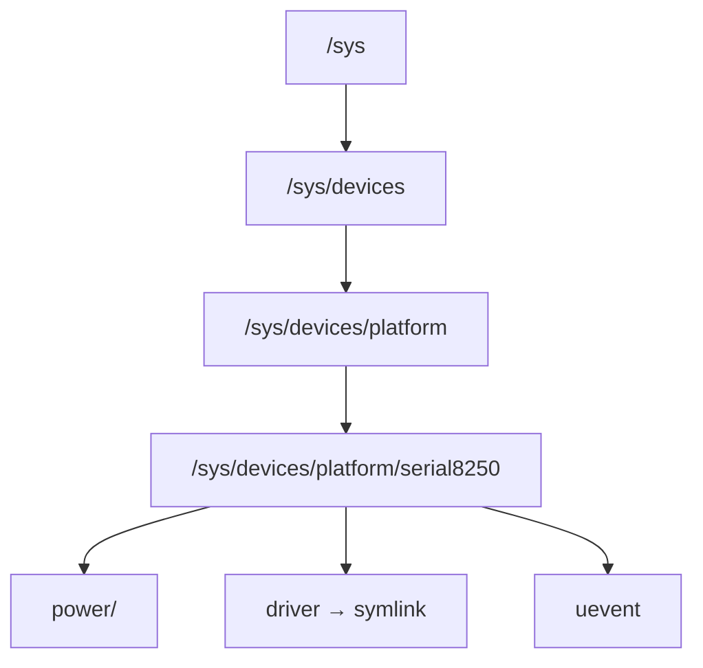

# 02 — kobject

## 1. What is kobject?

`kobject` is the **fundamental building block** of the device model:
- Provides reference counting (`kref`)
- Backs every sysfs directory
- Enables hierarchical device tree (`parent` pointer)

---

## 2. struct kobject

```c
/* include/linux/kobject.h */
struct kobject {
    const char          *name;        /* sysfs directory name */
    struct list_head    entry;        /* Siblings in parent */
    struct kobject      *parent;      /* Parent in hierarchy */
    struct kset         *kset;        /* Containing set (optional) */
    const struct kobj_type *ktype;    /* Type: sysfs ops + release */
    struct kernfs_node  *sd;          /* kernfs backing node */
    struct kref         kref;         /* Reference count */
    unsigned int        state_initialized:1;
    unsigned int        state_in_sysfs:1;
    unsigned int        state_add_uevent_sent:1;
    unsigned int        state_remove_uevent_sent:1;
    unsigned int        uevent_suppress:1;
};
```

---

## 3. kref — Reference Counting

```c
struct kref {
    refcount_t refcount;
};

/* Increment ref */
kobject_get(kobj);   /* kref_get(&kobj->kref) */

/* Decrement ref — calls release function when count==0 */
kobject_put(kobj);   /* kref_put() → ktype->release() */
```

---

## 4. kobj_type

```c
struct kobj_type {
    void (*release)(struct kobject *kobj);  /* Destructor */
    const struct sysfs_ops *sysfs_ops;      /* show/store */
    const struct attribute_group **default_groups;
    const struct kobj_ns_type_operations *(*child_ns_type)(struct kobject *);
    const void *(*namespace)(struct kobject *);
    void (*get_ownership)(struct kobject *, kuid_t *, kgid_t *);
};
```

---

## 5. kobject Hierarchy = /sys Tree


```

---

## 6. Embedding kobject in Your Structure

```c
/* CORRECT: embed kobject, DON'T allocate separately */
struct my_device {
    int id;
    char name[32];
    struct kobject kobj;    /* Embedded */
};

/* Create */
struct my_device *dev = kzalloc(sizeof(*dev), GFP_KERNEL);
kobject_init(&dev->kobj, &my_ktype);
kobject_add(&dev->kobj, parent_kobj, "mydev%d", id);

/* Container_of pattern to get back to my_device */
static void my_release(struct kobject *kobj)
{
    struct my_device *dev = container_of(kobj, struct my_device, kobj);
    kfree(dev);
}
```

---

## 7. kset — Collection of kobjects

```c
/* kset groups related kobjects (e.g., all block devices) */
struct kset {
    struct list_head    list;       /* All kobjects in this set */
    spinlock_t          list_lock;
    struct kobject      kobj;       /* Represents the kset in sysfs */
    const struct kset_uevent_ops *uevent_ops; /* Uevent filtering */
};
```

---

## 8. Source Files

| File | Description |
|------|-------------|
| `lib/kobject.c` | kobject_init, kobject_add, kobject_put |
| `lib/kref.c` | kref reference count |
| `include/linux/kobject.h` | All kobject types |

---

## 9. Related Topics
- [01_Device_Model.md](./01_Device_Model.md)
- [03_sysfs.md](./03_sysfs.md)
