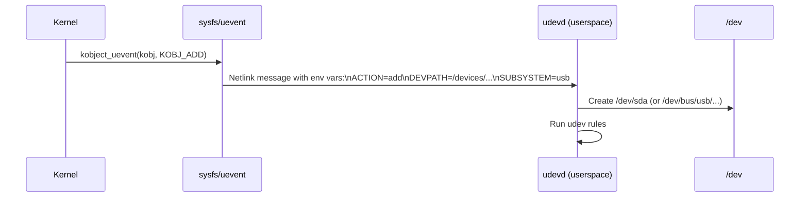

# 03 — sysfs

## 1. What is sysfs?

`sysfs` is a **virtual filesystem** (mounted at `/sys`) that exports kernel object attributes to userspace.

- Each kobject → one directory in `/sys`
- Each attribute → one file in that directory
- Rules: **one value per file**, human-readable, ASCII

---

## 2. sysfs Layout

```
/sys/
├── block/          — Block devices (symlinks)
├── bus/            — Bus types (pci, usb, i2c, platform)
│   └── pci/
│       ├── devices/ — Symlinks to devices
│       └── drivers/ — All PCI drivers
├── class/          — Device classes (net, input, tty)
├── devices/        — Full device tree
│   └── pci0000:00/
│       └── 0000:00:1f.2/  ← PCI device
│           ├── vendor
│           ├── device
│           └── driver  → symlink to driver
├── firmware/       — Firmware info
├── fs/             — Filesystem info
├── kernel/         — Kernel tuneables
├── module/         — Loaded modules
└── power/          — Power management
```

---

## 3. Creating sysfs Attributes

```c
#include <linux/sysfs.h>

/* Simple attribute: show/store callbacks */
static ssize_t speed_show(struct device *dev,
                           struct device_attribute *attr, char *buf)
{
    struct mydev *priv = dev_get_drvdata(dev);
    return sysfs_emit(buf, "%d\n", priv->speed);
}

static ssize_t speed_store(struct device *dev,
                            struct device_attribute *attr,
                            const char *buf, size_t count)
{
    struct mydev *priv = dev_get_drvdata(dev);
    int val;
    if (kstrtoint(buf, 10, &val))
        return -EINVAL;
    priv->speed = val;
    return count;
}

/* Declare the attribute */
static DEVICE_ATTR_RW(speed);     /* Creates dev_attr_speed */
/* Or: */
static DEVICE_ATTR_RO(name);      /* Read-only: name_show only */
static DEVICE_ATTR_WO(reset);     /* Write-only: reset_store only */

/* Register in probe: */
device_create_file(&dev->dev, &dev_attr_speed);
/* Or groups: */
static struct attribute *mydev_attrs[] = {
    &dev_attr_speed.attr,
    NULL
};
static const struct attribute_group mydev_group = {
    .attrs = mydev_attrs,
};
static const struct attribute_group *mydev_groups[] = {
    &mydev_group,
    NULL
};
/* Assign to device: dev->groups = mydev_groups */
```

---

## 4. Kernel kobject Attribute

```c
/* For kobject-level attributes (not device): */

struct kobj_attribute my_attr = __ATTR(myval, 0644, myval_show, myval_store);

/* Create file: /sys/kernel/mysubsys/myval */
static struct kobject *mysubsys_kobj;
mysubsys_kobj = kobject_create_and_add("mysubsys", kernel_kobj);
sysfs_create_file(mysubsys_kobj, &my_attr.attr);
```

---

## 5. Uevent — Hotplug Notification



```bash
# Monitor uevents in real time:
udevadm monitor
```

---

## 6. Source Files

| File | Description |
|------|-------------|
| `fs/sysfs/` | sysfs filesystem implementation |
| `lib/kobject.c` | kobject_uevent |
| `drivers/base/core.c` | device sysfs integration |
| `include/linux/sysfs.h` | DEVICE_ATTR_*, sysfs_create_file |

---

## 7. Related Topics
- [02_kobject.md](./02_kobject.md)
- [01_Device_Model.md](./01_Device_Model.md)
